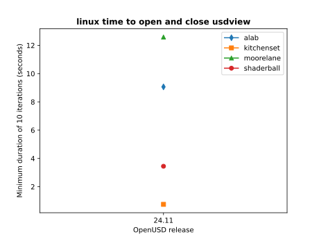
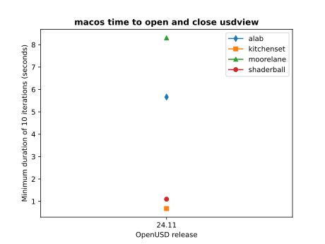
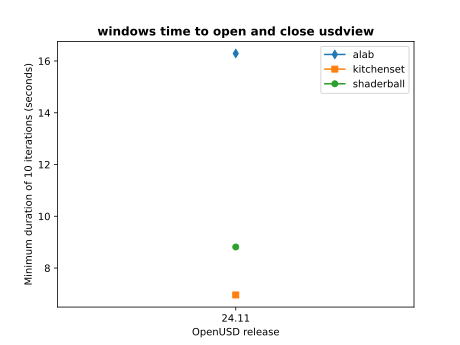

.. include:: rolesAndUtils.rst

.. _performance_metrics:

###################
Performance Metrics
###################

As of release 24.11, for each release, USD generates performance metrics using a 
specific set of assets and specific hardware and software configurations. This 
page describes what metrics are collected, what hardware and software 
configurations are used, the actual metrics results, and how to generate the
metrics locally. 

***************
What We Measure
***************

For a given asset, our performance script captures the following metrics by 
default (items in **bold** are reported on this page):

* Time to load and configure USD plugins for :program:`usdview`
* **Time to open the stage**
* Time to reset the :program:`usdview` prim browser
* Time to initialize the :program:`usdview` UI
* **Time to render first image** (in :program:`usdview`)
* **Time to shutdown Hydra**
* **Time to close the stage**
* Time to tear down the :program:`usdview` UI
* **Total time to start and quit** :program:`usdview`
* Time to traverse the prims in the stage

We run 10 iterations for each asset, and capture the minimum and maximum times
for that set of iterations. We also calculate the mean time across the 10
iterations.

For each asset, we first warm the filesystem cache by loading the
asset in :program:`usdview`, to ensure we're not including cache performance
issues in our metrics.

All assets used to measure performance are assumed to be available 
locally. Time to download assets is not measured or included as part of 
the gathered performance metrics.

.. _perf_environments:

************************
What Environment Is Used
************************

This section describes the computing environment used to generate the 
published performance metrics. The following operating systems and hardware are 
currently used.

.. note::

    Machine specifications are subject to change. If specifications do change
    for a give release, historical performance measurements will be run to 
    backfill any outdated data.

Linux
=====

* **OS**: CentOS Linux 7
* **CPU**: 23 cores of Intel(R) Xeon(R) Platinum 8268 CPU @ 2.90GHz
* **RAM**: 117GB
* **GPU**: NVIDIA TU102GL (Quadro RTX 6000/8000)

macOS
=====

* **OS**: macOS 14.3
* **CPU**: Apple M2 Ultra (20 Core)
* **RAM**: 192GB
* **GPU**: Apple M2 Ultra GPU (76 Core)

Windows
=======

* **OS**: Microsoft Windows 10 Enterprise
* **CPU**: AMD EPYC 7763 64-Core Processor, 2450 Mhz, 31 Core(s), 31 Logical Processor(s)
* **RAM**: 128GB
* **GPU**: NVIDIA RTXA6000-24Q

USD Build
=========

For each of the operating systems and hardware platforms listed previously, we
build USD with the same build configuration. We use a stock invocation of 
``build_usd.py`` with the default options (release build, Python components,
imaging and USD imaging components, usdview, etc).

*******
Metrics
*******

Metrics are all measured in seconds.

Performance Graphs Per Platform
===============================

The following graphs show the time (in seconds) to open and close 
:program:`usdview` for each asset. Graphs are provided for Linux, macOS, and
Windows platforms (as described in :ref:`perf_environments`).

Standard Shader Ball
====================

This asset is designed to be a comprehensive test of a broad array of material 
properties in a single render. Geometry is expressed using USD, materials are 
defined using MaterialX, texture maps are provided in OpenEXR format and encoded 
using the Academy Color Encoding System ACEScg color space. 

.. image:: https://raw.githubusercontent.com/usd-wg/assets/main/full_assets/StandardShaderBall/media/figure02.png
    :width: 500

The shader ball asset can be `downloaded here <https://github.com/usd-wg/assets/tree/main/full_assets/StandardShaderBall>`__.

.. datatemplate:yaml:: performance/24.11_linux_shaderball.yaml
   :template: perf_metric_shaderball_template.tmpl

Kitchen Set
===========

This asset provides a complex kitchen scene.

.. image:: https://openusd.org/images/Kitchen_set_thumb.png
    :width: 500

The Kitchen Set asset can be `downloaded here <https://openusd.org/release/dl_kitchen_set.html>`__.

.. datatemplate:yaml:: performance/24.11_linux_kitchenset.yaml
   :template: perf_metric_kitchenset_template.tmpl

ALab
====

ALab is a full production scene created by Animal Logic and contains over 300 
assets, complete with high-quality textures and two characters with looping 
animation in shot context. Supplied as four separate downloads: the full 
production scene, high-quality textures, shot cameras matching the ALab trailer, 
and baked procedural fur and fabric for the animated characters.

The metrics have been measured with the base asset merged with the additional
"techvars" info.

.. image:: https://animallogic.com/wp-content/uploads/2022/08/LoopySequence02.gif
    :width: 500

The ALab asset can be `downloaded here <https://animallogic.com/alab/>`__.

.. datatemplate:yaml:: performance/24.11_linux_alab.yaml
   :template: perf_metric_alab_template.tmpl

Moore Lane
==========

4004 Moore Lane is a fully composed, high-quality scene for the purpose of 
testing various visual computing issues. The house itself was wrapped around a 
number of typical problem areas for light transport and noise sampling. This 
includes things like thin openings in exterior walls, recessed area light 
sources, deeply shadowed corners, and high-frequency details. The exterior 
landscape surrounding the house consisted of a relatively simple ecosystem of 
instanced plants which could provide some additional levels of complexity. In 
addition to the geometry itself being designed to exacerbate some typical 
issues, the USD structure itself was created for several layers of testing.

The metrics have been measured using the contained 
:filename:`MooreLane_ASWF_0623.usda` file.

.. image:: https://dpel.aswf.io/images/4004/render_20181.jpeg
    :width: 500

The Moore Lane asset can be `downloaded here <https://dpel.aswf.io/4004-moore-lane/>`__.

.. datatemplate:yaml:: performance/24.11_linux_moorelane.yaml
   :template: perf_metric_moorelane_template.tmpl

***********************************
Running Performance Metrics Locally
***********************************

We encourage developers to run the USD performance metrics to measure 
performance impacts of OpenUSD code contributions. Performance metrics can
also be run to validate local runtime environments and hardware configurations.

Performance metrics are generating using the :program:`usdmeasureperformance.py`
script found in ``pxr/extras/performance``. See the 
`usdmeasureperformance tool docs <toolset>`_ for more 
information on the different parameters available.

:program:`usdmeasureperformance.py` uses :program:`usdview` and 
:program:`testusdview`, so you will need to make sure those are in your current 
path, or aliased properly. 

For gathering the metrics published on this page, the following parameters
are used (for each asset):

.. code-block:: 

    python usdmeasureperformance.py <asset.usda> -i 10 -a min -o <metrics output filename.yaml>

Adding Custom Metrics
=====================

You can add your own custom metrics and have :program:`usdmeasureperformance.py`
include them as part of the set of metrics that it measures. 

To define a custom metric, create a script file that defines a 
``testUsdviewInputFunction()`` function that will be passed to ``testusdview``.
For example, if you wanted to add a metric named "process prims", that 
traversed the stage and processed each prim in some way, you might have a 
``processPrimsMetric.py`` script that looks something like:

.. code-block:: python

    from pxr import Usd, UsdUtils, Usdviewq

    def testUsdviewInputFunction(appController):
        with Usdviewq.Timer("process prims", True):
            stage = appController._dataModel.stage
            for prim in stage.Traverse():
                # process prim as needed, etc

See also the "traverse stage" example in ``pxr/extras/performance/explicitMetrics/stageTraversalMetric.py``.

To include your custom metrics when running :program:`usdmeasureperformance.py`,
add your metrics script name and metric name as part of the ``--custom-metrics``
script parameter. For example, if you wanted to include the "process prims"
metric example for "MyTestAsset.usda", you would use a 
:program:`usdmeasureperformance.py` command line similar to:

.. code-block::

    python usdmeasureperformance.py MyTestAsset.usda --custom-metrics processPrimsMetric.py:'process prims'

:program:`usdmeasureperformance.py` will look for your custom metric script 
relative to the directory from which the :program:`usdmeasureperformance.py`
script is run.
