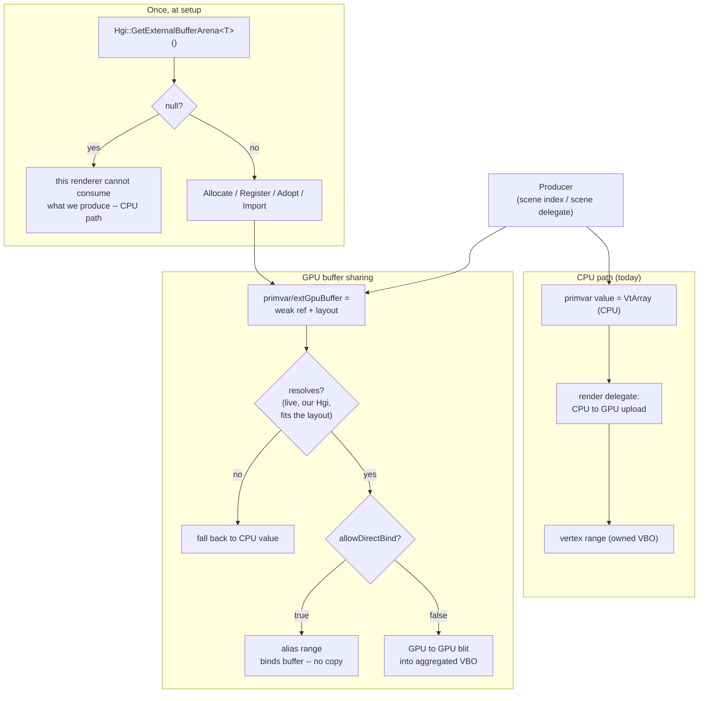
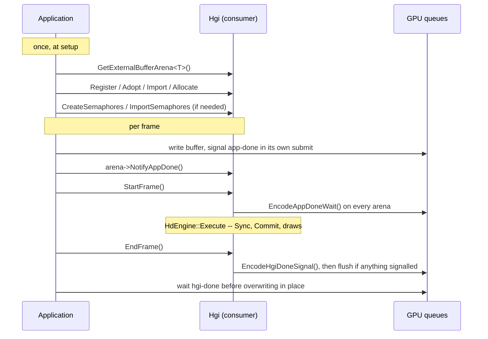

External GPU Buffer Sharing
===========================

Version 3 - September 22, 2026

> **What changed since Version 2.** V2 described a flat schema that published
> native handles directly: `backendApi`, `rawHandle`, `externalMemoryHandle`,
> `deviceUuid`, `logicalDeviceId`, and a nested `HdExtGpuSyncSchema` carrying
> semaphore handles. Review of PR #4207 replaced all of it with two Hgi objects,
> `HgiExternalBuffer` and `HgiExternalBufferArena`, and reduced the schema to a
> weak reference plus layout. Every field V2 enumerated is now a detail of the
> arena, and every negotiation V2 performed per buffer now happens once, when
> the arena is created. Synchronization moved with it: there is no sync schema,
> and the bracket is encoded by Hgi from `StartFrame`/`EndFrame`.

## Contents

- [Background](#background)
- [What it is](#what-it-is)
- [How it works](#how-it-works)
- [Implementation status](#implementation-status)
- [Future Considerations](#future-considerations)

## Background

Hydra feeds geometry to a render delegate as CPU data: primvars are `VtArray`
values that flow through the scene index, and the render delegate uploads them
to the GPU when it builds its draw resources.

That model is a poor fit when the producer already holds the data on the GPU —
a GPU deformer, a GPU simulation, or any producer that shares a GPU context with
the renderer. To publish through the CPU primvar it must read the data back
(**GPU → CPU**), and the render delegate then uploads it again (**CPU → GPU**),
round-tripping data that never needed to leave the device. For animated
geometry this cost is paid every frame, and the readback tends to serialize the
GPU pipeline.

This proposal lets a producer hand Hydra a *reference* to a GPU buffer it
already owns, so the render delegate can bind or copy it on-device and skip the
round trip entirely.

## What it is

Two objects, on opposite sides of a deliberate line.

**`HgiExternalBufferArena`** (in `hgi`) is where an application and a renderer
agree, once, on how they will share memory. The application asks Hgi for an
arena, hands it buffers, and gets back `HgiExternalBuffer` objects. Everything
API-specific lives here: native handles, OS memory handles, device identity,
semaphores, and reclamation.

**`HdExtGpuBufferSchema`** (in `hd`) is a typed container data source a producer
overlays as a child of a primvar, under the token `extGpuBuffer`. It carries a
**weak reference** to one `HgiExternalBuffer` plus the layout of the stream
inside it — and nothing else. It is renderer- and API-agnostic because it
describes no API.

```
primvars/points:
  primvarValue:  <empty or lazy VtArray>
  interpolation: vertex
  role:          point
  extGpuBuffer:                    # HdExtGpuBufferSchema
    externalResource               # weak ref to an HgiExternalBuffer
    numElements, elementType
    byteOffset, byteStride
    allowDirectBind
```

| Member | Type | Meaning |
| --- | --- | --- |
| `externalResource` | `HdExternalBufferDataSource` | A **weak** reference to the `HgiExternalBuffer` being shared. |
| `numElements` | `size_t` | Number of tuples (vertices / elements) in this stream. |
| `elementType` | `HdTupleType` | Element type and tuple arity (e.g. `Float32`×3 for points). |
| `byteOffset` | `size_t` | Offset to the first element within the buffer. Non-zero means this stream is a sub-allocation of a larger pooled buffer. |
| `byteStride` | `size_t` | Bytes between consecutive elements. `0`, or equal to the element size, means tightly packed and directly aliasable. |
| `allowDirectBind` | `bool` | Permission, not instruction: whether the renderer *may* bind zero-copy. It is free to copy anyway. |

That is the whole schema. There is no `backendApi`, because the buffer knows its
own Hgi. No `rawHandle` or `externalMemoryHandle`, because which native route
was used was settled when the arena was created. No `deviceUuid` or
`logicalDeviceId`, because a buffer from the wrong device cannot be in this
arena. No `sync` child, because synchronization is per arena, not per buffer.

**The reference is weak on purpose.** Scene indices cache, flatten and copy the
containers they pass along, and any of those caches may outlive the geometry it
described. A strong reference in the scene description would let a forgotten
cache entry pin GPU memory for the life of the renderer. What keeps a buffer
alive is its arena, plus whatever strong reference a renderer takes while it is
actually consuming. An expired reference means "that buffer is gone, fall back
to the CPU primvar" — which is also exactly the right behaviour when a producer
withdraws a buffer.

`HdExternalBufferPtr` is a struct wrapping `std::weak_ptr<HgiExternalBuffer>`
rather than the bare `weak_ptr`, because `VtValue` requires equality and
streaming operators that `weak_ptr` does not have. Its equality is
ownership-based, so two references to the same buffer compare equal even after
both expire. Note that `hd` **forward-declares** `HgiExternalBuffer` and neither
includes nor links `hgi`: only a producer and the consuming renderer ever
dereference it, and both live above the boundary where `hgi` is available. In
between the value is transported opaquely, which is what keeps this from
becoming an hd-on-hgi dependency.

### Getting an arena

```cpp
auto arena = hgi->GetExternalBufferArena<HgiGLExternalBufferArena>();
if (!arena) { /* interop unavailable -- copy through the CPU instead */ }
```

Get-or-create, one arena per type per Hgi. The template parameter names a
backend arena type, and **the arena belongs to the consuming backend** — asking
for `HgiGLExternalBufferArena` means "can this renderer consume OpenGL-produced
buffers?"

**Null is the entire negotiation, and it is settled once.** A Vulkan-backed
Storm asked for a GL arena gets null, because OpenGL cannot export an allocation
for another API to import — impossible rather than unimplemented, so no arena
type for GL→Vulkan exists or can exist. The caller handles null by falling back
to its own copy. This replaces V2's per-buffer comparison of backend tokens,
device UUIDs and logical device ids with one question asked at setup.

The gate is `T::IsSupportedBy(hgi)`, checked before anything is allocated:

| Arena | Supported when |
| --- | --- |
| `HgiGLExternalBufferArena` | `hgi->GetAPIName() == OpenGL` |
| `HgiVulkanExternalBufferArena` | Vulkan **and** the device reports `supportsNativeInterop` |

**One producer per arena.** Because there is one arena per type per Hgi, two
independent producers would share its semaphore pair and its epoch counter, and
the epoch counter does not distinguish them: producer A's publish can be
consumed by the wait raised for B, and the signal that follows zeroes the state
for both. On a binary semaphore, two publishes against one wait also leave it
signalled, so the next frame consumes a stale signal and neither producer is
ordered at all. None of this is detected. An application with two genuinely
independent producers needs two Hgis, or must serialize them into one producer.

### The four routes

How a buffer gets into an arena depends on who allocated it and who may destroy
it. The split matters: getting it wrong is a double free or a leak, not a
degradation.

| Route | Who allocates | Who destroys | Use when |
| --- | --- | --- | --- |
| `AllocateBuffer` | Hgi | Hgi | Hgi should own the memory; the application imports the description and writes into it |
| `RegisterBuffer` | application | **application** | the application still uses and recycles the buffer on its own schedule |
| `AdoptBuffer` | application | Hgi | the application is genuinely handing the buffer over and will never touch it again |
| `ImportBuffer` | another device / another API | Hgi (its own wrapper) | the memory crosses a device or API boundary and is named by an OS handle |

`AllocateBuffer` is the **only route on the base class**, and that is structural
rather than incidental: it is the only one whose signature carries no native
handle. `RegisterBuffer(GLuint)` and `RegisterBuffer(VkBuffer)` cannot be
unified without erasing the handle, which is precisely the type safety this
redesign was for. A producer that wants to stay backend-agnostic can use
`AllocateBuffer` through an `HgiExternalBufferArena*`; anything else names a
concrete arena type.

Which arena type to ask for is decided by **the producer's API, not the
renderer's** — a GL producer asks for the GL arena because that is what its
handles are.

### Worked examples

The three publishes below describe the same thing: the 8 corners of a cube as a
`points` primvar, `Float32`×3, 96 bytes. They differ only in how the producer
got the buffer into an arena. Notice that the *schema* is nearly identical in
all three — that is the point of the redesign.

**GL producer, GL consumer.** A viewport that allocates its own vertex buffers
in the same GL context the renderer draws into, and recycles them itself.

```cpp
auto arena = hgi->GetExternalBufferArena<HgiGLExternalBufferArena>();
if (!arena) { return false; }                      // Vulkan Storm -> CPU path

HgiExternalBufferSharedPtr buffer = arena->RegisterBuffer(
    myGlBufferName, /*byteSize*/ 96,
    HgiBufferUsageVertex | HgiBufferUsageStorage);
```

```
extGpuBuffer:
  externalResource: <weak ref to buffer>
  numElements:      8
  elementType:      {Float32, 3}
  byteOffset:       0
  byteStride:       0            # tightly packed
  allowDirectBind:  true
```

`RegisterBuffer`, not `AdoptBuffer`, because the viewport still owns the GL
name: deleting it from Hgi would be a double free, and GL may hand the freed
name back out for an unrelated allocation.

**Vulkan producer, Vulkan consumer, same logical device.** The producer writes
in its own submission on the consumer's device.

```cpp
auto arena = hgi->GetExternalBufferArena<HgiVulkanExternalBufferArena>();
arena->CreateSemaphores(HgiSemaphoreKindBinary);   // one device, no export
HgiExternalBufferSharedPtr buffer = arena->RegisterBuffer(
    myVkBuffer, 96, HgiBufferUsageVertex | HgiBufferUsageStorage);

// ... the producer signals arena->GetAppDoneVkSemaphore() in its own submit,
//     then:
arena->NotifyAppDone();
```

The schema is the same shape as the GL case. The `VkBuffer` must come from the
consumer's own logical device — `RegisterBuffer` binds the handle directly, and
a handle from another device names an unrelated object. Nothing can detect that,
because a `VkBuffer` carries no evidence of which device minted it; use
`ImportBuffer` across devices, which shares memory rather than handles.

**Vulkan producer on its own device, any consumer.** The realistic topology for
a producer whose allocation must not depend on the renderer's device.

```cpp
// Producer side, its own Hgi:
auto producerArena =
    producerHgi->GetExternalBufferArena<HgiVulkanExternalBufferArena>();
auto produced = producerArena->AllocateBuffer(96, usage, "producer");
auto const &info =
    static_cast<HgiVulkanExternalBuffer *>(produced.get())->GetExportInfo();

// Consumer side, the renderer's Hgi -- Vulkan or GL, same code shape:
HgiVulkanImportBufferDesc desc;
desc.externalHandle  = info.externalHandle;
desc.handleType      = info.handleType;      // OpaqueWin32 or OpaqueFd
desc.memoryBlockSize = info.memoryBlockSize;
desc.memoryOffset    = info.memoryOffset;
desc.byteSize        = 96;
HgiExternalBufferSharedPtr buffer = consumerArena->ImportBuffer(desc);
```

Again the published schema is unchanged — the consumer's arena decided which
native mechanism applies, and the scene description never learns which.

## How it works

### The CPU path (baseline)

The GPU path mirrors the existing CPU primvar path, so it helps to state that
baseline first.

A producer publishes a primvar as a container data source under
`primvars/<name>`, holding the value, its `interpolation`, and its `role`. The
value is a `HdSampledDataSource` whose `GetValue()` returns a `VtValue` wrapping
a `VtArray<T>` — e.g. `VtArray<GfVec3f>` for points.

Note that `VtArray<T>` is a **convention, not a schema rule**.
`GetPrimvarValue()` returns an `HdSampledDataSource` and `GetValue()` returns a
type-erased `VtValue`; the schema places no constraint on the held type. What
imposes the array shape is the *interpolation* together with *consumer code*:
every renderer reads the value with `value.Get<VtArray<T>>()` and expects the
length to match the interpolation. So a `VtArray<T>` of the right length is
required *because that is what consumers pull*, not because anything validates
it. This is precisely why the GPU reference rides in the `extGpuBuffer` child
rather than the value slot (see *Alternatives considered*): the value slot stays
a real — possibly empty, or lazily materialized — `VtArray<T>` so existing
consumers keep working, while the GPU description stays additive and ignorable.

The render delegate then turns that `VtArray` into its own draw resources. In
Storm the steps are:

- **Buffer source** — the array is wrapped in an `HdVtBufferSource`, which
  *holds the CPU bytes*. This is the type `HdStExtGpuBufferSource` substitutes
  for.
- **Aggregation** — the source is placed in a **buffer array range (BAR)**, a
  sub-allocation inside a larger aggregated VBO shared with other prims.
- **Upload** — on commit, the registry copies the source's CPU bytes into that
  VBO region (**CPU → GPU**).

So the CPU array is copied at least twice on the way to the GPU: once when the
producer materializes it (often itself a **GPU → CPU** readback), and again on
the delegate's upload. The GPU buffer path replaces the `HdVtBufferSource` with
a source that carries a reference instead of bytes, and either aliases it as its
own BAR (direct bind) or blits GPU → GPU into the aggregated VBO — removing both
copies.

### Producer side

Three steps, of which only the third recurs:

1. **Ask for an arena.** Null means this renderer cannot consume what you
   produce; fall back to the CPU primvar and stop.
2. **Put the buffer in it** via one of the four routes, and hold the returned
   `HgiExternalBufferSharedPtr` for as long as the buffer is published. This is
   the *only* strong reference outside the arena.
3. **Per frame:** write the buffer, signal the app-done semaphore in your own
   submission, then call `arena->NotifyAppDone()`.

The CPU value may be left empty when a valid GPU buffer is published — see
*Fallback and capability negotiation* for why a lazy value is better than either
an empty one or a full one.

An arena with **no semaphores** is the common case and skips step 3 entirely: a
producer sharing the consumer's own context or queue is already ordered by
command order. `CreateSemaphores` / `CreateExportableSemaphores` /
`ImportSemaphores` are opt-in, and an arena without them never encodes a wait or
a signal.

### Consumer side

Storm is the reference consumer; another render delegate would follow the same
shape, and the concrete `HdSt*` types are its implementation rather than part of
the schema contract.

```
HdSt_GetPrimDataSource(sceneDelegate, id, registry)   // once per prim
  -> HdSt_GetExtGpuBufferSchema(primDs, name)         // per dirty primvar
    -> HdSt_TryCreateExtGpuBufferSource(name, schema, registry)
      -> HdStExtGpuBufferDesc::FromSchema(schema, hgi)
```

- `HdStExtGpuBufferDesc` — the decoded descriptor, holding a **strong**
  reference upgraded from the schema's weak one, for as long as Storm is
  consuming.
- `HdStExtGpuBufferSource` — an `HdBufferSource` whose CPU `GetData()` is never
  called; consumers detect it and take a GPU path.
- `HdStExtGpuBufferArrayRange` — a BAR that *aliases* the producer's buffer
  instead of owning storage.

`HdStMesh::_PopulateVertexPrimvars` (and the face-varying / element equivalents,
plus `HdStBasisCurves`, `HdStPoints` and `HdStInstancer`) try to build an
`HdStExtGpuBufferSource` **before** falling back to the CPU `HdVtBufferSource`.

There is no route selection left in Storm. V2 chose between adopt, import and
fallback by comparing backend tokens and device identities per buffer; that
decision now happened when the arena was created, and what remains is one check:

```cpp
if (d.externalBuffer->GetHgi() != hgi) { return std::nullopt; }
```

Several renderers can consume one scene index — two viewports, or Storm plus a
path tracer — and a buffer from another renderer's arena is a valid-looking
object naming something on a different device. "Not from my Hgi" means copy
through the CPU instead.

Once a descriptor is built, `allowDirectBind` selects the strategy:

**Direct bind (zero-copy).** The source goes into an `HdStExtGpuBufferArrayRange`
and Storm binds the external buffer directly. A byte-only update — the producer
overwriting the same buffer in place — is seen at the next draw with no work; a
change of buffer or element count is applied as an in-place range update that
keeps the range pointer stable and avoids draw-batch invalidation. This path is
not aggregatable: each buffer is its own binding.

**Copy into aggregated storage.** The source is aggregated normally, and the
aggregation strategy's `CopyData` detects it and performs a **GPU → GPU blit**
into Storm's own vertex buffer. The geometry stays inside Storm's indirect-draw
batches, at the cost of one blit per dirty primvar per frame.

`HdSt_TryCreateExtGpuBufferAliasBAR` requires that *every* source in a set be
directly bindable; a single ordinary source, or one the producer only permitted
Storm to copy, sends the whole set through the usual aggregation path. Mixing
the two in one range is what the alias range's coding errors exist to catch.



### Validation and fallback

The GPU path is an optimization that always degrades safely to the CPU path.
`HdStExtGpuBufferDesc::FromSchema` returns `std::nullopt` — and Storm bumps
`HdStPerfTokens->extGpuBufferFallbackCount` and reads the CPU primvar — for any
of:

- **Incomplete.** `IsComplete()` requires an `externalResource`, a non-zero
  `numElements`, and a valid `elementType`.
- **Expired.** The weak reference no longer resolves. Deliberately *not* treated
  as incomplete: the producer described the buffer correctly and it has since
  gone away. A producer is entitled to withdraw a buffer between publishing it
  and Storm getting there.
- **Another renderer's.** `GetHgi() != hgi`, as above.
- **Does not fit.** `byteOffset + numElements * stride` must lie within the
  registered byte size. The arena can check this because the registration
  carried a size, and it runs before anything is bound.
- **No support at all.** A consumer that does not implement `extGpuBuffer` never
  descends into the child and reads the value slot as before.

> **Producer note.** The bounds check is the one that most often surprises. A
> producer that under-reports its buffer's byte size at registration gets
> **silent** CPU fallback, not an error, because an under-sized registration is
> indistinguishable from an overrunning descriptor.

### Synchronization

Sharing a buffer is only half the problem: the consumer must not read bytes the
producer has not finished writing, and the producer must not overwrite bytes the
consumer is still reading. Two ordering edges, in both directions:

- **RAW (read-after-write)** — the consumer's read must not begin before the
  producer's write completes.
- **WAR (write-after-read)** — the producer must not overwrite in place before
  the consumer's read completes.

A CPU-side refcount cannot express either. It answers "may I deallocate?", a
lifetime question, whereas RAW and WAR are about the relative ordering of
*in-flight GPU work*. So they need queue-level wait/signal.

**One semaphore pair per arena, not per buffer.** The granularity is therefore
the whole arena: the application cannot touch *any* buffer in it until Hgi is
done, even buffers Hgi never looked at. That costs some overlap and buys a great
deal of simplicity.

The bracket is four operations, and only two of them are the arena's to perform:

|        | app-done semaphore  | hgi-done semaphore      |
| ------ | ------------------- | ----------------------- |
| signal | the application     | `EncodeHgiDoneSignal()` |
| wait   | `EncodeAppDoneWait()` | the application       |

Hgi encodes its two from `Hgi::StartFrame()` and `Hgi::EndFrame()`, sweeping
every arena it owns. The application does its two in its own submission, and
reports the signal afterwards with `NotifyAppDone()`.

**The diagonal is the whole explanation:** the arena can only encode onto the
*consumer's* queue. It has no access to the application's, so the two cells on
the other diagonal are things the application does for itself, with the
semaphores from `GetAppDoneHgiSemaphore()` / `GetHgiDoneHgiSemaphore()` or a
backend's native accessors. `NotifyAppDone()` exists because the arena cannot
see the application's signal and must not guess: without it there is no way to
tell "the application published" from "the application is idle". There is no
counterpart for the application's wait, because nothing depends on knowing it
happened — and no `EncodeHgiDoneWait()`, because the arena could not encode one
if it wanted to.

`EncodeAppDoneWait()` and `EncodeHgiDoneSignal()` are **protected**, with `Hgi`
a friend. Calling them from application code would not fail loudly: it would
consume an epoch, and the frame that needed it would go silently unsynchronized.

**Why the frame hooks, and not the renderer's commit.** A directly bound
buffer's reads *are* the draws. At commit time those have not been recorded yet,
so a signal there claims the reads are finished before they exist — and the
application then overwrites bytes a draw is about to read. This is not
hypothetical: it was the behaviour through most of development, and
`testHdStExtGpuBuffer_VK_GL` reproduced it 5 runs out of 5, rendering frame 2's
geometry into frame 1. Nothing inside the renderer can do better, because
several render passes run per frame and none of them knows it issued the last
one. Only the host that assembled the frame knows where it ends.

**Repetition is the arena's problem, not the application's.** `NotifyAppDone()`
opens an epoch; `EncodeAppDoneWait()` encodes a wait only for an epoch it has
not waited for yet, and `EncodeHgiDoneSignal()` signals only for an epoch that
was actually waited for. So N render passes in one application frame produce one
wait and one signal, and an idle application that published nothing produces
neither — which matters, because waiting on a binary semaphore nobody is going
to signal hangs the frame.

Two obligations follow, and both are real:

- **The host must call both hooks**, once per application frame, with
  `StartFrame` ahead of everything that reads a shared buffer and `EndFrame`
  after all of it has been submitted. A host that does not gets no
  synchronization at all *and no diagnostic saying so* — the check that would
  report a missing signal lives inside the wait, which is itself in the hook
  that was not called.
- **Producers must publish before `StartFrame`.** `NotifyAppDone()` called after
  it opens an epoch this frame will not wait for, and an epoch that was not
  waited for is not signalled at `EndFrame` either, so the producer's next wait
  for hgi-done slips to the following frame. The publish is delayed, never lost.



**Binary semaphores only.** Timeline is declared in `HgiSemaphoreKind` but
implemented by no backend, and every creation and import path refuses it rather
than returning a semaphore that cannot be submitted correctly. See *Future
Considerations*.

**Vulkan needs a flush.** A Vulkan signal attaches to the *next* queue
submission, and at a frame boundary there is no next submission coming. So the
signal sweep is followed by `Hgi::_FlushSemaphoreSignals()`, which `HgiVulkan`
overrides to record an `ALL_COMMANDS` pipeline barrier and submit. The barrier
is not decoration: without it the flush is a `vkQueueSubmit` carrying a signal
and no commands, with nothing ordering it after the draws. It runs only when
something was actually signalled, so an application sharing nothing does not pay
a queue submission per frame. OpenGL needs none of this —
`glSignalSemaphoreEXT` is a command stream operation at the call site and
implies a flush.

**Lighter-weight alternatives remain valid.** Within one API and one context or
share group no semaphores are needed at all, which is why an arena's pair is
optional and why the common configuration has none. Where memory allows,
**N-buffering** beats a tight WAR handshake: the producer writes buffer *i+1*
while the consumer reads *i*, which the alias range already expresses since the
buffer may change per frame.

### Lifetime

Synchronization orders work; it cannot say when an allocation is unreferenced.
That is a separate mechanism with a separate guarantee.

**The arena releases its own reference only after a two-stage retire.**
`GarbageCollect()` first moves any buffer whose only remaining reference is the
arena's onto a pending list, stamped with the GPU work in flight at that moment.
A later pass destroys it, once that work has retired. A reference count reaching
zero says only that the CPU let go; destroying a buffer a submitted draw still
names is a use-after-free.

The payoff is a property a producer can rely on: **the moment a weak reference
expires is the moment the buffer is genuinely safe to recycle.** That would not
be true if the arena dropped its reference as soon as the count fell.

Everything retired in one pass shares one stamp — those buffers stopped being
referenced at the same moment, so the work that could still name them is the
same work. On OpenGL each stamp is a `glFenceSync`, so per-buffer stamping would
be correct but wasteful. A buffer nobody has released is never stamped at all.

**Keepalive** covers the case where the producer's own object must outlive Hgi's
use of it. `HgiExternalBuffer::SetKeepalive(std::shared_ptr<void>)` attaches an
opaque reference that Hgi never interprets and releases when the buffer is
destroyed — which, because of the retire test above, is after the GPU is done:

```cpp
auto raw = std::shared_ptr<MyGlBuffer>(...);       // producer's own, refcounted
auto shared = arena->RegisterBuffer(raw->name, byteSize, usage);
shared->SetKeepalive(raw);
```

The producer may now drop `raw` whenever it likes — object destroyed, scene
cleared, node deleted mid-frame — and the allocation survives until the GPU has
finished with draws that named it. The same mechanism drives a **pool**: make
the deleter recycle rather than delete, and a buffer returns to the free list
only after retire.

Three limits worth stating rather than implying:

- **It does not cover overwrite.** Keeping an object alive does not stop its
  owner overwriting the bytes a submitted draw still reads. That is the WAR
  edge, and it needs the semaphore.
- **It fires only at end of life** — once the consumer drops the buffer *and*
  the work retires. A producer that waited on it to pace per-frame reuse would
  wait forever, because a consumer legitimately holds the buffer across frames.
- **It needs something refcounted to hand over.** A producer whose buffers are
  owned by something it cannot refcount or defer — a pooled viewport buffer the
  host application recycles on its own schedule — cannot use it, and is back to
  the unenforced promise that the registered buffer outlives Hgi's use of it.

The deleter runs on whichever thread drops the last reference, which is the
thread that runs `GarbageCollect()`, so it must be thread-safe and should
enqueue rather than call GPU APIs inline. It *may* reenter the arena:
`GarbageCollect` deliberately drops the references outside its own mutex for
exactly that reason.

### Cross-API memory interop

The import route rests on a fact that inverts the obvious ownership model:
**OpenGL cannot export memory.** `GL_EXT_memory_object` is import-only, so a
buffer GL allocated natively can never be handed to Vulkan zero-copy. Sharing
across APIs therefore requires that the **Vulkan side allocate** exportable
memory and GL import it — even when GL is conceptually the producer.

This is why the arena matrix is asymmetric rather than merely incomplete:

| Consumer arena | OpenGL producer | Vulkan producer |
| --- | --- | --- |
| `HgiGLExternalBufferArena` | `RegisterBuffer` / `AdoptBuffer` (passthrough) | `ImportBuffer` |
| `HgiVulkanExternalBufferArena` | **impossible** — GL cannot export | `RegisterBuffer` (same device) / `ImportBuffer` (across devices) |

A GL producer feeding a Vulkan consumer has no entry point and never will. Such
an application must either let Hgi own the memory (`AllocateBuffer`, which
allocates exportable and hands back the import description) or copy through the
CPU.

Two platform constraints follow from the mechanisms rather than the design:

- **Same physical device.** Opaque handles are only importable on the device
  that exported them.
- **Handle ownership differs by platform.** On Win32 the importer does not take
  ownership, so the exporter must close its own copy; `vkGetMemoryWin32HandleKHR`
  is also invalid to call twice for the same memory and handle type, so
  `HgiVulkanDevice` caches per allocation and `DuplicateHandle`s per call. On
  Linux an exported fd is a fresh reference every call and the import
  **consumes** it, so there is nothing to cache and nothing to duplicate. Both
  are implemented; getting this wrong leaks or double-closes rather than failing
  visibly.

### Fallback and capability negotiation

The mechanism above is safe — a consumer that does not understand `extGpuBuffer`
reads the primvar value — but whether that fallback actually *renders* depends
on what the producer left in the value slot. Publishing GPU-only (empty
`VtArray` + `extGpuBuffer`) avoids the readback the proposal exists to remove,
but a non-supporting consumer then reads an empty array and the prim disappears.
Publishing a full CPU `VtArray` as well is always fallback-correct but pays the
readback every frame, defeating the optimization.

The way out is a **lazy CPU value**: publish the `extGpuBuffer` child alongside a
value data source whose `GetValue()` materializes the CPU array *only if it is
actually pulled*.

- A GPU-aware consumer reads the child and never pulls the value → no readback.
- A non-supporting consumer pulls the value → the readback runs on demand →
  correct fallback.

Because Hydra is pull-based this needs no negotiation and scales to multiple
simultaneous consumers: whichever consumer needs CPU data triggers the readback;
the others never do.

```cpp
// Sits in the primvar's `primvarValue` slot in place of a retained VtArray.
// Holds only a closure for the producer's GPU buffer plus its element count;
// the GPU -> CPU readback runs only if GetValue() is actually pulled.
class _LazyReadbackDataSource final : public HdSampledDataSource
{
public:
    HD_DECLARE_DATASOURCE(_LazyReadbackDataSource);

    VtValue GetValue(Time /*shutterOffset*/) override {
        std::call_once(_once, [this] {
            VtVec3fArray pts(_numElements);
            _readBack(pts.data(), _numElements * sizeof(GfVec3f));
            _cached = VtValue(pts);        // only the first pull pays
        });
        return _cached;
    }

    bool GetContributingSampleTimesForInterval(
        Time, Time, std::vector<Time>*) override { return false; }

private:
    ReadFn _readBack;                      // producer-supplied GPU->CPU copy
    size_t _numElements;
    mutable std::once_flag _once;
    mutable VtValue        _cached;
};
```

The readback logic lives **producer-side** — it owns and knows how to map its
buffer; the schema and consumers never learn to read foreign memory. And
invalidation follows the ordinary Hydra model: data sources are immutable, so a
producer that changes the buffer contents dirties the primvar and republishes a
fresh instance rather than mutating the cache.

A separate renderer-capability query was considered and rejected: support is
per-primvar rather than per-renderer, so a renderer-wide boolean cannot tell a
producer what to do for any given prim, and with multiple consumers it would
have to be combined as an intersection. The lazy value resolves this at the
right granularity with no negotiation.

> **A caution on laziness.** A lazy value must snapshot at a moment the data is
> known good. If the producer's buffer is recycled or overwritten by something
> on its own schedule — a DCC viewport, say — reading it at pull time reads
> whatever is there *then*, which is the same write-after-read hazard the GPU
> path needs a semaphore for, with no semaphore available. Such a producer
> should copy eagerly at publish time instead.

### Dirtying

Updating shared geometry uses the ordinary primvar dirtying model: the producer
dirties the primvar's locator, which maps to `HdChangeTracker::DirtyPoints`, and
the render delegate re-reads.

- **Direct bind, stable buffer** — re-reading rebinds the same buffer in place,
  no copy. For a pure byte-only deformation the dirty is largely redundant: the
  alias already exposes the new bytes at the next draw, except where the
  delegate must recompute derived data (e.g. smooth normals) from the moved
  points.
- **Copy into aggregated storage** — `DirtyPoints` drives the GPU → GPU blit and
  is required each frame the data changes.

So a static mesh aggregates and batches from the first frame, while an animating
mesh backed by a stable shared buffer can reach a near-zero per-frame publish
cost.

### Instancing

Instancing meets buffer sharing on two independent axes, matching Hydra's split
between a prototype rprim and its instancer.

**Prototype primvars.** A prototype's geometry is stored once and drawn N times,
so an external GPU buffer on a prototype primvar needs no instancing-specific
handling. A zero-copy alias range is compatible with instanced draws because the
draw reads each item's base offset and element count independently of the
instance count. `numElements` is the prototype's vertex count, exactly as in the
non-instanced case.

**Instancer primvars.** The per-instance data an instancer carries is a separate
buffer published on the **instancer** prim. A GPU particle system can publish
`extGpuBuffer` on the instance primvar exactly as for geometry, with
`numElements` equal to the **instance count**. This is often the higher-value
share: for large animating instance counts the transform buffer dominates,
whereas the prototype geometry is bound once regardless.

A single GPU buffer can back several per-instance streams at once — each primvar
publishes its own schema referencing the same `HgiExternalBuffer`, with
`byteOffset`/`byteStride` selecting its region. So both AoS and SoA layouts
work. Nested instancing needs no special handling: each level is its own
instancer with its own buffer.

Two considerations are specific to instancer primvars: `numElements` must be the
instance count, and a shared instance-transform buffer must already be in the
renderer's expected matrix layout and precision, since the GPU path skips the
CPU matrix conversion the value path would perform.

### What it costs when nothing is shared

Most applications will never share a buffer, and the feature is gated so they do
not pay for it.

**Hgi** — `StartFrame`/`EndFrame` each take the arena registry's mutex and sweep
an empty map. Two uncontended lock/unlock pairs per frame. The Vulkan queue
flush is skipped entirely, because `EncodeHgiDoneSignal` reports whether it
signalled and the flush is conditional on that.

**Storm** — gated on one relaxed atomic load. `Hgi::HasExternalBufferArenas()`
is false until an application asks for an arena, and `HdSt_GetPrimDataSource`
returns null immediately when it is:

```cpp
Hgi *hgi = registry ? registry->GetHgi() : nullptr;
if (!hgi || !hgi->HasExternalBufferArenas()) {
    return nullptr;
}
```

That null short-circuits everything downstream — `HdSt_GetExtGpuBufferSchema`
tests it first, and `FromSchema` tests the resulting null schema. Without the
gate, every prim of every frame in every application would pay a
`GetTerminalSceneIndex()->GetPrim(id)` (up to three times per mesh, for the
vertex, element and face-varying primvar populations) plus three container
lookups per dirty primvar.

The flag is sound to gate on because it only ever goes false→true while an Hgi
is in use: an arena must exist before a producer can publish a buffer belonging
to it, and arenas are never removed once created.

### Alternatives considered

**Carry the GPU buffer in the primvar value itself.** Rejected for three
reasons:

- **It is not an array.** A `VtArray` holds a single typed array; a buffer
  reference plus its layout is not that shape. Wrapping a descriptor as a struct
  in a `VtValue` is the other option, and that is exactly the POD-in-`VtValue`
  design this schema replaced.
- **It breaks un-updated consumers.** Every reader of a primvar does
  `value.Get<VtArray<GfVec3f>>()` — extent and bounds computation, CPU fallback,
  refinement, picking, other render delegates. Keeping the GPU info in a
  *separate child* leaves the value slot legitimately empty, so a consumer that
  does not understand the child falls through automatically.
- **Value semantics fight GPU ownership.** `VtArray` is copy-on-write and freely
  copied, detached and mutated. A container built for value-semantic CPU arrays
  is the wrong home for a reference to device memory.

**Extend a polymorphic `HdBuffer` type and carry it in the value.** The
abstraction is sound, but its placement is wrong: it already exists one layer
down as Storm's buffer-source layer, and pushing it up into the primvar value
leaks device concepts into the scene description while forcing every render
delegate and value-inspecting filter to migrate. It also converges with the lazy
value anyway, since a CPU consumer's "give me bytes" accessor would have to read
back on demand.

**Publish native handles in the schema (Version 2).** The design this replaces.
It worked, but every consumer had to re-derive the same negotiation per buffer
from `backendApi`, `deviceUuid` and `logicalDeviceId`, and each comparison was a
place to get it wrong: a mismatch that should have selected the import route
instead adopting a handle from the wrong namespace is undefined behaviour rather
than a clean error. Moving the negotiation into arena creation makes the wrong
combinations unrepresentable — a buffer in your arena is consumable by
construction — and deletes ten schema members and an entire nested sync schema.
The cost is that the scene description no longer describes the sharing
mechanism, so it is no longer inspectable or recordable from the scene index
alone.

## Implementation status

All green as of 2026-09-22.

| Piece | Status |
| --- | --- |
| `HdExtGpuBufferSchema` (6 members), generated from `hdSchemaDefs.py` | Landed |
| `HgiExternalBuffer` / `HgiExternalBufferArena` | Landed |
| `HgiGLExternalBufferArena` — register / adopt / allocate / import-from-Vulkan | Landed |
| `HgiVulkanExternalBufferArena` — register / adopt / allocate / import | Landed |
| Direct-bind alias range and GPU→GPU blit strategies | Landed |
| Per-arena binary semaphore pair with epoch guard | Landed |
| Bracket encoded from `Hgi::StartFrame` / `EndFrame` | Landed |
| Two-stage retire; weak-through-Hydra lifetime; keepalive | Landed |
| Win32 and Linux (fd) interop | Landed, both tested |
| Zero-cost gate for applications that share nothing | Landed |
| Timeline semaphores | Declared, **not implemented**, refused by every path |
| `HgiMetal` | No arena — the path does not exist yet |
| Post-retire release signal for pooled producers | Not implemented; see below |

**Tests.** `testHdStExtGpuBuffer` renders the same cube (and an instanced grid)
twice — once through the CPU primvar path, once shared — and compares pixels.
Every case is **two frames with changing geometry**, which is what makes the WAR
edge observable: a buffer written once and never touched again has no hazard and
is indistinguishable from an ordinary VBO.

| Test | Topology |
| --- | --- |
| `_GL_GL` | GL producer, GL consumer, direct bind |
| `_GL_GL_Instancing` | as above, instance transforms |
| `_GL_GL_Copy` | as above, blit instead of bind |
| `_VK_VK` | Vulkan producer on the consumer's device, own submission, native semaphores |
| `_VK_VK_Copy` | as above, blit |
| `_VK_VK_Import` | second `VkDevice` as producer; import route |
| `_VK_VK_Import_Copy` | as above, import then blit |
| `_VK_GL` | Vulkan producer, GL consumer — the cross-API direction |
| `_VK_GL_Copy` | as above, import then blit |

All nine now register on Linux as well as Windows. A machine that cannot do
interop reports `SKIPPED` with the reason rather than failing, since a missing
`VK_KHR_external_memory_fd` or `GL_EXT_memory_object_fd` is not something the
code under test can fix.

`testHgiExternalBufferArena` covers the arena's CPU bookkeeping with no GPU at
all, by stubbing the retire clock and the semaphores: five cases for reclaim
ordering, six for the synchronization contract — including that a publish
arriving after `StartFrame` is delayed to the next frame rather than lost.

## Future Considerations

### Timeline semaphores

`HgiSemaphoreKind` declares `HgiSemaphoreKindTimeline`, and **no backend
implements it.** Every path now refuses it rather than returning a semaphore
that cannot be submitted correctly:

- `HgiGLImportedSemaphore` — `GL_EXT_semaphore` has no timeline form.
- `HgiVulkanSemaphore::ImportSemaphore` — refuses.
- `HgiVulkanExternalBufferArena::CreateSemaphores` /
  `CreateExportableSemaphores` — refuse, as of this version. They previously
  succeeded and installed a timeline semaphore that the encode path then treated
  as binary, which is worse than unsupported: a timeline semaphore in
  `pSignalSemaphores` without a `VkTimelineSemaphoreSubmitInfo` is invalid
  usage, not merely wrong.

The reason is one layer down. `HgiVulkanSemaphore::EncodeWait`/`EncodeSignal`
discard the value, because the command queue's pending wait and signal lists
carry no values. Implementing timeline means teaching the queue to carry them
through to `VkTimelineSemaphoreSubmitInfo` — not changing the arena, whose value
bookkeeping is complete and is held correct by a unit test.

**The motivation has also weakened.** The original argument for timeline was
that a wait can be satisfied more than once, so several render passes in one
frame would not each need a signal. The epoch guard now collapses that case to
one wait and one signal regardless. What timeline would still buy is removal of
the binary counting discipline and the ability to *poll* progress, neither of
which is currently a live problem.

A second gap would need closing too: `_hgiDoneValue` has no accessor, so an
application could not learn which value to wait for.

### Metal

Metal has no arena, so the path does not exist rather than being incomplete.
`MTLBuffer` can be shared within a process and `MTLSharedEvent` is
timeline-capable, so a same-device route is plausible; the cross-API story
differs from Win32's, since `IOSurface` and shared heaps replace opaque NT
handles. `HgiExternalHandleType` is an enum precisely so a Metal-native form can
be added without changing anything above it.

### Relaxing the Vulkan interop gate for the same-device case

`HgiVulkanExternalBufferArena::IsSupportedBy` requires `supportsNativeInterop`
for every case, including a producer on the consumer's own device that exports
nothing and imports nothing. That is stricter than the case requires, and it
means `_VK_VK` depends on external-memory extensions it never uses.

### Other external resources

If external sharing grows beyond buffers — an external texture, say — the arena
generalizes naturally, since synchronization already lives on the arena rather
than on the buffer and would cover a mixed set of resources unchanged. The
schema would gain a sibling carrying a weak reference to the new resource type,
with the same shape.
