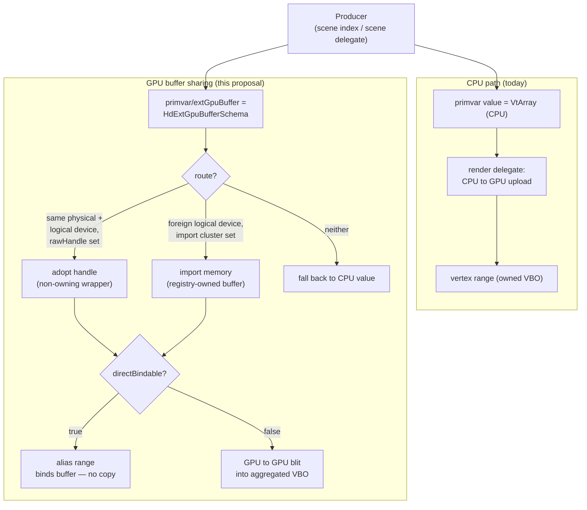
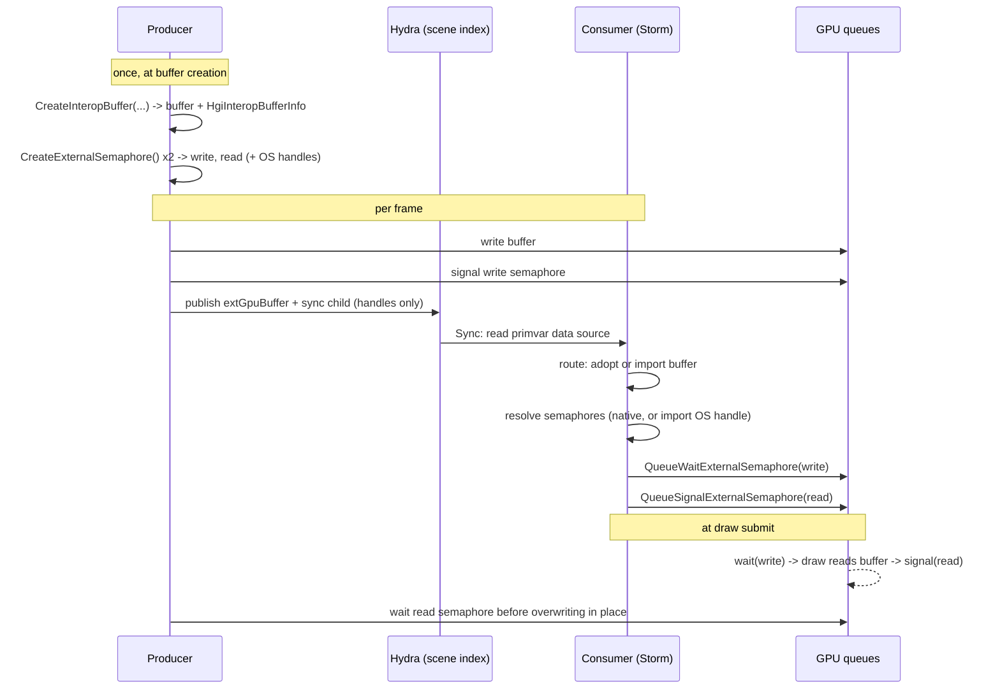

External GPU Buffer Sharing
===========================

Version 2 - August 13, 2026

## Contents

- [Background](#background)
- [What it is](#what-it-is)
- [How it works](#how-it-works)
- [Implementation status](#implementation-status)
- [Future Considerations](#future-considerations)

## Background

Hydra feeds geometry to a render delegate as CPU data: primvars are `VtArray`
values that flow through the scene index, and the render delegate uploads them
to the GPU when it builds its draw resources.

That model is a poor fit when the producer already holds the data on the GPU —
a GPU deformer, a GPU simulation, or any producer that shares a GPU context with
the renderer. To publish through the CPU primvar it must read the data back
(**GPU → CPU**), and the render delegate then uploads it again (**CPU → GPU**),
round-tripping data that never needed to leave the device. For animated
geometry this cost is paid every frame, and the readback tends to serialize the
GPU pipeline.

This proposal lets a producer hand Hydra a *handle* to a GPU buffer it already
owns, so the render delegate can bind or copy it on-device and skip the round
trip entirely.

## What it is

`HdExtGpuBufferSchema` is a typed container data source that a producer overlays
as a child of a primvar, under the token `extGpuBuffer`, describing an
**externally-owned GPU buffer** that backs that primvar. When it is present, it
becomes an alternative source of truth for the primvar's value: a render
delegate that understands it may consume the GPU buffer directly and never
require the CPU `VtArray`.

It sits as a child of the ordinary primvar container, alongside the value,
interpolation, and role:

```
primvars/points:
  primvarValue:  <empty or lazy VtArray>
  interpolation: vertex
  role:          point
  extGpuBuffer:                          # HdExtGpuBufferSchema
    backendApi, numElements, elementType, byteOffset, byteStride, directBindable
    rawHandle, rawHandleByteSize                       # adopt route
    externalMemoryHandle, externalHandleType,          # import route
      memoryBlockSize, memoryOffset, dedicated
    deviceUuid, logicalDeviceId                        # who owns it
    sync:                                # HdExtGpuSyncSchema (optional)
      backendApi, deviceUuid, logicalDeviceId, handleType, kind
      writeSemaphore, readSemaphore                    # adopt route
      externalWriteSemaphore, externalReadSemaphore    # import route
```

The schema describes the buffer, not how to bind it, so it stays **renderer- and
API-agnostic**:

| Member | Type | Meaning |
| --- | --- | --- |
| `backendApi` | `TfToken` | GPU API the handle belongs to — the same token Hgi reports via `Hgi::GetAPIName()` (`HgiTokens->OpenGL` / `Vulkan` / `Metal`). A consumer ignores `rawHandle` if it does not match the active backend. |
| `numElements` | `size_t` | Number of elements (e.g. vertices) the primvar addresses. |
| `elementType` | `HdTupleType` | Element type and tuple arity (e.g. `Float32`×3 for points). |
| `byteOffset` | `size_t` (optional) | Offset to the first element within the buffer. |
| `byteStride` | `size_t` (optional) | Byte stride between consecutive elements (`0` = tightly packed). |
| `directBindable` | `bool` | Hint: `true` = the buffer may be bound directly (zero-copy); `false` = the consumer should copy it into its own storage. |
| `deviceUuid` | `TfToken` (optional) | Physical device owning the memory, as 32 lowercase hex chars. Absent = "unknown", treated as a match. |
| `logicalDeviceId` | `uint64` (optional) | The logical device (`VkDevice`, `MTLDevice`) whose handle namespace `rawHandle` was minted in, unique within the process. `0`/absent = "unknown", treated as a match. |

### Naming the buffer: two routes

A buffer can be named two ways, and the difference is not cosmetic — it decides
whether the consumer can bind the producer's object or has to build its own.

**Adopt route** — for a consumer that shares the producer's context or logical
device:

| Member | Type | Meaning |
| --- | --- | --- |
| `rawHandle` | `uint64` | The native GPU buffer handle (GL buffer id, `VkBuffer`, `MTLBuffer`, …). |
| `rawHandleByteSize` | `size_t` (optional) | Total byte size of the underlying allocation; enables a bounds check. |

**Import route** — for a consumer on a different device or a different API, which
imports the underlying memory allocation and wraps it in a buffer of its own:

| Member | Type | Meaning |
| --- | --- | --- |
| `externalMemoryHandle` | `uint64` | OS-shareable handle (Win32 NT handle / fd) naming the memory **allocation**, not the buffer object. |
| `externalHandleType` | `TfToken` | `opaqueWin32` or `opaqueFd`. Required whenever `externalMemoryHandle` is set — never inferred, since a handle value can collide with a native `rawHandle`. |
| `memoryBlockSize` | `size_t` | Size of the whole memory block; the importer must allocate all of it, not just the bytes it uses. |
| `memoryOffset` | `size_t` | The buffer's offset **within that block** — distinct from `byteOffset`, which is this stream's offset within the buffer. Both may be non-zero. |
| `dedicated` | `bool` | Whether the allocation is a dedicated memory object; the importer must match or the import fails. |

The two routes are independent, and publishing both is the recommended default:
one publish then serves a consumer that shares the producer's device and one that
does not, without the producer having to know which it got.

**Two identities, because a handle has two ways of being foreign.** What makes
publishing both safe is that the consumer can tell whether `rawHandle` means
anything to it, and that takes two separate comparisons:

| Field | Answers | Governs |
| --- | --- | --- |
| `deviceUuid` | *Which GPU is the memory on?* | Whether the memory is reachable at all — an opaque handle only imports on the device that exported it, so a mismatch rules out **both** routes. |
| `logicalDeviceId` | *Which device object minted `rawHandle`?* | Whether the native handle is interpretable — a mismatch rules out **adopt only**, and the consumer imports instead. |

The second is not implied by the first. Two logical Vulkan devices on one physical
GPU report the *same* `deviceUuid` and hand out completely unrelated `VkBuffer`
values, so `backendApi` plus `deviceUuid` agreeing is not enough to justify
binding a foreign handle. Without a way to say which device object a handle came
from, that case is indistinguishable from a genuine same-device producer, and the
consumer binds an arbitrary object — which is why the field exists.

`logicalDeviceId` comes from `Hgi::GetLogicalDeviceId()`, a process-unique id
`HgiVulkan` draws from a monotonic counter at device creation. It is deliberately
opaque and process-local: it is an identity to compare, never a handle to use, and
nothing is serialized or shared across processes. Backends with no logical device
to name report `0`, as does GL, whose handle namespace is the context share group
rather than a device object.

`0`/absent therefore means "unknown" and is treated as a match, which keeps
producers written before the field working exactly as they did. That backward
compatibility is also the field's one sharp edge: **a producer that publishes
`rawHandle` without a `logicalDeviceId` is asserting it allocated on the
consumer's own device.** A producer that cannot report an id and cannot make that
promise should publish the import cluster alone.

Because it is an ordinary data source living under an ordinary primvar, it flows
through scene indices unchanged and is discoverable with `GetFromParent`. It
carries no dependency on any particular producer, and a consumer that does not
understand it simply reads the CPU value as before.

### Worked examples: the minimum, then every field

The four publishes below describe the same thing — the 8 corners of a cube as a
`points` primvar, `Float32`×3, 96 bytes — and differ in who allocated the buffer
and how much the producer chooses to say about it. They escalate: the least a
producer can publish, the same shape on Vulkan, then ordering, then reachability
from a foreign device. Values are illustrative.

**Minimal example — GL producer, GL consumer, nothing optional filled in.** This is the
entire schema a producer needs when it allocates in the same GL context the
renderer draws into:

```
primvars/points:
  primvarValue:  <empty VtVec3fArray>
  interpolation: vertex
  role:          point
  extGpuBuffer:
    backendApi:   "OpenGL"
    numElements:  8
    elementType:  {Float32, 3}
    rawHandle:    12               # a GL buffer name
```

Four members, which is exactly what `IsComplete()` demands: `backendApi`, a
non-zero `numElements`, a non-degenerate `elementType`, and one of the two routes.
The consequences of leaving the rest out are worth spelling out, because none of
them is quite neutral.

**`backendApi` is `"OpenGL"`, not `"GL"`.** It has to be spelled the way
`Hgi::GetAPIName()` spells it, since the consumer compares the two verbatim. The
schema's convenience builder `BuildBackendApiDataSource()` also accepts a shorter
`GL` token that no consumer matches, so publish `HgiTokens->OpenGL` and ignore it.

**Omitting `directBindable` opts out of zero-copy.** It defaults to `false`, which
selects the *copy* strategy: Storm adopts the handle as a blit source and copies
into its own aggregated vertex buffer, one GPU-to-GPU blit per dirty primvar per
frame. That is a reasonable default — the geometry stays inside Storm's
indirect-draw batches — but a producer that wants its buffer bound directly has to
ask for it. Omitting `rawHandleByteSize` similarly forfeits the bounds check:
`0` means unknown, so there is nothing for Storm to validate `byteOffset` and
`byteStride` against, and an overrunning descriptor is discovered by the GPU
instead of rejected.

**The absent identity fields are an assertion, not a shrug.** Missing
`deviceUuid` and `logicalDeviceId` both read as "unknown", which is treated as a
match, so this publish is implicitly promising that `12` is a valid buffer name in
the consumer's namespace. That promise holds here by construction, because `HgiGL`
issues into whatever GL context is current — the producer's own — but it is a
promise, and it is the reason a foreign-device producer cannot publish this
shape.

**There is no sync child, and it is optional here.** With a GL producer and a GL
consumer sharing one context, commands execute in submission order, so if the
producer records its write before Storm records its read the ordering is
implicit — no published semaphore, and nothing more for the producer to do. The
sync child earns its keep only when the two sides are *distinct* submissions that
GL cannot order for free — a separate producer queue, or a foreign-device /
foreign-API producer — which is what the Vulkan examples below add.

What this publish cannot do is serve a Vulkan consumer. Storm on Vulkan sees a
`backendApi` it does not match, finds no import cluster to fall back to, and reads
the CPU value instead. The rest of the examples are Vulkan-consumer publishes,
each adding what the one before it lacks.

**Minimal example — Vulkan producer, Vulkan consumer, same logical device and queue.** The
producer records its writes into the same Hgi the consumer draws with. This is what
`testHdStExtGpuBuffer_Vulkan` does: allocate through `Hgi::CreateBuffer` with
`initialData`, so the upload rides that Hgi's own command queue.

```
primvars/points:
  primvarValue:  <empty VtVec3fArray>
  interpolation: vertex
  role:          point
  extGpuBuffer:
    backendApi:         "Vulkan"
    numElements:        8
    elementType:        {Float32, 3}
    directBindable:     true
    rawHandle:          0x1f4a2c00       # a VkBuffer of device #1
    rawHandleByteSize:  96
    logicalDeviceId:    1                # == the consumer's
```

**There is no `sync` child, and that is correct here.** This is the one arrangement
where leaving it out is sound rather than optimistic. `HgiVulkan` has a single
`VkQueue` per device, so a producer recording into that same Hgi shares the
consumer's queue, submission order does the sequencing, and the memory dependency it
still needs is a `vkCmdPipelineBarrier` at the end of its own recording — something
the producer issues directly, not something scene description can carry. Disturb any
part of that and semaphores become mandatory: a second queue, a second device, or
writes issued through another API all break the single-stream assumption, and the
next two examples are exactly those cases.

**`logicalDeviceId` is published even though omitting it would also work.** In the
GL example above, absent identity fields were an implicit promise; here the same
promise is stated, so the consumer verifies it instead of trusting it. `deviceUuid`
is left out because a matching logical device id already implies the same physical
GPU — the converse does not hold, which is why the interop example needs both.
Everything else optional follows the reasoning from the GL example: `directBindable`
buys the zero-copy bind, `rawHandleByteSize` buys the bounds check.

**Sync example — Vulkan producer, Vulkan consumer, same logical device but different queues.** 
Same device as before, but the producer submits its own command buffers instead of 
recording into the consumer's Hgi: the buffer still needs no import, yet the accesses 
now need ordering.

```
primvars/points:
  primvarValue:  <empty VtVec3fArray>
  interpolation: vertex
  role:          point
  extGpuBuffer:
    backendApi:         "Vulkan"
    numElements:        8
    elementType:        {Float32, 3}
    directBindable:     true
    rawHandle:          0x1f4a2c00       # a VkBuffer of the consumer's device #1
    rawHandleByteSize:  96
    logicalDeviceId:    1                # == the consumer's, so adopt is safe
    sync:                                # the only addition to the publish above
      backendApi:       "Vulkan"
      logicalDeviceId:  1                # == the consumer's: native handles work
      kind:             binary
      writeSemaphore:   0x1f4a3100       # a VkSemaphore of device #1
      readSemaphore:    0x1f4a3180
```

**The queue, not the device, is what changed.** Nothing about the buffer differs
from the previous example; the producer merely submits its own command buffers, so
its writes and the consumer's reads are now independent streams, and Vulkan orders
nothing across streams. That makes the semaphores mandatory even though producer
and consumer share one logical device. This is what `--vulkanSync`
(`testHdStExtGpuBuffer_Vulkan_Sync`) exercises.

**No `handleType`, and no external semaphore fields.** That is what the matching
`logicalDeviceId` buys. The `VkSemaphore` handles mean something to the consumer as
they stand, so nothing is exported and nothing is imported; `handleType` is
required only when an external handle is actually present.

**The missing import cluster is the cost of this shape.** A consumer on a second
logical device, or on another GPU, has no route to this buffer at all and falls
back to the CPU value. Closing that gap is what the last example does.

**Interop example — producer allocated a Vulkan-exportable GL buffer on its own logical
device, same GPU.** This is the topology that actually reaches a Vulkan consumer
from a GL writer, and the one `--vulkanInterop`
(`testHdStExtGpuBuffer_Vulkan_Interop`) exercises. The producer
owns Vulkan device #7, allocates exportable memory there, has GL import that
allocation and writes the cube through it, and publishes everything:

```
primvars/points:
  primvarValue:  <empty VtVec3fArray>
  interpolation: vertex
  role:          point
  extGpuBuffer:
    backendApi:             "Vulkan"         # what rawHandle IS, not who writes
    numElements:            8
    elementType:            {Float32, 3}
    byteOffset:             0
    byteStride:             0                # tightly packed
    directBindable:         true
    rawHandle:              0x2b91d400       # a VkBuffer of the producer's #7
    rawHandleByteSize:      96
    deviceUuid:             "5d2c...a7"      # the consumer's GPU too
    logicalDeviceId:        7                # ...but not the consumer's device
    externalMemoryHandle:   0x000003b0       # the allocation GL imported and
    externalHandleType:     opaqueWin32      #   wrote through -- the route every
    memoryBlockSize:        65536            #   other consumer has to this data
    memoryOffset:           0
    dedicated:              false
    sync:
      backendApi:             "Vulkan"       # the semaphores are VkSemaphores
      deviceUuid:             "5d2c...a7"
      logicalDeviceId:        7
      kind:                   binary         # forced: GL has no timelines
      handleType:             opaqueWin32
      writeSemaphore:         0x2b91e900     # VkSemaphores of device #7
      readSemaphore:          0x2b91e980
      externalWriteSemaphore: 0x000003b4     # the same two, as OS handles
      externalReadSemaphore:  0x000003b8
```

Three things about this publish are easy to get wrong.

**`backendApi` is `"Vulkan"` even though GL does the writing.** The field describes
what `rawHandle` *is*, not who produces the data. Vulkan allocated the memory
because it must — `GL_EXT_memory_object` is import-only, so GL can never be the
exporter — and the GL buffer that aliases it is not published at all. It could not
usefully be: a GL buffer name is scoped to its context share group, the producer's
share group is not the consumer's, and no field in the schema qualifies a GL
namespace the way `logicalDeviceId` qualifies a Vulkan one.

**`rawHandle` is published even though almost nobody can use it.** Before
`logicalDeviceId` existed it had to be withheld, because a consumer had no way to
distinguish this publish from one made on its own device and would have bound
`0x2b91d400` as if it were its own. Labelled with device #7 it can be offered
honestly: a second consumer that happens to share the producer's device gets the
zero-copy adopt, and everyone else is steered to the import cluster.

**The semaphores are Vulkan objects that GL signals.** The producer creates them on
device #7, exports OS handles, and GL imports those to signal after its write —
which is why `sync.backendApi` is `"Vulkan"` rather than `"OpenGL"`, and why `kind`
is `binary`: GL has no timeline semaphores, so the writer's capability constrains
the whole handshake.

**What each consumer does with it.** The buffer route and the semaphore route are
decided by the same two comparisons, applied independently:

| Consumer | Outcome |
| --- | --- |
| Vulkan, logical device **#7** — the producer's own | **adopt** `rawHandle`; use the native semaphores |
| Vulkan, logical device **#1**, same GPU | ids differ → **import** the memory and the semaphores |
| Vulkan, **different GPU** | `deviceUuid` differs → **CPU fallback**; the memory is not reachable at all |
| GL | `backendApi` differs → attempts import, which `HgiGL` does not implement → **CPU fallback** |

Two details the table compresses. The `deviceUuid` mismatch in row three rules out
both routes, not just adopt, because an opaque handle is only importable on the
device that exported it — so unlike a `logicalDeviceId` mismatch, there is nothing
to fall back to but the CPU value. And the whole `sync` container is honored only
when `sync.backendApi` matches the consumer's backend, so the GL row ignores the
semaphores entirely rather than importing them.

## How it works

### The CPU path (baseline)

The GPU path mirrors the existing CPU primvar path, so it helps to state that
baseline first.

A producer publishes a primvar as a container data source under
`primvars/<name>`, holding the value, its `interpolation`, and its `role`. The
value is a `HdSampledDataSource` whose `GetValue()` returns a `VtValue` wrapping
a `VtArray<T>` — e.g. `VtArray<GfVec3f>` for points — that owns N elements of
CPU data. This container flows through the scene indices unchanged and is read
by the render delegate at the emulation boundary.

Note that `VtArray<T>` is a **convention, not a schema rule**. `GetPrimvarValue()`
returns an `HdSampledDataSource` and `GetValue()` returns a type-erased `VtValue`;
the schema places no constraint on the held type. What imposes the array shape is
the *interpolation* together with *consumer code*: every renderer reads the value
with `value.Get<VtArray<T>>()` and expects the length to match the interpolation
(`vertex` → one per point, `uniform` → one per face, `faceVarying` → one per
face-vertex, `instance` → one per instance; `constant` being the loose case — a
single value or a one-element array). So a `VtArray<T>` of the right length is
required *because that is what consumers pull*, not because anything validates it.
This is precisely why the GPU handle rides in the `extGpuBuffer` child rather than
the value slot (see *Alternatives considered*): the value slot stays a real —
possibly empty, or lazily materialized — `VtArray<T>` so existing `Get<VtArray<T>>`
consumers keep working, while the GPU description stays additive and ignorable.

The render delegate then turns that `VtArray` into its own draw resources. In
Storm the steps are:

- **Buffer source** — the array is wrapped in an `HdVtBufferSource`, an
  `HdBufferSource` that *holds the CPU bytes* and knows its element type and
  count. This is the type the external-GPU source (`HdStExtGpuBufferSource`)
  substitutes for.
- **Aggregation** — the source is registered with the resource registry, which
  places it in a **buffer array range (BAR)** — a sub-allocation inside a larger
  aggregated vertex buffer (VBO) shared with other prims of compatible layout,
  so many prims draw from few buffers.
- **Upload** — on commit, the registry copies the source's CPU bytes into that
  VBO region (**CPU → GPU**). On a `DirtyPoints`, the producer republishes the
  `VtArray`, and the delegate re-runs the upload to refresh the region.

So the CPU array is copied at least twice on the way to the GPU: once when the
producer materializes it (often itself a **GPU → CPU** readback if the data was
computed on-device), and again on the delegate's upload. The GPU buffer path
replaces the `HdVtBufferSource` with a source that carries a handle instead of
bytes, and either aliases that handle as its own BAR (direct bind) or blits it
GPU → GPU into the aggregated VBO — removing both copies.

### Producer side

A producer publishes the schema as the `extGpuBuffer` child of a primvar
container, alongside the usual primvar descriptor. The CPU value may be left
empty when a valid GPU buffer is published. The producer keeps the buffer alive
and coherent while it is published, and dirties the primvar when the buffer's
identity or contents change.

If the buffer is to be shared across APIs, the producer allocates it as
exportable — `Hgi::CreateInteropBuffer` returns both an owning `HgiBuffer` and an
`HgiInteropBufferInfo` describing the memory another API can import — and
publishes that description in the import cluster. It also creates the semaphore
pair with `Hgi::CreateExternalSemaphore` and publishes the handles under `sync`.
Both are one-time setup: only the per-frame signal recurs.

### Consumer side

Storm is used here as the example consumer; another render delegate would follow
the same shape, and the concrete `HdSt*` types below are its reference
implementation rather than part of the schema contract.

The render delegate reads the schema at the emulation boundary
(`GetRenderIndex().GetTerminalSceneIndex()->GetPrim(id).dataSource`), decodes it
once into a renderer-private descriptor, and turns it into a buffer source that
carries **no CPU payload**. In Storm this is three pieces:

- `HdStExtGpuBufferDesc` — the decoded, flattened descriptor (`FromSchema`).
- `HdStExtGpuBuffer` — a **non-owning** `HgiBuffer` wrapper around `rawHandle`;
  its destructor does not free the resource.
- `HdStExtGpuBufferSource` — an `HdBufferSource` whose CPU `GetData()` is never
  called; consumers detect it (via `dynamic_cast`) and take a GPU path.

`HdStMesh::_PopulateVertexPrimvars` (and the face-varying / element equivalents)
try to build an `HdStExtGpuBufferSource` from the schema **before** falling back
to the CPU `HdVtBufferSource`.

**Choosing a route.** Before deciding *how* to consume the buffer, the consumer
decides *whether* it can reach it at all. `HdSt_TryCreateExtGpuBufferSource`
picks one of three outcomes:

1. **Adopt** — `backendApi` matches the active Hgi, both the physical device and
   the logical device match, and `rawHandle` is set. Storm wraps the handle
   non-owningly and binds it.
2. **Import** — otherwise, if the physical device matches and the import
   cluster is present, Storm calls `Hgi::CreateBufferFromExternalMemory` to
   build its own buffer over the producer's allocation. This serves both
   consumption strategies: a `directBindable` stream is bound zero-copy, and a
   non-`directBindable` one is GPU→GPU blitted from the imported buffer into
   the aggregated VBO. Either way the CPU round trip is avoided, which for a
   foreign-device producer — one with no cheap CPU copy of its own — is cheaper
   than the CPU fallback, not more expensive.
3. **Fall back** — neither route is open; bump
   `HdStPerfTokens->extGpuBufferFallbackCount` and return null, so the caller
   reads the CPU primvar.

Imported buffers are **owned and cached by `HdStResourceRegistry`**, not by the
buffer array range, and are released when the registry is destroyed. Caching is
mandatory rather than an optimization: importing per Sync would allocate a
`VkDeviceMemory` every frame. The cache key is the device UUID, handle type,
memory offset, byte size, *and* the handle value — the handle has to be part of
it, because two dedicated allocations both report `memoryOffset` 0 and would
otherwise collide, handing back a buffer over the wrong memory.

Once a route is chosen, the `directBindable` hint selects the consumption
strategy:

**Direct bind (zero-copy) — `directBindable = true`.** The source goes into an
`HdStExtGpuBufferArrayRange`, a buffer array range that *aliases* the producer's
GPU buffer instead of owning storage; Storm binds the external handle directly.
A byte-only update (producer overwrites the same handle in place) is seen at the
next draw with no work; a change of handle or element count is applied as an
in-place range update that keeps the range pointer stable and avoids draw-batch
invalidation. This path is not aggregatable — each buffer is its own binding.

**Copy into aggregated storage — `directBindable = false`.** The source is
aggregated normally, and the aggregation strategy's `CopyData` detects the
external source and performs a **GPU → GPU blit** into Storm's own vertex
buffer, instead of a CPU upload. The blit source is whatever the route
resolved — the adopted handle on the adopt route, or the imported buffer on the
import route — so this strategy works for both; `CopyData` reads a single
resolved `HgiBuffer` and does not care how it was named. The geometry stays
inside Storm's indirect-draw batches, at the cost of one blit per dirty primvar
per frame for animating geometry.



### Validation and fallback

The GPU path is an optimization that always degrades safely to the CPU path:

- **Backend match** — if `backendApi` does not match the active backend, the
  consumer will not adopt `rawHandle`. It may still take the import route, which
  is API-neutral: imported memory is memory, whoever allocated it.
- **Device match** — an opaque external handle is only importable on the physical
  device that exported it, so a `deviceUuid` that disagrees with the consumer's
  own device rules out both routes. An absent UUID on either side means "unknown"
  and is treated as a match, so producers predating the import cluster keep
  taking the adopt path.
- **Handle namespace match** — a `logicalDeviceId` that disagrees with
  `Hgi::GetLogicalDeviceId()` rules out *adopt* while leaving import open, since
  the memory is still reachable even though the producer's buffer object is not
  interpretable. `0` on either side means "unknown" and is treated as a match.
- **Completeness / bounds** — `IsComplete()` requires `backendApi`,
  `numElements`, `elementType`, and at least one of the two routes (a
  `rawHandle`, or `externalMemoryHandle` together with `externalHandleType`). A
  schema whose `byteOffset + numElements * stride` exceeds `rawHandleByteSize`
  is rejected, and the bounds check runs *before* any import, so a bad
  descriptor never allocates device memory.
- **No CPU coupling** — the schema is a child of the primvar, so a consumer that
  does not implement it falls through to the CPU value automatically.

### Synchronization

Sharing a buffer is only half the problem: the consumer must not read bytes the
producer has not finished writing, and the producer must not overwrite bytes the
consumer is still reading. Two ordering edges, in both directions:

- **RAW (read-after-write)** — the consumer's read must not begin before the
  producer's write completes, so a draw never samples a half-written buffer.
- **WAR (write-after-read)** — the producer must not overwrite in place (or free)
  before the consumer's read completes. Deallocation is the terminal WAR case.

A CPU-side refcount cannot express either edge. It answers "may I deallocate?", a
lifetime question, whereas RAW and WAR are about the relative ordering of
*in-flight GPU work* on the GPU timeline. So they need queue-level wait/signal.

The converse is equally true and easier to miss: **a semaphore cannot express
lifetime either, so calling deallocation the terminal WAR case understates it.**
Freeing needs two independent facts — that submitted work has finished, which is
the WAR edge, and that no *new* work can be created that reads the buffer, which no
queue primitive can report because the consumer still holds the buffer and a clean
frame re-binds it without re-running Sync. That second half is a reference
question, and it is why *Lifetime* below is a separate mechanism rather than part
of synchronization.

`HdExtGpuSyncSchema` carries these as an optional `sync` child *inside*
`extGpuBuffer` — the sync objects are 1:1 with the buffer they guard, so nesting
keeps the association explicit and preserves graceful degradation at both levels:
a consumer that implements `extGpuBuffer` but not `sync` ignores the child and
falls back to implicit ordering; one that implements neither never descends into
it.

| Member | Type | Meaning |
| --- | --- | --- |
| `backendApi` | `TfToken` | API that created the semaphores. A consumer ignores the whole container if this does not match its active backend. |
| `writeSemaphore` | `uint64` | Native handle the producer signals after writing; the consumer waits on it (RAW). Same logical device only. |
| `readSemaphore` | `uint64` | Native handle the consumer signals after reading; the producer waits on it before overwriting (WAR). Same logical device only. |
| `externalWriteSemaphore` | `uint64` | OS-shareable handle for the write semaphore, so a consumer on another device can import it. |
| `externalReadSemaphore` | `uint64` | OS-shareable handle for the read semaphore. |
| `handleType` | `TfToken` | `opaqueWin32` / `opaqueFd`. Required whenever either external handle is set. |
| `kind` | `TfToken` | `binary` or `timeline`. Absent means binary. A consumer that cannot honor the stated kind must ignore the container rather than guess. |
| `deviceUuid` | `TfToken` | Physical device owning the semaphores, compared exactly as the buffer's. |
| `logicalDeviceId` | `uint64` | Logical device that created the semaphores, compared exactly as the buffer's. A native `VkSemaphore` is namespaced like a native `VkBuffer`, so it takes the same check. |

The native/external split mirrors the buffer's adopt/import split, and the
consumer resolves each semaphore the same way: prefer the native handle when the
producer shares both its physical and its logical device, otherwise import the OS
handle via `Hgi::ImportExternalSemaphore` (cached on the resource registry, like
imported buffers).

**As shipped, the semaphores are binary, not timeline.** A timeline semaphore is
the more natural primitive, since a monotonic 64-bit value avoids per-frame object
churn on an edge that recurs every frame. The implementation uses binary
semaphores instead, for one reason: OpenGL cannot do better.
`GL_EXT_semaphore` can import an external semaphore but can only wait and signal
it as **binary**, with no value — and a GL producer is the motivating case. Since
a binary-only participant forces binary on the whole handshake, the timeline path
would have been dead code until a Vulkan-to-Vulkan producer appeared. The `kind`
field records which flavour is in play so a timeline path can be added without a
schema change.

The consequence is that the per-frame *values* problem disappears along with the
timeline: there is nothing to advance, so no runtime handshake object is needed to
carry them. The schema alone is sufficient, and everything stays in data sources.

**Hgi surface.** Four methods carry the whole contract, all defaulting to no-op
or "unsupported" so backends opt in:

```cpp
// Producer side: create a semaphore whose signal state is exportable, returning
// a backend-native handle plus an OS handle for the other API to import.
uint64_t CreateExternalSemaphore(uint64_t* outExternalHandle);
void     DestroyExternalSemaphore(uint64_t semaphore);

// Consumer side: make the NEXT queue submission wait on / signal a semaphore.
void QueueWaitExternalSemaphore(uint64_t semaphore);    // RAW
void QueueSignalExternalSemaphore(uint64_t semaphore);  // WAR
```

Note that `QueueWait`/`QueueSignal` attach to the *next* submission rather than
taking a command buffer. The consumer discovers the sync container during Sync,
which is well before the draw is submitted, so the pending wait is recorded and
rides along on whatever submission the draw ends up in.

**How the calls interleave.** The producer creates the semaphores once and
signals per frame; Hydra only transports handles and never touches a queue; the
consumer waits and signals around its draw:



The asymmetry is worth naming: the consumer's two calls are *enqueued* during
Sync but *execute* at submit, so both edges are resolved on the GPU timeline with
no CPU stall on either side.

**Binary semaphores impose a counting discipline.** Each wait consumes exactly
one signal. If the consumer's Sync runs more than once between submissions, it
would enqueue two waits against a single signal, and the second never completes —
a hang rather than a visible failure. This is the sharpest edge in the current
design and the first thing to suspect if a shared-buffer frame stops advancing.

**Lighter-weight alternatives** remain valid where they apply. Within one API and
one context or share group, no external semaphore is needed at all — a `GLsync`
plus a producer-side flush covers ordering, and the test harness falls back to
`glFinish` when semaphore import is unavailable. Where memory allows,
**N-buffering** beats a tight WAR handshake: the producer writes buffer *i+1*
while the consumer reads *i*, which the alias range already expresses since the
handle may change per frame, converting per-frame WAR stalls into "do not recycle
buffer *i* until its read completes."

### Lifetime

Synchronization orders work; it cannot tell the producer when the allocation is
unreferenced. That is a separate mechanism, and it is deliberately not a schema
member.

**The consumer retains the data source carrying whichever handle it bound** — the
one naming the memory, so `rawHandle` on the adopt route and
`externalMemoryHandle` on the import route — and hands it to the buffer that binds
it, as an opaque `std::shared_ptr<void>` on `HgiBuffer` that Hgi never interprets.
A producer wanting lifetime tracking publishes a data source that *owns* the
allocation rather than a plain retained value, and learns from its release that the
buffer is free. No new schema member, no out-of-band object, and nothing asked of a
producer that manages lifetime some other way.

Retention deliberately follows the published *value*. A filter that substitutes a
different handle releases the allocation the old one named, which is correct — the
substituted buffer is what gets bound.

**Anchoring the reference to the `HgiBuffer` rather than to the consumer's buffer
array range is what makes one signal sufficient.** Backends destroy buffers through
a garbage collector that records which command buffers were in flight when the
object was trashed and deletes only once those have retired. So the reference drops
only when both facts hold: the consumer let go, *and* no submission that could name
the buffer is outstanding. The producer needs neither a fence nor a pumped frame.

```
range released ──▶ Hgi::DestroyBuffer ──▶ trashed, inflight bits recorded
                                                │
                        command buffers retire ──┘
                                                ▼
                        HgiBuffer destroyed ──▶ keepalive released
                                                ▼
                                    producer frees or recycles
```

Inside the renderer the same idea covers the consumer's own resources: an imported
buffer is shared by every prim naming that allocation and released when the last
range lets go, rather than pinned until renderer teardown.

Three limits worth stating rather than implying uniformity. Storm's generic OpenGL
wrapper is deleted directly rather than collected, so on that path the reference is
released when the range goes away and the GPU half is inherited from GL's own
deferred object deletion instead of provided here. A filter that *copies* the handle
value into a data source of its own breaks the chain while still using the
allocation, which is why this is a convention a producer opts into rather than
something the scene description enforces. And the deleter runs on whichever thread
drops the last reference — usually during garbage collection — so it must be
thread-safe, must enqueue rather than call GPU APIs inline, and a producer must not
*block* waiting for release on the thread that drives the frame, since collection
happens at frame end and the wait would deadlock against it.

Note what this does not cover: overwriting in place. There the count never reaches
zero, because the consumer legitimately holds the buffer across frames, so
recycling still needs the WAR edge above.

### Cross-API memory interop

The import route above rests on a fact that inverts the obvious ownership model:
**OpenGL cannot export memory.** `GL_EXT_memory_object` is import-only, so a
buffer GL allocated natively can never be handed to Vulkan zero-copy, no matter
what the schema says. Sharing therefore requires that the **Vulkan side
allocate** exportable memory and GL import it — even when GL is conceptually the
producer that writes the data.

That leaves two viable topologies, and the schema serves both:

| Topology | Who allocates | What the producer publishes | Consumer route |
| --- | --- | --- | --- |
| **Same-device** | The consumer's own Vulkan device | `rawHandle` + its `logicalDeviceId` | adopt |
| **Foreign-device** | The producer's own Vulkan device | the import cluster + external semaphore handles, and optionally `rawHandle` labelled with its own `logicalDeviceId` | import |

The foreign-device topology is the realistic one for a producer whose buffer
allocation must not depend on the renderer being loaded, on a particular backend,
or on the consumer's device outliving the buffer. A producer that owns its own
Vulkan device cannot hand a bindable `VkBuffer` to a consumer on a *different*
logical device even on the same physical GPU, so what the consumer binds is its
own buffer over the same allocation. It can still publish the `VkBuffer`
alongside, since `logicalDeviceId` tells the consumer whether the handle is
interpretable, and a second consumer that happens to share the producer's device
then gets the adopt route from the same publish.

Two constraints follow from the platform mechanisms rather than from the design:

- **Same physical device.** Opaque handles (`opaqueWin32` / `opaqueFd`) are only
  importable on the device that exported them. A mismatch between the producer's
  device, the consumer's device, and the GL context's device is a hard import
  failure, which is why `deviceUuid` is compared before either route is taken.
- **Handle ownership differs by platform.** On Win32, neither
  `glImportMemoryWin32HandleEXT` nor `VkImportMemoryWin32HandleInfoKHR` takes
  ownership, so one handle can serve several importers and the app closes it. On
  Linux, fd import *transfers* ownership, so each importer needs its own `dup()`.
  Getting this wrong leaks or double-closes rather than failing visibly.

On the consumer side, an imported buffer owns its `VkBuffer` and its memory
*reference*, but not the allocation, which stays alive as long as any importer
holds it. Because interop buffers are allocated `VK_SHARING_MODE_EXCLUSIVE`, the
import also issues a one-time acquire barrier from `VK_QUEUE_FAMILY_EXTERNAL` to
make the producer's writes visible. It is emitted once at import rather than per
frame, since re-acquiring a buffer the device already owns is pointless. The
matching producer-side *release* barrier is not emitted for a GL producer,
because `GL_EXT_memory_object` offers no way to express one; a Vulkan producer
should release to `VK_QUEUE_FAMILY_EXTERNAL`.

### Fallback and capability negotiation

The mechanism above is safe — a consumer that does not understand `extGpuBuffer`
simply reads the primvar value — but whether that fallback actually *renders*
depends on what the producer left in the value slot. A producer that publishes
GPU-only (empty `VtArray` + `extGpuBuffer`) avoids the readback the proposal
exists to remove, but a non-supporting consumer then reads an empty array and
the prim disappears. Publishing both a full CPU `VtArray` and the schema is
always fallback-correct, but pays the GPU → CPU readback every frame — defeating
the optimization. So the producer is otherwise forced to choose between "fast"
and "portable."

The robust way out is a **lazy CPU value**: the producer publishes the
`extGpuBuffer` child alongside a value data source whose `GetValue()`
materializes the CPU array *only if it is actually pulled*.

- A GPU-aware consumer reads the child and never pulls the value → no readback.
- A non-supporting consumer pulls the value → the readback runs on demand →
  correct fallback.

Because Hydra is pull-based, this needs no negotiation and scales to multiple
simultaneous consumers (e.g. two viewports, or Storm plus a path tracer):
whichever consumer needs CPU data triggers the readback; the others never do.
The cost is that the fallback readback then happens mid-frame on the consuming
thread, which is acceptable for a correctness path that only fires when needed.

Concretely, the lazy value is **not** a `VtArray` of placeholder data — the
primvar value slot is a *data source*, so it is a custom `HdSampledDataSource`
that holds no CPU copy and does the readback inside `GetValue()`:

```cpp
// Sits in the primvar's `primvarValue` slot in place of a retained VtArray.
// Holds only a handle/closure for the producer's GPU buffer plus its element
// count; the GPU -> CPU readback runs only if GetValue() is actually pulled.
class _LazyReadbackDataSource final : public HdSampledDataSource
{
public:
    HD_DECLARE_DATASOURCE(_LazyReadbackDataSource);

    VtValue GetValue(Time /*shutterOffset*/) override {
        std::call_once(_once, [this] {
            VtVec3fArray pts(_numElements);
            // Producer owns the buffer, so the readback lives producer-side:
            // map/copy device memory (glGetBufferSubData, a staging copy,
            // clEnqueueReadBuffer, ...) into pts.
            _readBack(pts.data(), _numElements * sizeof(GfVec3f));
            _cached = VtValue(pts);        // cache: only the first pull pays
        });
        return _cached;
    }

    bool GetContributingSampleTimesForInterval(
        Time, Time, std::vector<Time>*) override { return false; }

private:
    _LazyReadbackDataSource(ReadFn readBack, size_t numElements)
        : _readBack(std::move(readBack)), _numElements(numElements) {}

    ReadFn _readBack;                      // producer-supplied GPU->CPU copy
    size_t _numElements;
    mutable std::once_flag _once;
    mutable VtValue        _cached;
};
```

The producer publishes it exactly where the CPU array goes today, with the
schema overlaid on the same primvar:

```cpp
HdPrimvarSchema::Builder()
    .SetPrimvarValue(_LazyReadbackDataSource::New(readFn, numPoints))  // lazy
    .SetInterpolation(vertex).SetRole(point).Build();
// + overlay { extGpuBuffer: HdExtGpuBufferSchema(...) } on the same primvar
```

Two consequences worth noting. The readback logic lives **producer-side** (it
owns and knows how to map its buffer); the schema and consumers never learn to
read foreign memory. And invalidation follows the ordinary Hydra model: data
sources are immutable, so rather than mutate the cache, a producer that changes
the buffer contents **dirties `primvars/points` and republishes a fresh data
source instance** — the new instance re-reads on its next pull, the stale one is
dropped.

Providing the GPU buffer plus a lazy CPU value is enough on its own, and is the
recommended approach. A separate renderer-capability query — e.g. a new
`HdRenderDelegate::IsExtGpuBufferSharingSupported()` — was considered as a way to
let the producer skip wiring up the lazy readback entirely, but it turns out to
add little:

- **Support is per-primvar, not per-renderer.** In practice a scene mixes CPU-
  and GPU-backed primvars within a single renderer, so a renderer-wide boolean
  cannot tell the producer what to do for any given prim. The lazy value already
  resolves this at the right granularity, one primvar at a time, with no query.
- **It would only avoid setting up the lazy path**, not change correctness —
  and the lazy path costs nothing until it is pulled. With multiple active
  consumers the flag would also have to be combined as an intersection (drop CPU
  only if *every* delegate supports sharing), adding negotiation logic for a
  marginal saving.

So the capability check stays out of the schema contract; publishing the GPU
buffer with a lazy CPU value is both sufficient and correct.

### Dirtying

Updating shared geometry uses the ordinary primvar dirtying model: the producer
dirties the primvar's locator (e.g. `primvars/points`), which maps to
`HdChangeTracker::DirtyPoints`, and the render delegate re-reads. The cost now
depends on the mode:

- **Direct bind, stable handle** — re-reading rebinds the same handle in place,
  no copy. For a pure byte-only deformation the dirty is largely redundant: the
  alias already exposes the new bytes at the next draw, so it can be elided
  except where the delegate must recompute derived data (e.g. smooth normals)
  from the moved points.
- **Copy into aggregated storage** — `DirtyPoints` drives the GPU → GPU blit that
  refreshes the aggregated buffer, and is required each frame the data changes.

A static mesh can therefore aggregate and batch from the first frame, while an
animating mesh backed by a stable GPU handle can reach a near-zero per-frame
publish cost.

On the import route the same reasoning holds, with one addition: a change of
`externalMemoryHandle` (or of the allocation's size or offset) is a different
cache key, so the consumer imports afresh rather than reusing the previous
buffer. In-place byte updates to the same allocation stay free, so a producer
that wants the cheap path should keep its allocation stable and overwrite it —
which is exactly the case the WAR edge exists to make safe.

### Instancing

Instancing meets buffer sharing on two independent axes, matching Hydra's split
between a prototype rprim and its instancer.

**Prototype primvars.** A prototype's geometry (points/normals/uv) is stored
once and drawn N times by an instanced draw — instances inherently refer to that
single buffer. So an external GPU buffer on a prototype primvar needs no
instancing-specific handling: it is the same prototype vertex buffer, bound once
and drawn N times, whether direct-bound or copied. A zero-copy alias range is
compatible with instanced draws because the draw reads each item's base offset
and element count independently of the instance count. (The only nuance is batch
aggregation — a direct-bound prototype forms its own draw batch instead of
aggregating with normally-uploaded prototypes; a cost/parallelism trade-off, not
a correctness issue.) `numElements` here is the prototype's vertex count, exactly
as in the non-instanced case.

**Instancer primvars.** The per-instance data an instancer carries (instance
transforms, or translate/rotate/scale) is a *separate* buffer published on the
**instancer** prim, not the prototype. When a producer computes this on the GPU
(a GPU/particle instancer), it can publish `extGpuBuffer` on the instance primvar
exactly as for geometry, with `numElements` equal to the **instance count**. The
consumer builds the source in its instance-primvar population step and
direct-binds or copies it as usual. This is often the higher-value share: for
large, animating instance counts the transform buffer dominates, and sharing it
avoids reading back and re-uploading one transform per instance every frame,
whereas the prototype geometry is bound once regardless.

A single GPU buffer can even back several per-instance streams at once: each
primvar publishes its own schema pointing at the same buffer (the same
`rawHandle`, or the same `externalMemoryHandle` and `memoryOffset`), with
`byteOffset`/`byteStride` selecting its region. So both layouts work:

- **AoS** (each instance = `{mat4 xform, vec4 color, …}`): xform → offset 0,
  stride = struct size; color → offset 64, stride = struct size.
- **SoA** (all transforms, then all colors): xform → offset 0, stride 64;
  color → offset = transforms-region size, stride 16.

Nested instancing needs no special handling — each nesting level is its own
instancer with its own instance-primvar buffer, so the same per-instancer
consumption applies at every level.

Two considerations are specific to instancer primvars: `numElements` must be the
instance count (the consumer uses it to bound instance indices), and a shared
instance-transform buffer must already be in the renderer's expected matrix
layout/precision, since the GPU path skips the CPU matrix conversion the value
path would otherwise perform (sharing plain translate/rotate/scale vectors avoids
that).

### Alternatives considered

**Carry the GPU buffer in the primvar value itself.** Rather than add a schema,
the GPU handle could ride in the same value slot that holds CPU data — either as
a custom struct wrapped in a `VtValue`, or stuffed into a `VtArray`. It is
tempting because the primvar value plumbing already exists, but it was rejected:

- **It is not an array.** A GPU buffer is one opaque descriptor of a dozen-odd
  heterogeneous fields (handle, backend, offset, stride, type, count, external
  memory handle, device UUID, …), not N elements of vertex data. A `VtArray` holds a single typed array, so it can
  carry at most the handle; the remaining fields would need sibling data sources
  anyway — a hand-rolled schema without the type safety. Wrapping the descriptor
  as a struct in a `VtValue` is the other option, but that is exactly the older
  POD-in-`VtValue` design this schema replaced.
- **It breaks un-updated consumers.** Every reader of a primvar does
  `value.Get<VtArray<GfVec3f>>()` / `IsHolding<…>()` — extent and bounds
  computation, CPU fallback, refinement, picking, other render delegates. If the
  value slot holds a GPU descriptor instead of points, those either read empty or
  misinterpret it. Keeping the GPU info in a *separate child* leaves the value
  slot legitimately empty, so a consumer that does not understand the child falls
  through to the CPU value automatically.
- **Value semantics fight GPU ownership.** `VtArray` is copy-on-write and freely
  copied, detached, and mutated; the shared handle is non-owning and must not be.
  A container built for value-semantic CPU arrays is the wrong home for it.

The child-schema overlay avoids all three: it is discoverable and introspectable,
gives typed accessors plus an `IsComplete()` check, composes onto the existing
primvar without disturbing its value, and follows the same idiom as
`HdPrimvarSchema` and `HdExtComputationSchema`.

**Extend a polymorphic `HdBuffer` type and carry it in the value.** A refinement
of the above: define a buffer type that can be either CPU- or GPU-backed (ask it
for bytes or for a handle) and return it as the primvar value, so one type serves
both consumers. The abstraction is sound, but its placement is wrong:

- **It already exists one layer down.** The render delegate's buffer-source layer
  is exactly this abstraction — `HdBufferSource` (base), `HdVtBufferSource` (CPU
  bytes), `HdStExtGpuBufferSource` (GPU handle, no CPU payload). GPU concepts
  belong *inside* the delegate; the scene index above it is deliberately renderer-
  and API-agnostic, and pushing a GPU-capable buffer up into the primvar value
  leaks device concepts into the scene description.
- **It changes the universal value contract.** Every render delegate and every
  value-inspecting scene-index filter is written to "`GetValue()` returns a
  `VtValue` holding `VtArray<T>`." Redefining the value to "an `HdBuffer`" forces
  all of them to migrate, whereas the additive child schema leaves old code
  untouched. `VtArray` also remains the wrong container — a length-1 array of one
  buffer object is a category error against consumers that expect
  `value.size() == numElements`.
- **It converges with the lazy value anyway.** For a CPU consumer such a buffer's
  "give me bytes" accessor would have to read back from the GPU on demand — which
  is exactly the lazy CPU value described under *Fallback*. So the same "one thing
  serves both consumers" benefit is available without touching the value contract:
  the `extGpuBuffer` child carries the handle, and a lazy value data source
  supplies bytes only if pulled.

If a single scene-level source of truth were genuinely wanted instead of "child
schema + lazy value," it would have to be a **new data-source type**, not an
`HdBuffer` smuggled through the legacy `VtArray` value slot — a large breaking
change for little gain over the additive schema.

## Implementation status

Both schemas (`HdExtGpuBufferSchema`, `HdExtGpuSyncSchema`) are generated from
`hdSchemaDefs.py`. Storm is the reference consumer; `HgiVulkan` is the only
backend implementing the interop surface.

| Piece | Status |
| --- | --- |
| Core schema, adopt route, direct-bind and blit strategies | Landed |
| Binary RAW/WAR semaphores, native and imported | Landed |
| Foreign-memory import route | Landed |
| Import + blit for non-`directBindable` foreign producers | Landed — the blit is route-agnostic, reading the imported buffer with no new plumbing; covered by `testHdStExtGpuBuffer_Vulkan_Interop_Copy` |
| Imported-buffer cache, refcounted — released when the last consumer range lets go, not at renderer teardown | Landed |
| Imported-semaphore cache | Landed, but registry-owned for the whole session; refcounting it needs the command queue's pending wait/signal lists to hold a reference first |
| Producer-observable allocation lifetime — keepalive on `HgiBuffer`, retained from the data source carrying the bound handle | Landed |
| `HgiVulkan` interop surface (create/import buffer, create/import semaphore, device UUID, logical device id) | Landed |
| `logicalDeviceId` on both schemas, gating adopt for buffers and native semaphores | Landed |
| `HgiGL` | Adopt only — GL cannot export memory or own an exportable semaphore |
| `HgiMetal` | **Not implemented, and not merely missing:** its generic buffer wrapper would misinterpret a foreign handle, so a consumer should reject `backendApi=Metal` until a real Metal path exists |
| Timeline semaphores | Not implemented; see below |
| Linux / `opaqueFd` | Schema and Hgi surface allow it; only Win32 is exercised |

Coverage comes from `testHdStExtGpuBuffer`, which renders the same cube (and an
instanced grid) through the CPU primvar path and the shared-buffer path and
compares pixels, in these producer topologies and consumption strategies:

- default — Storm's own `Hgi` allocates a plain buffer; adopt route.
- `--vulkanSync` (`testHdStExtGpuBuffer_Vulkan_Sync`) — a Vulkan producer
  allocates the buffer on the consumer's own device and writes it in its own
  independent submission; adopt route with native RAW/WAR semaphores.
- `--vulkanInterop` (`testHdStExtGpuBuffer_Vulkan_Interop`) — a
  *second* `HgiVulkan` stands in for a producer with its own device; import route
  with imported semaphores. This is the acceptance case, since the single-device
  topology cannot by construction catch device-mismatch or UUID-negotiation bugs.
  It publishes `directBindable = true`, so it covers import + zero-copy alias.
- `--vulkanInterop --copy` (`testHdStExtGpuBuffer_Vulkan_Interop_Copy`) — the
  same two-device import topology, but publishing `directBindable = false`, so
  Storm imports the foreign allocation and then GPU → GPU blits it into its
  aggregated VBO. This covers the import + blit path that the direct-bind interop
  test does not.

All of them publish `logicalDeviceId`, so the matching path is exercised, but
none yet publishes a `rawHandle` from a *foreign* logical device — the case the
gate exists for. Covering it means having the two-device producer offer both handles
and asserting the import route is still taken, which is worth adding since the
failure it guards against is an adopted handle from the wrong namespace: undefined
behaviour rather than a clean error.

## Future Considerations

### Timeline semaphores

Binary semaphores are what ship, because GL forces them (see *Synchronization*).
A Vulkan-to-Vulkan producer has no such constraint, and for it a timeline
semaphore is the better primitive: one monotonic 64-bit value instead of per-frame
object churn, and no exposure to the wait/signal counting hazard that binary
semaphores carry. The `kind` field already distinguishes the two, so this is an
additive change. It is a trade rather than a free upgrade, though, for the reason
developed below.

What makes it more than a drop-in is that per-frame **values** come back. A binary
semaphore is just "signalled or not", so the schema holds the whole story in a
handle that never changes. A timeline wait or signal is a *pair* — the semaphore
plus a 64-bit value — and the value advances every frame. So each frame the
consumer must learn which value to wait for, and the producer must learn which
value the consumer will signal when its read completes.

Those values cannot live in a data source. Data sources are immutable, so changing
a published value means building a new instance and dirtying the locator, which
pushes change notification through every downstream scene index and can force the
prim to re-Sync. That is a fair price for "the points moved" and an absurd one for
"increment a counter", which is otherwise a single atomic add.

The alternative is to pass the values through a small **runtime handshake object**
that producer and consumer both hold a pointer to, handed over out-of-band at
setup rather than carried as scene data. It is a handshake because it is
bidirectional: the producer publishes the write value it just signalled (RAW), and
the consumer registers the read value it promises to signal (WAR).

```cpp
class HdExtGpuBufferSync {
public:
    // RAW: producer's latest write completion the consumer must wait for.
    virtual HgiSemaphoreSubmit GetWriteCompleteWait() = 0;
    // WAR: consumer registers the read-completion it will signal; the producer
    // waits on this value before overwriting/freeing the buffer.
    virtual HgiSemaphoreSubmit AcquireReadCompleteSignal() = 0;
};
```

This would be **the one non-serializable handle in the design**, and the
distinction is worth stating precisely. Everything else in the schema —
`rawHandle`, `externalMemoryHandle`, sizes, tokens — is plain data: values that can
be written into a data source, printed, diffed, or recorded. They are
process-scoped in the sense that a GL buffer id means nothing elsewhere, but they
remain numbers a consumer interprets by documented API rules. A C++ interface
pointer differs in kind: it is a live vtable pointer to an object with *behaviour*,
meaningful only inside the address space that built it and only to code compiled
against the same ABI. It is the single place the design would stop being "scene
description is data."

The coupling that introduces is acceptable because it is **not a new
restriction**. Buffer sharing already requires producer and consumer to share a
process — they share a device or context, and the handles are only interpretable
there — so requiring the handshake object to be in-process forbids nothing that
was otherwise possible.

The real cost is **observability**, not portability. A value travelling through an
opaque pointer is invisible to scene-index filters: a filter that reroutes or
copies prims passes it along with no way to inspect or intercept it, and
record-and-replay tooling cannot reproduce the frame. This is the sense in which
the binary design is better than it first appears — with no values to advance,
nothing travels out-of-band and the entire contract stays inside data sources. So
the timeline upgrade is worth it for a Vulkan-to-Vulkan producer that would
otherwise hit the counting hazard, and not otherwise.

**A timeline does not solve deallocation, and is not even needed for it.** Worth
settling explicitly, since framing deallocation as the terminal WAR case invites
the opposite conclusion. What a timeline genuinely fixes is four things about the
shipped path: a wait no longer consumes a signal, so the counting hazard goes away;
the CPU can *poll* progress with `vkGetSemaphoreCounterValue`, where a binary
semaphore offers no query at all and can only be waited on — a deadlock on the
frame thread; values name which submission completed, so a signal that rode an
unrelated `Flush` becomes detectable rather than silently early; and
wait-before-signal is legal, so correctness stops depending on setup order.

All four are about *ordering*. None tells the producer that no future submission
will name the allocation, which is the other half of freeing. That half is answered
by the keepalive in *Lifetime*, which also supplies the ordering half for free:
`Hgi::DestroyBuffer` on the backends that matter does not delete but trashes,
recording the command buffers in flight at that moment and deleting only after they
retire. So the reference is released only when both facts hold — conservatively, by
construction, with no agreed value semantics and no out-of-band handshake object.
Which also means it does not depend on timeline support, and therefore already
works for the GL producer that motivates the whole design.

The two mechanisms partition rather than compete. Refcounting covers teardown,
freeing and handle-swap; a timeline covers the case refcounting cannot touch,
overwriting in place at frame rate, where the count never reaches zero because the
consumer legitimately holds the buffer across frames.

The backend capabilities that shape this:

| API | Buffer sharing | Sync primitive | Timeline values | External handle |
| --- | --- | --- | --- | --- |
| **Vulkan** | `VK_KHR_external_memory_{fd,win32}` | `VkSemaphore` | Yes (`VK_KHR_timeline_semaphore`) | `VK_KHR_external_semaphore_{fd,win32}` |
| **Metal** | shared `MTLBuffer` / `IOSurface` / heap | `MTLSharedEvent` | Yes (monotonic value) | shared event (same process) |
| **OpenGL** | `GL_EXT_external_objects` (import only) | `GLsync`, or imported semaphore via `GL_EXT_semaphore` | No — GL semaphores are binary only | `GL_EXT_semaphore_{fd,win32}` (import only) |

### Metal

Metal is the remaining backend gap, and the interesting question is not the
plumbing but which topology applies. `MTLBuffer` can be shared within a process
and `MTLSharedEvent` is timeline-capable, so a same-device adopt route is
plausible; the cross-API story is different from Win32's, since `IOSurface` and
shared heaps replace opaque NT handles. The schema's `externalHandleType` is a
token precisely so a Metal-native form can be added without changing the shape.

### Linux and fd handles

`opaqueFd` is expressible everywhere but untested. The one materially different
behaviour is ownership: fd import *transfers* ownership, unlike Win32, so every
importer needs its own `dup()`. This affects producers most — a producer handing
one allocation to both a GL importer and a Vulkan importer must export twice.

### Other external resources

If external sharing grows beyond buffers — an external texture, or whole-prim
sync — `HdExtGpuSyncSchema` would be promoted from a child of `extGpuBuffer` to a
standalone schema that both it and the new resource reference. For now buffers
are the only shared resource, so nesting is the right call, and the promotion
path stays clean because the sync container never refers to the buffer it guards.
