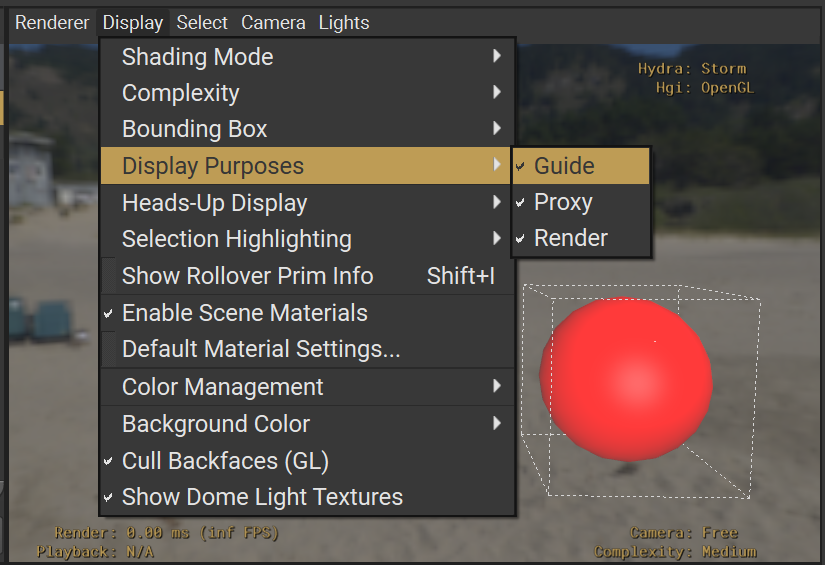

% WARNING: THIS FILE IS GENERATED BY genSchemaDocs. DO NOT EDIT.
% Generated: 05:01PM on October 02, 2025


(Imageable)=
# Imageable

The Imageable schema is the base class for all prims that can be rendered or displayed in a 3D scene. It provides common properties for controlling visibility and purpose, which determine how geometry should be included in rendering and other computations.

## Common Use Cases

1. **Visibility Control**: Managing which prims are visible in renders and viewports
2. **Purpose Classification**: Organizing geometry into categories (render, proxy, guide, default)
3. **Proxy Relationships**: Linking high-detail render geometry to lightweight proxy representations
4. **Rendering Optimization**: Enabling renderers to filter and optimize based on purpose

## Examples

### Render and Proxy Setup
```{code-block} usda
#usda 1.0

def Mesh "HighDetailMesh"
{
    token purpose = "render"
    rel proxyPrim = </ProxySphere>
    # ... mesh data ...
}

def Sphere "ProxySphere"
{
    token purpose = "proxy"
    double radius = 1.0
}
```

### Visibility Animation
```{code-block} usda
#usda 1.0
(
    startTimeCode = 1
    endTimeCode = 48
    timeCodesPerSecond = 24
)
def Plane "AnimatedVisibility"
{
    token visibility.timeSamples = {
        0: "inherited",
        24: "invisible",
        48: "inherited"
    }
}
```

### Guide Geometry
This sphere is meant to be used as a guide while working a 3D scene. It will only render when the guide purpose is turned on.
```{code-block} usda
#usda 1.0

def Sphere "GuideSphere"
{
    double radius = 3.0
    float3[] extent = [(-3, -3, -3), (3, 3, 3)]
    token purpose = "guide"  
    color3f[] primvars:displayColor = [(1.0, 0.0, 0.0)] (
        interpolation = "constant"
    )
}
```



## Best Practices

1. **Visibility**:
   - Use "inherited" for normal visibility behavior
   - Use "invisible" to hide prims and their children
   - Remember that invisible prims are still available for inspection and positioning

2. **Purpose**:
   - Use "default" for general-purpose geometry
   - Use "render" for final quality geometry
   - Use "proxy" for lightweight interactive representations
   - Use "guide" for helper/visualization geometry

3. **Proxy Relationships**:
   - Only create proxyPrim relationships on prims with purpose="render"
   - Use proxyPrim to link render geometry to its proxy representation
   - This enables efficient switching between detail levels

4. **Performance**:
   - Use purpose filtering to optimize rendering performance
   - Consider using proxy representations for complex scenes
   - Leverage visibility for culling and optimization

```{contents}
:depth: 2
:local:
:backlinks: none
```

(Imageable_properties)=

## Properties

(Imageable_proxyPrim)=

### proxyPrim

**USD type**: `rel` (relationship)

The proxyPrim relationship allows linking a prim whose purpose is "render" to its (single target) purpose="proxy" prim. This is useful for:

- Pipeline complexity management through pruning
- DCC optimizations for interactive processing
- Hydra-based selection mapping

Note: Only valid to author on prims whose purpose is "render".


(Imageable_purpose)=

### purpose

**USD type**: `token`

**Fallback value**: `default`

Purpose classifies geometry into categories that can each be independently included or excluded from different operations, such as rendering or bounding-box computation.

Allowed values:
- "default": No special purpose, included in all traversals
- "render": For final quality renders
- "proxy": For lightweight interactive renders
- "guide": For helper/visualization geometry


(Imageable_visibility)=

### visibility

**USD type**: `token`

**Fallback value**: `inherited`

Visibility is the simplest way to control whether geometry is shown or hidden. It can be animated, allowing a sub-tree of geometry to appear and disappear over time. Unlike deactivating geometry, invisible geometry is still available for inspection, positioning, and defining volumes.

Allowed values:
- "inherited" (default): Inherits visibility from parent prims
- "invisible": Hides the prim and all its children from rendering

