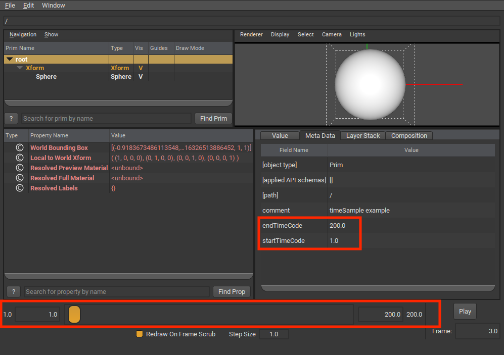
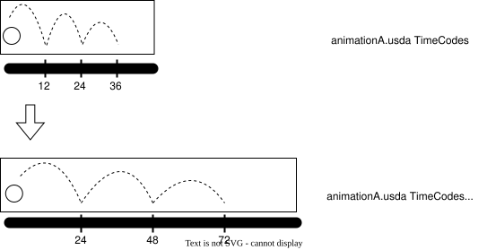
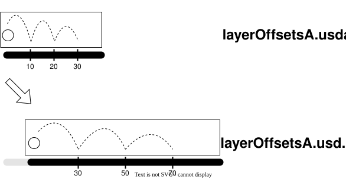
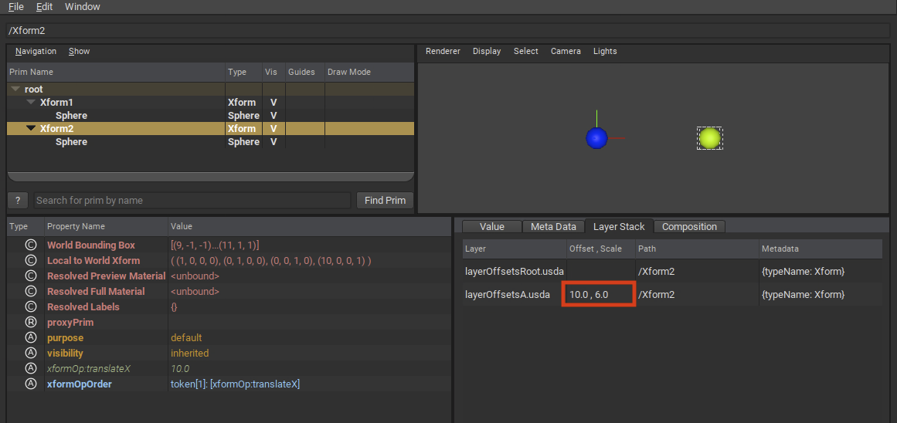
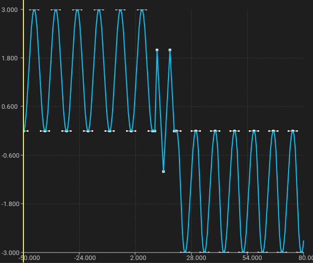

.. include:: ../rolesAndUtils.rst

.. _time_and_animated_values:

########################
Time and Animated Values
########################

OpenUSD supports authoring animated values that do not resolve to a single 
static value but vary in value over time. This functionality is typically used 
for describing animations in a USD scene, but can be used for any scenario where 
time-varying values are needed, such as simulations. 

To support animated values, OpenUSD provides features to author animated values, 
query and interpolate values over time, and work with "clips" of animated data.

.. contents:: Table of Contents
    :local:
    :depth: 3

.. _time_understanding_timecodes:

***********************
Understanding TimeCodes
***********************

TimeCodes are the basic time coordinate for USD. By themselves, TimeCodes are 
unitless, and do not necessarily conceptually map to "frames per second". 
TimeCodes also do not represent other industry standard time codes, such as 
SMPTE. Keeping TimeCodes unitless gives clients flexibility to encode their 
time-varying data in ways that make the most sense for their application, while 
at the same time OpenUSD still provides mechanisms for mapping TimeCodes to real 
time units for decoding and playback, as described in 
:ref:`time_scaling_timecodes_to_real_time` below.

TimeCodes are encoded in USD layers as numeric (double precision) values. The 
following simple example shows animated attribute values (using 
:ref:`TimeSamples <usdglossary-timesample>`) represented as pairs of TimeCodes 
and values (in this case, float values specifying a translation along the
X-axis).

.. code-block:: usda

   double xformOp:translateX.timeSamples = {
        1: 0,
        25: 10,
        99: 5,
    }

TimeCodes are most commonly used as the time coordinate for animated values,
as shown above. However, you can also specify that an attribute or metadata
field's value type is a TimeCode.

.. code-block:: usda

    def "PrimA"
    (
        # custom metadata with timecode value type 
        customData = {
            timecode timeCodeMetadata = 24
        }
    )
    {
        # attribute with timecode value type 
        timecode timeCodeAttr = 24
    }

When used this way, the attribute or metadata field's value will be subject to
any TimeCode scaling or offsets via composition, as described in 
:ref:`time_working_with_timecode_offsets`.

.. admonition:: Avoid Using Infinite TimeCodes

    When working with TimeCodes, you may encounter situations where you 
    want to use "infinite" time coordinates. For example, you might have an 
    animated attribute where you want to set an arbitrary "earliest" value at 
    time "negative infinity", so you can adjust the TimeCode later. 

    While OpenUSD allows authoring and querying using infinite (-inf/inf) 
    TimeCodes, we strongly discourage working with infinite TimeCodes. 
    TimeCodeRanges created with infinite TimeCodes are not considered valid, 
    DCC tools may not be able to represent infinite TimeCodes, and the use
    of infinite TimeCodes may create future incompatibilities.    

.. _time_working_with_timecodes_programmatically:

Working With TimeCodes Programmatically
=======================================

OpenUSD provides ways for working with TimeCodes programmatically, for cases
where you want to query an animated attribute at a particular TimeCode, or
over a TimeCode range. The following example Python code demonstrates using 
TimeCode APIs to query and author animated values. Note that while you can use 
double-precision values when querying an animated attribute, we recommend using 
TimeCodes to ensure future compatibility.

.. code-block:: python

    # Given an attribute with animated values, get the value
    # at a specific timeCode (which could be interpolated)
    workTimeCode = Usd.TimeCode(14)
    workValue = translate_attr.Get(workTimeCode)

    # Set a new value at a specific timeCode (for this example we assume
    # the attribute is using time samples for animated values)
    newTimeCode = Usd.TimeCode(24)
    translate_attr.Set(2, newTimeCode)

When working with TimeCodes programmatically, there are 
some situations where the exact numeric value for a TimeCode is not known, or 
can't be represented. OpenUSD provides the following features for these 
situations.

* For cases where you are looking for the "earliest" time in a set of TimeCodes, 
  OpenUSD provides 
  :usdcpp:`UsdTimeCode.EarliestTime() <UsdTimeCode::EarliestTime()>`. 
  For example, if you had the following animated values for the 
  :usda:`xformOp:translateX` attribute:

  .. code-block:: usda

     double xformOp:translateX.timeSamples = {
         3: 5,
         25: 10,
         99: 5,
     }

  The following Python query would get the attribute value at the earliest 
  TimeCode for :usda:`xformOp:translateX` (for this example, the value of
  5 at the earliest TimeCode, which is 3).

  .. code-block:: python

     earliestValue = translate_attr.Get(Usd.TimeCode.EarliestTime())

* For cases where you want the value immediately before a given TimeCode, 
  OpenUSD provides 
  :usdcpp:`UsdTimeCode.PreTime(time) <UsdTimeCode::PreTime(double)>`. 
  This is useful in situations where an attribute's value can change 
  discontinuously at a specific TimeCode, for example, when evaluating 
  attributes with "held" interpolation values, or splines with dual-valued 
  knots at the given TimeCode. 
  :usdcpp:`UsdTimeCode.PreTime(time) <UsdTimeCode::PreTime(double)>` will
  evaluate the limit of an attribute's animated value as time 
  approaches the given time from the "left". For example, using the same set
  of animated values for the :usda:`xformOp:translateX` attribute that we used
  previously:

  .. code-block:: usda

     double xformOp:translateX.timeSamples = {
         3: 5,
         25: 10,
         99: 5,
     }

  The following Python query would get the attribute value for the 
  :usda:`xformOp:translateX` attribute just prior to TimeCode 25 (which in 
  this example would be evaluated to 10.0, as the interpolated value is 
  continuous at TimeCode 25).

  .. code-block:: python

     preValue = translate_attr.Get(Usd.TimeCode.PreTime(25))

* OpenUSD has a special "Default" sentinel TimeCode coordinate. The 
  :usdcpp:`Default <UsdTimeCode::Default()>` TimeCode is used when working with 
  attributes that have :ref:`default values <usdglossary-defaultvalue>` 
  --- "static", non-time-varying values separate from animated values (if any) 
  for an attribute. In inequality comparisons, the Default TimeCode is 
  considered less than any numeric TimeCode, including :mono:`EarliestTime()`. 
  The following Python example queries the :usda:`xformOp:translateX` attribute 
  for its default value, if any.

  .. code-block:: python

     defaultValue = translate_attr.Get(Usd.TimeCode.Default())

.. _time_scaling_timecodes_to_real_time:

Mapping TimeCodes to Real Time
==============================

TimeCode coordinates for animated values are mapped to real-time seconds by 
scaling by the layer's :usda:`timeCodesPerSecond` metadata. The following 
example sets :usda:`timeCodesPerSecond` to 24.

.. code-block:: usda

    #usda 1.0
    (
        timeCodesPerSecond = 24
    )

Assuming the scene used a TimeCode range that started at 0, this would mean a 
TimeCode of 240 would correspond to 10 seconds of real time.

OpenUSD also provides the legacy :usda:`framesPerSecond` layer metadata, used
as an indication of the desired playback rate when the animation is viewed in a 
playback device (DCC tool, :program:`usdview`, etc.). 

.. admonition:: Legacy Behavior of :mono:`framesPerSecond`

    :usda:`framesPerSecond` normally does not affect TimeCode scaling and does 
    not combine or interfere with any :usda:`timeCodesPerSecond` value. However, 
    OpenUSD does provide a special legacy behavior where the
    :usda:`framesPerSecond` value, if set, is used as a fallback value for 
    :usda:`timeCodesPerSecond` if :usda:`timeCodesPerSecond` is *not* set. The 
    order of precedence OpenUSD uses for determining the 
    :usda:`timeCodesPerSecond` to use is:

    1. :usda:`timeCodesPerSecond` from session layer
    2. :usda:`timeCodesPerSecond` from root layer
    3. :usda:`framesPerSecond` from session layer
    4. :usda:`framesPerSecond` from root layer
    5. fallback value of 24     

    The general best practice is to use :usda:`timeCodesPerSecond` to specify 
    how TimeCodes are scaled to real time, and :usda:`framesPerSecond` if you 
    need to encode a specific playback rate on playback devices, regardless of 
    how many samples per second are recorded in the USD scene. We provide the 
    information about :usda:`framesPerSecond` as fallback for 
    :usda:`timeCodesPerSecond` primarily as a debugging aid, should you observe 
    unexpected time-scaling. The fallback behavior derives only from USD's 
    relationship to Pixar's Presto animation system.

.. _time_layer_start_end_times:

Specifying Layer Start and End Times
====================================

You can specify start and end time codes in a layer using the 
:usda:`startTimeCode` and :usda:`endTimeCode` layer metadata.

.. code-block:: usda

    #usda 1.0
    (
        startTimeCode = 1
        endTimeCode = 240
    )

This TimeCode range is primarily used by clients when determining the initial 
playback range to expose to users in a tool. For example, :program:`usdview` 
uses this range to set the initial range in the playback bar.

:usda:`startTimeCode` and :usda:`endTimeCode` are not used by OpenUSD to set an 
actual value resolution evaluation range. For example, if you had authored 
animated values outside the startTimeCode/endTimeCode range, you can still query 
for those values, or for interpolated values outside the 
startTimeCode/endTimeCode range.

.. _time_using_timecode_ranges:

Using TimeCode Ranges
=====================

If you need to programmatically create a closed range of TimeCodes, use 
:usdcpp:`UsdUtilsTimeCodeRange`. Note that you cannot use TimeCode's 
:usdcpp:`EarliestTime <UsdTimeCode::EarliestTime()>` or 
:usdcpp:`Default <UsdTimeCode::Default()>` as the start 
or end TimeCode for the range. You can specify a non-zero stride used for 
iterating over TimeCodes in the range. The following Python snippet creates a 
TimeCodeRange using the stage's start and end TimeCode, with a stride of 2 
TimeCodes, to iterate and get an attribute value over that range.

.. code-block:: python

    timeCodeRange = UsdUtils.TimeCodeRange(stage.GetStartTimeCode(), 
                                           stage.GetEndTimeCode(), 2)
    for timeCode in timeCodeRange:
        print(f"At TimeCode {timeCode}, attribute value is: "
              f"{example_attribute.Get(timeCode)}")

Negative stride values are allowed only if the range's start TimeCode is greater 
than or equal to the range's end TimeCode.

.. _time_working_with_timecode_offsets:

Working with Automatic and Explicit TimeCode Remapping Across Composition
=========================================================================

When a layer uses composition via 
:ref:`sublayering <usdglossary-sublayers>`, 
:ref:`references <usdglossary-references>`, or 
:ref:`payloads <usdglossary-payload>`, OpenUSD can apply a scale and/or offset 
to the TimeCode coordinates for animated values and the values of any 
TimeCode-valued attributes and metadata from the target layer. This provides the 
flexibility to use animated data in your workflow in different scenes with 
different time frames of reference.

.. _time_automatic_scaling:

Automatic Scaling of timeCodesPerSecond
---------------------------------------

If a layer specifies :usda:`timeCodesPerSecond` and is targeted by a sublayer,
reference, or payload composition arc, the TimeCode values and 
animated value coordinates in the targeted layer are automatically scaled to map 
into the time frame defined by the source layer's :usda:`timeCodesPerSecond`.

The following example :filename:`animationA.usda` layer specifies a 
:usda:`timeCodesPerSecond` of 12.

.. code-block:: usda
    :caption: animationA.usda

    #usda 1.0
    (
        timeCodesPerSecond = 12
    )

This layer is sublayered into another layer :filename:`animationRoot.usda` that 
specifies a :usda:`timeCodesPerSecond` of 24.

.. code-block:: usda
    :caption: animationRoot.usda

    #usda 1.0
    (
        timeCodesPerSecond = 24
        subLayers = [
          @animationA.usda@  
        ] 
    )

With :filename:`animationRoot.usda` as the root layer in a composed stage, any 
TimeCodes for animated attribute values on prims from 
:filename:`animationA.usda` would be automatically scaled to 
:filename:`animationRoot.usda`'s time frame. In this case, the 
TimeCodes would be scaled by a factor of 2, so that an animated value at 
TimeCode 12 in :filename:`animationA.usda` (which would map to 1 second in 
:filename:`animationA.usda`'s :usda:`timeCodesPerSecond`) would have its 
TimeCode scaled to 24 to match the desired 1 second time mapping in 
:filename:`animationRoot.usda`'s time scaling. The following diagram shows a 
couple of TimeCodes in :filename:`animationA.usda` scaled to map to 
the :filename:`animationRoot.usda` :usda:`timeCodesPerSecond` mapping.

This automatic scaling is applied across the entire 
:ref:`LayerStack <usdglossary-layerstack>` targeted by the 
sublayer/reference/payload composition arc. For example, 
:filename:`animationA.usda` could also sublayer another layer, 
:filename:`animationB.usda` (not shown) that has its own 
:usda:`timeCodesPerSecond` of 6.

.. code-block:: usda
    :caption: animationA.usda with sublayer

    #usda 1.0
    (
        timeCodesPerSecond = 12
        subLayers = [
          @animationB.usda@  # animationB has timeCodesPerSecond = 6  
        ] 
    )

In the composed stage, the TimeCodes for animated values in 
:filename:`animationB.usda` would be automatically scaled by 2 to fit within 
:filename:`animationA.usda`'s time frame, and then automatically scaled 
again by 2 to fit within :filename:`animationRoot.usda`'s time frame.

The automatic scaling is also applied to authored values of attributes or
metadata fields of the TimeCode value type. For example, suppose 
:filename:`animationA.usda` had a prim with an attribute and metadata field of 
TimeCode value type.

.. code-block:: usda
    :caption: animationA.usda with TimeCode value type attribute and metadata

    #usda 1.0
    (
        timeCodesPerSecond = 12
    )

    def "PrimA"
    (
        # metadata with timecode value type
        customData = {
            timecode timeCodeMetadata = 10
        }
    )
    {
        # attribute with timecode value type 
        timecode timeCodeAttr = 15 
    }    

If this layer were sublayered into :filename:`animationRoot.usda` with a 
:usda:`timeCodesPerSecond` of 24, the metadata field and attribute values would 
be automatically scaled in the flattened results.

.. code-block:: usda
    :caption: animationRoot.usda flattened with scaled timecode values

    #usda 1.0
    (
        timeCodesPerSecond = 24
    )

    def "PrimA" (
        customData = {
            timecode timeCodeMetadata = 20
        }
    )
    {
        timecode timeCodeAttr = 30
    }

Note there is no automatic application of a layer's :usda:`startTimeCode` or 
:usda:`endTimeCode` as offsets for TimeCode coordinates in a composed stage. 
There is a way to manually specify an offset, discussed in the next section.

.. _time_configuring_using_layer_offsets:

Configuring TimeCode Scaling and Offsets Using LayerOffsets
-----------------------------------------------------------

If you need to scale or shift the TimeCodes in a 
:ref:`sublayer <usdglossary-sublayers>` or 
:ref:`referenced <usdglossary-references>` or 
:ref:`payloaded <usdglossary-payload>` layer, you can do so by adding a 
"LayerOffset" to the composition arc. For example, you might have character 
animation that you want to re-use for a different background character, but it 
needs to be re-timed for the current scene.

The following :filename:`layerOffsetsRoot.usda` layer specifies a LayerOffset 
with an offset of 10 and a scale of 2 for a sublayer composition.

.. code-block:: usda
    :caption: layerOffsetsRoot.usda

    #usda 1.0
    (
        timeCodesPerSecond = 24
        subLayers = [
          @layerOffsetsA.usda@ (offset = 10; scale = 2)
        ]
    )

In the composed stage, TimeCodes for animated values in 
:filename:`layerOffsetsA.usda` will be scaled and offset accordingly. Note that 
when mapping from a layer's time frame to that of the layer that references or 
sublayers it, OpenUSD will apply **scaling first, and then the offset**, if both 
are specified. 

.. math::

    \text{Adjusted TimeCode} = (\text{Layer TimeCode} * \text{LayerOffset scale}) + \text{LayerOffset offset}

In the above example, an animated value at TimeCode 10 in 
:filename:`layerOffsetsA.usda` will have its TimeCode scaled to 20, and then 
offset by 10 to 30, in the composed stage. The following diagram shows TimeCodes 
from :filename:`layerOffsetsA.usda` being scaled by 2 and then offset by 10 in a 
composed stage.

LayerOffsets can be specified for references and payloads in a similar way. The 
following example applies a scale and offset to the TimeCodes for any animated 
attributes of a referenced Prim.

.. code-block:: usda

    def Xform "Xform2"
    (
        prepend references = @animationA.usda@</Xform2> (offset = 10; scale = 2)
    )
    {
    }

As mentioned in :ref:`time_understanding_timecodes`, TimeCodes can be used as
an attribute or metadata field's value type. LayerOffsets will scale and offset
authored TimeCode values just like TimeCode coordinates. For example, assume you
had the following :filename:`timeCodeValues.usda` layer. 

.. code-block:: usda
    :caption: timeCodeValues.usda

    def "PrimA"
    (
        # custom metadata with timecode value type 
        customData = {
            timecode timeCodeMetadata = 10
        }
    )
    {
        # attribute with timecode value type 
        timecode timeCodeAttr = 15
    }

This layer is then sublayered into :filename:`timeCodeValuesRoot.usda`
with a LayerOffset scale and offset.

.. code-block:: usda
    :caption: timeCodeValuesRoot.usda

    #usda 1.0
    (
        startTimeCode = 1
        endTimeCode = 240
        timeCodesPerSecond = 24
        subLayers = [
          @timeCodeValues.usda@ (offset = 10; scale = 2)
        ]
    )

If :filename:`timeCodeValuesRoot.usda` is loaded into a stage and flattened,
the result will have the LayerOffset applied to the TimeCode attribute and 
metadata field values from PrimA.

.. code-block:: usda
    :caption: flattened timeCodeValuesRoot.usda

    def "PrimA" (
        customData = {
            timecode timeCodeMetadata = 30
        }
    )
    {
        timecode timeCodeAttr = 40
    }

Keep in mind the following requirements for LayerOffsets.

* Scale cannot be 0. This will cause a composition error and the LayerOffset 
  will be ignored.
* Scale also cannot be negative (this will also cause a composition error and
  be ignored), as this could cause incorrect resolution of animated values. 
  If you want to reverse the time order of TimeCodes, consider using the 
  :ref:`Value Clips <usdglossary-valueclips>` feature.
* Offset can be negative, which results in the TimeCodes being offset "earlier" 
  in the composed stage. 
* A LayerOffset itself cannot be animated. You can't change the specified 
  offset or scale over time. If you need this behavior, the 
  :ref:`Value Clips <usdglossary-valueclips>` feature can provide this.

In :program:`usdview`, you can see the LayerOffset for a given layer stack via 
the "Layer Stack" tab.

.. _time_combining_automatic_scaling_and_offsets:

Combining Automatic Scaling and Layer Offsets
---------------------------------------------

If you apply a LayerOffset to a target layer, and the target layer has a 
:usda:`timeCodesPerSecond` that differs from that of the referencing layer, 
OpenUSD applies both the automatic source/target layer scaling and the 
LayerOffset scale (in that order) to TimeCodes in the composed stage. For 
example, assume you have the following :filename:`animationLayer.usda` layer.

.. code-block:: usda
    :caption: animationLayer.usda

    #usda 1.0
    (
        timeCodesPerSecond = 8
    )

If you then sublayered this layer in the root layer of your stage, using a 
Layer Offset with a scale of 2:

.. code-block:: usda
    :caption: animationRootLayer.usda

    #usda 1.0
    (
        timeCodesPerSecond = 24
        subLayers = [
          @animationLayer.usda@ (offset = 10; scale = 2)
        ]
    )

TimeCodes for animated values in :filename:`animationLayer.usda` would be 
adjusted as follows. First, the automatic scaling would adjust TimeCodes by a 
factor of 3 (from the animationRootLayer's :usda:`timeCodesPerSecond` value of
24 divided by animationLayer's :usda:`timeCodesPerSecond` value of 8). Then, the 
adjusted TimeCodes would be adjusted further by a factor of 2 (from the subLayer 
LayerOffset scale) and offset by 10. For example, a TimeCode coordinate of 10 in 
:filename:`animationLayer.usda` would be multiplied by 3, then multiplied by 2,
and finally offset by 10, resulting in a TimeCode coordinate of 70 in the
composed stage.

.. _time_animating_attribute_values:

**************************
Animating Attribute Values
**************************

To animate an attribute value, author the value using a value source that
varies the value over time. Currently, OpenUSD provides the following
time-varying value sources:

* **TimeSamples**: A list of (TimeCode, value) pairs that define an attribute's 
  value at specific points in time. OpenUSD uses linear or held interpolation, 
  depending on the value type, to interpolate values between TimeSamples.
  Use TimeSamples when working with discrete animation data, such as simulation
  outputs or motion-capture data. TimeSamples are the best choice when maximum
  interoperability is a priority, and are widely supported across DCC tools and
  renderers.

* **Splines**: A curve that specifies how a scalar floating point value varies 
  over time. A spline is primarily defined by its collection of knots and the 
  curve segments between them. OpenUSD supports several different 
  curve/interpolation types, as well as features like looping and extrapolation. 
  Use Splines when you need precise control over animation curve shape and 
  timing. Splines are also a good choice when data size is a concern, as complex 
  curves can be represented with a small set of knots. 

* **Value Clips**: Groups of time-varying values (TimeSamples or Splines) that 
  are partitioned into multiple clip layers, and then sequenced and optionally
  retimed on multiple models. Use Value Clips when working with large sets of 
  animated data from multiple sources. Value Clips are particularly useful when 
  working with crowd animations where you can apply the same sets of animations 
  to multiple background characters, re-sequenced and/or re-timed as necessary, 
  to create a large variety of animations from a base set of clips. Value Clips
  are also useful for working with very large simulation datasets, where it is 
  desirable to put each simulation step's output into a different file/asset.  

Each of these is described in more detail in sections below. For a
step-by-step tutorial that uses TimeSamples and Splines, see
:doc:`../tut_xforms`.

.. _time_providing_a_default_value:

Providing a Default Value
=========================

OpenUSD provides a way to author a "default" value for an attribute, that
acts as a "static", non-time-varying value. This can be authored in addition
to an animated value, or authored as the single static value for attributes
where you don't need to (or want to) author animated values. Some examples
where you might author a default value include placing static objects in a
scene, or composing layers with existing animated assets where you want to use
their static pose in your stage (you would also use an
:ref:`animation block <time_using_animation_blocks>` to ignore any animated
values in this example).

The following example has both a default value and an animated value (using
TimeSamples) authored for the :mono:`attr` attribute.

.. code-block:: usda

   def "PrimRef"
   {
       double attr = 100  # Default value for attr
       double attr.timeSamples = {
           1: 100,
           24: 500,
       }
   }

OpenUSD uses :ref:`value resolution <time_understanding_value_resolution>`
rules to determine when to return the Default value when the attribute is
queried, versus returning an animated value. As mentioned previously, other
OpenUSD features, such as
:ref:`animation blocks <time_using_animation_blocks>` can also govern when
Default values are used.

Programmatically you can use the unique TimeCode :usdcpp:`UsdTimeCode::Default()`
when authoring or querying default values, as described in
:ref:`time_working_with_timecodes_programmatically` above.

.. note::

   Default values should not be confused with Fallback values, which are
   values set in schema definitions for an attribute that will automatically
   be used if nothing is authored for that schema attribute.

.. _time_understanding_value_resolution:

Understanding Value Resolution
==============================

When authoring or querying animated values, it's important to understand how
OpenUSD resolves all the value sources for an attribute locally and across the
layer stack.

.. note::

   While metadata values also have a specific process for resolving multiple
   opinions from different sites, that process is not discussed here, as
   metadata values cannot be animated. See :ref:`usdglossary-valueresolution`
   for more details on metadata value resolution.

Part of attribute value resolution involves resolving all the propertySpecs
for the attribute across any composition arcs for the prims that contain the
property. Animation workflows commonly use composition to coordinate animation
data. For example, a character rigging department might create a "base pose"
layer for a character rig with the character joint orientation attribute
default values authored to fit the "base pose" of the rig. An animation
department might sublayer the base pose layer and then author stronger
opinions for the joint orientation attributes using animated values. When
composing the animation layer, OpenUSD will properly apply the animated values
to the rig.

Attribute value resolution differs from prim-level composition in some ways
(as described in :ref:`usdglossary-valueresolution`),
and additionally, attributes in a propertyStack can have multiple value
sources authored at the local site. There are four possible sources for an
attribute value, listed as follows in strong-to-weak order:

* TimeSamples
* Splines
* Default Value
* Value Clips

For attributes that are defined in a schema, there is a potential fifth
source, which is the fallback value for the attribute specified by the schema.
The fallback value will be used if no other value sources have been authored.

The following example shows a Sphere's radius attribute with opinions for all
four possible value sources (and indirectly the fifth, as the Sphere schema
provides a fallback for the radius attribute).

.. code-block:: usda

   def Sphere "SphereA"
   (
       # A clip set for this prim, that points to clip data and clip
       # manifest information (omitted for brevity) that contains
       # time varying values for radius.
       clips = {
           dictionary default = {
               asset[] assetPaths = [@./satav_clip1.usda@]
               asset manifestAssetPath = @./satav_manifest.usda@
               double2[] active = [(1,0)]
               string primPath = "/Clip"
               double2[] times = [(1,1), (30, 30)]
           }
       }
   )
   {
       double radius = 7.0
       double radius.timeSamples = {
           1: 1.0,
           30: 3.0
       }
       double radius.spline = {
           bezier,
           1: 10; pre (0, 0); post curve (0, 0),
           30: 30; pre (0, 0); post curve (0, 0),
       }
   }

When an attribute is queried for a value, OpenUSD will use the following
value resolution process, depending on whether the query was for a particular
TimeCode (with OpenUSD taking into account any
:ref:`TimeCode layer scaling or offset <time_working_with_timecode_offsets>`),
or for the Default Value (by querying explicitly with
:usdcpp:`UsdTimeCode::Default()` or using a query method without providing any
TimeCode).

.. image:: time_valueresolution.drawio.svg
    :width: 50%
    :alt: OpenUSD value resolution process

.. note::

   You can't "compose" partial animated values, or "sparsely" override
   animated values. For example, if you had two prims, PrimRef1 and PrimRef2,
   both with animated values for a property at different TimeCode ranges,
   using references that compose both prims will not result in combining
   animated values from both prims.

   .. code-block:: usda

      def "PrimRef1"
      {
          float floatAttr.timeSamples = {
              1: 2,
              30: 20,
          }
      }

      def "PrimRef2"
      {
          float floatAttr.timeSamples = {
              40: 5,
              70: 7,
          }
      }

      def "NewPrim"
      (
          # We'll only get floatAttr opinions from PrimRef1
          prepend references = [</PrimRef1>, </PrimRef2>]
      )
      {
      }

   If you need to combine opinions for animated values for a property from
   multiple sources, consider using :ref:`value clips <time_using_value_clips>` 
   where each source can come from a separate "clip" layer.

.. _time_blocking_animated_values:

Blocking Animated Values From Weaker Opinions
=============================================

As mentioned previously, a composed Prim's attributes may have animated
values contributed from composition arcs. However, there may be scenarios
where you want the composed model in your scene, but you explicitly do not
want certain associated animated values, and want to avoid destructively
editing the "source" layers that contain the animated values. For these
situations, OpenUSD provides attribute blocks and animation blocks.

.. _time_using_attribute_blocks:

Blocking All Values (Attribute Blocks)
--------------------------------------

A full value block (also known as an attribute block) can be used to block 
**all values** (including Default values) contributed from weaker opinions for 
an attribute. In the following example, SphereBlockValue references SphereRef, 
which contains animated and default values for the radius attribute. 
SphereBlockValue also has an attribute block authored on 
:usda:`SphereBlockValue.radius`. Queries for the value of 
:usda:`SphereBlockValue.radius` will return 1.0 (the schema fallback value), and 
the referenced TimeSample values **and** Default value will not contribute to 
:usda:`SphereBlockValue.radius`.

.. code-block:: usda

   def Sphere "SphereRef"
   {
       double radius = 10
       double radius.timeSamples = {
           1: 1,
           10: 3,
           20: 5
       }
   }

   def Sphere "SphereBlockValue" (
       references = </SphereRef>
   )
   {
       # Block all weaker opinions, including any default values
       # Fallback for radius will come through, however.
       double radius = None
   }

In this example the schema fallback value is returned for a query at any time
value, because the attribute block is expressing the intent to treat the
attribute as having no authored value. This can result in schema fallback
values (if any) being accessible.

To programmatically author an attribute block, you can use
:usdcpp:`UsdAttribute.Block() <UsdAttribute::Block()>`.

.. code-block:: python

   # Block the entire attribute
   attr.Block()

.. _time_using_value_blocks:

Using Value Blocks in Animated Values
-------------------------------------

You can author a value block on an individual TimeSample or Spline
knot, but the behavior (and intent) is different from an attribute block
applied to an attribute. A value block is an explicit authored opinion for a
specific time or curve segment. OpenUSD treats the attribute as having an
authored opinion at that time, so the attribute at that time will evaluate to
:usda:`None`, regardless of whether the attribute has a schema fallback.

For TimeSamples, a value block marks that the attribute has no value over a
specific time range:

.. code-block:: usda

   def Sphere "BigBall"
   {
       double radius.timeSamples = {
           101: 12,
           110: None,
           120: 14
       }
   }

Queries for radius at time codes [110, 120) return no value. Unlike an
attribute block, the schema fallback for radius is not returned; the
:usda:`None` time sample covering that range causes the Attribute to report that 
it cannot resolve any value for that range.

.. note::

   Per-TimeSample attribute blocks can't be used to sparsely override
   TimeSamples, just as TimeSamples can't be sparsely overridden in general.
   If you have TimeSamples for an attribute at times 1 and 24, and then
   reference this into another prim that has a None value at time 1,
   getting the value for the attribute on this same prim at time 24 will
   evaluate to None, and not the reference target's attribute TimeSample
   value at time 24.

To programmatically author a value block for a specific TimeSample, you can
use :usdcpp:`UsdAttribute.Set(SdfValueBlock, TimeCode) <UsdAttribute::Set()>`.

.. code-block:: python

   # Block at a specific TimeCode (for a TimeSample)
   attribute2.Set(Sdf.ValueBlock(), Usd.TimeCode(40))

For Splines you can block individual curve segments to block opinions for
that segment. The following example specifies that the curve segment from the
knot at TimeCode 20 to the knot at TimeCode 30 is blocked.

.. code-block:: usda
   :emphasize-lines: 6

   def "SplineRef"
   {
       double splineAttr.spline = {
           bezier,
           1: 10; pre (0, 0); post curve (5, 0.0125),
           20: 20; pre (0, 0); post none,
           30: 10; post curve (0, 0),
       }
   }

.. note::

   Setting an attribute to an empty spline (a spline with no knots) behaves
   similarly to a value block segment in a Spline. Because no knot opinions
   are authored, querying for a value returns no value (not the schema
   fallback if any), however the attribute itself is considered authored with
   a (empty) Spline. Don't set an attribute to an empty spline if your intent
   is to block all values for an attribute and make the attribute appear
   "unauthored"; use an explicit attribute block instead.

.. _time_using_animation_blocks:

Using Animation Blocks
----------------------

Animation blocks are similar to attribute blocks, however they only block
animated values but not default values. Use an animation block when you want
to block animated values from weaker opinions in your scene, but you still
want the default value from weaker layers to come through. A use case for
animation blocks might be where an animation team has composed sublayers that
were originally authored by a different department with scratch animation
data. The animation team wants to use the layers as if no animated values were
authored, but they want to start with the same default values that were
already authored in establishing layers.

In the following example, an animation block is authored on :usda:`PrimA.attr`.
Queries for the value of :usda:`PrimA.attr` will return 100 (the Default value
from :usda:`PrimRef.attr`). If :usda:`PrimRef.attr` did not have an authored 
Default value, queries for :usda:`PrimA.attr` would return None, similar to the
behavior if :usda:`PrimA.attr` used an attribute block.

.. code-block:: usda

   def "PrimRef"
   {
       double attr = 100  # Default value for attr
       double attr.spline = {
           bezier,
           1: 10; pre (0, 0); post curve (5, 0.0125),
           20: 20; pre (0, 0); post curve (0, 0),
       }
   }

   def "PrimA" (
       references = </PrimRef>
   )
   {
       double attr = AnimationBlock
   }

Animation blocks cannot be used on individual TimeSamples or Spline curve
segments. You can only use animation blocks on the entire attribute value.
Animation blocks also cannot be used in
:ref:`Value Clips <time_using_value_clips>`.

To programmatically author an animation block, use
:usdcpp:`UsdAttribute.BlockAnimation() <UsdAttribute::BlockAnimation()>`.

.. code-block:: python

   # Set an animation block on attribute1
   attribute1.BlockAnimation()

.. _time_using_timesamples:

*****************
Using TimeSamples
*****************

TimeSamples represent a sparse mapping from TimeCode coordinates to attribute
values. TimeSamples provide a way to author a finite list of (time, value)
pairs that define how an attribute changes over time, with OpenUSD responsible
for filling in the gaps by interpolating values for TimeCodes between (and
outside of) defined values.

TimeSamples are useful for animating with values that work with linear
interpolation (generally numeric values). TimeSamples can also be used for 
animating non-interpolatable values (bools, strings/tokens) where the attribute
value needs to change at certain times, but otherwise is held at the last 
authored TimeSample value. Note that TimeSamples are the only option with
OpenUSD for animating non-scalar tuples (normals, matrices, etc.) and arrays
of scalar numbers.

For situations where animation complexity and/or precision end up requiring a
large amount of TimeSamples, consider using :ref:`time_using_splines` instead. 
For situations that require "higher-level" animation features such as looping, 
or easier editability, consider using Splines or Value Clips.

TimeSamples are represented as a list of TimeCode/value pairs that map
TimeCode coordinates to values of an attribute's type. The following example
has TimeSamples for two attributes on PrimA: :usda:`floatAttr` and 
:usda:`boolAttr`.

.. code-block:: usda

   #usda 1.0
   (
       startTimeCode = 1
       endTimeCode = 100
   )

   def "PrimA"
   {
       float floatAttr.timeSamples = {
           2: 5,
           7: 7,
           15: 25
       }

       bool boolAttr.timeSamples = {
           2: True,
           10: False,
           20: True
       }
   }

The following diagrams help visualize the interpolations and extrapolations
that OpenUSD uses with TimeSamples. "TimeSamples for float attribute" shows
the linear interpolation (and held extrapolation) for :usda:`floatAttr` over a
TimeCode range, and "TimeSamples for bool attribute" shows the held
interpolation for :usda:`boolAttr`.

.. image:: time_timesample_interpolations.drawio.svg
    :width: 50%
    :alt: TimeSample interpolations

For value types that are interpolatable, such as for :usda:`floatAttr` in the
above example, OpenUSD will use linear interpolation to determine values at
TimeCodes between the set of authored TimeSamples. For example, if you query
for the value of :usda:`floatAttr` at TimeCode 10, you'll get the interpolated
value 13.75 (we assume for this example that the layer has no
:ref:`TimeCode remapping <time_working_with_timecode_offsets>` applied).

.. code-block:: python

   prim = stage.GetPrimAtPath("/PrimA")
   floatAttr = prim.GetAttribute("floatAttr")
   val = floatAttr.Get(Usd.TimeCode(10))  # returns interpolated value

Note that linear (element-wise) interpolation extends to arrays of 
interpolatable types as well, provided the bracketing samples are arrays of the 
same length. In the following example, the interpolated value for arrayAttr
at time 5 will be :mono:`[(9.444445, 0, 0), (0.8888889, 5.4444447, 0)]`.

.. code-block:: usda

    def "PrimA" 
    {
        # USD will do element-wise interpolation provided all the arrays are 
        # the same length.
        float3[] arrayAttr.timeSamples = {
            1: [ (5.0, 0.0, 0.0), (0.0, 5.0, 0.0) ],
            10: [ (15.0, 0.0, 0.0), (2.0, 6.0, 0.0) ],
            20: [ (25.0, 0.0, 0.0), (5.0, 7.0, 0.0) ]
        }
    }

For value types that are not interpolatable, such as for :usda:`boolAttr` in the
previous example, OpenUSD will use "held" interpolation, where the value for
a given TimeCode will be "held" for all TimeCode coordinates until the next
authored TimeSample (if any). In the previous example if you query for the
value of :usda:`boolAttr` at TimeCode 15 you'll get the value False, held from
the value authored for TimeCode 10.

.. code-block:: python

   prim = stage.GetPrimAtPath("/PrimA")
   boolAttr = prim.GetAttribute("boolAttr")
   val = boolAttr.Get(Usd.TimeCode(15))  # returns held value

Additionally, as bool is not interpolatable, getting the value at the
:mono:`Usd.TimeCode.PreTime()` for an authored TimeSample will return the held
value (if any) up until that TimeCode. For example,
:mono:`Get(Usd.TimeCode.PreTime(10))` will return True (held from TimeCode 1).

.. code-block:: python

   val = boolAttr.Get(Usd.TimeCode.PreTime(10))

When querying for values "outside" the authored range of TimeCodes, OpenUSD
will extrapolate held values of the nearest TimeSample. If we query
:usda:`floatAttr` at TimeCode 1, which is earlier in time than the earliest
TimeSample (at TimeCode 2), we get the extrapolated held value from the
TimeSample at TimeCode 2.

.. code-block:: python

   # returns extrapolated value from TimeSample at TimeCode coordinate 2
   val = floatAttr.Get(Usd.TimeCode(1))

Additional things to be aware of when working with TimeSamples:

* TimeSample TimeCodes can be scaled and offset by
  :ref:`layer offsets <time_configuring_using_layer_offsets>`, or scaled by
  :ref:`automatic layer time scaling <time_automatic_scaling>`.
* You can use :ref:`value blocks <time_using_value_blocks>` to block
  individual TimeSamples.

.. _time_using_splines:

*************
Using Splines
*************

Splines represent curves that define how a scalar floating point value varies 
over time. Mathematically, a spline is a piecewise curve made up of **knots** 
and the **curve segments** between them.

Splines provide higher order controls for animation than TimeSamples. If you're 
authoring animations where you need smooth control over animation timing or more 
gradual (or sharper) "ease-in" and "ease-out" of your animation, Splines are 
easier to author and use less data than TimeSamples. In the following graphs, 
"Bezier Spline" shows a spline with 3 knots. "Sampled Spline" shows an 
*approximation* of the same spline using 20 TimeSamples and linear 
interpolation. Notice how the sampled version uses more data and loses some of 
the curve shape near times 0, 10, and 20.

.. image:: time_bezier.png
    :width: 50%
    :alt: Bezier Spline

.. image:: time_beziersampled.png
    :width: 50%
    :alt: Sampled Spline

Splines also provide additional features, such as inner looping (automatic
repeating of parts of the spline) and extrapolation modes including looping.
You can also use :ref:`value blocks <time_using_value_blocks>` to indicate
that a particular segment has no values.

OpenUSD's spline interpolation features are compatible with the
`AnimX Library <https://github.com/Autodesk/animx>`__, and Splines will be
most interoperable with engines and DCC tools that use the same interpolation
implementation. However, at the time OpenUSD Splines were implemented, some
features were included that were not available in some DCC Tools at the time,
such as dual-value knots, inner loops, and support for Value Clips. For
scenarios where your engine or tool uses AnimX but does not support these
additional features, OpenUSD provides ways to "bake out" spline data to an
AnimX-compatible form. For scenarios where your engine or tool can't use
AnimX or can't support splines, consider baking splines to
:ref:`TimeSamples <time_using_timesamples>` when transferring data to your
engine/tool. Splines are also only supported for floating-point scalar value
types, and all knots in a spline must have the same value type. If you need
to have animated values for non-floating-point value types, use
:ref:`time_using_timesamples`.

In OpenUSD, a spline is primarily defined by its collection of knots. Each
knot has a time and a value (and an optional pre-value) and information about
how to interpolate the value over the segments between it and its neighboring
knots. The following example shows a Prim whose :usda:`attr` attribute has an
authored spline with 3 knots at times 0, 10, and 20.

.. code-block:: usda

   def "Prim" {
       float attr.spline = {
            bezier,
            0: 5; pre (0, 0); post curve (3, 0),
            10: 20; pre (3, 0); post curve (3, 0),
            20: 5; pre (3, 0); post curve (0, 0),
       }
   }

.. _time_working_with_basic_spline_information:

Working with Basic Spline Information
=====================================

The OpenUSD spline type, :usdcpp:`Ts.Spline <Ts::Spline>`, contains value type 
and curve type information, along with a list of knots. Splines can also 
optionally contain inner loop and outer extrapolation information, described in
:ref:`time_looping_and_extrapolation` below.

Splines can only use **scalar value types** (float, double, half). All knots
in a Spline are expected to use the Spline's value type for the knot value.
Splines can also be used with "time valued" attributes, where the attribute
type is :usda:`timecode`.

Splines can specify the **curve type** used for all "curve interpolation"
segments in the Spline. The curve type can be Bezier (the default) or
Hermite. **Bezier curves** have freely adjustable knot tangent widths, and
provide the most control over the curve shape. The following Bezier curve
uses tangent widths of 4, resulting in a more gradual "ease-in/out" period
for the curve segment.

.. code-block:: usda
   :emphasize-lines: 4

   def "PrimWithBezier"
   {
       double attr.spline = {
           bezier,
           0: 5; pre (0, 0); post curve (4, 0),
           5: 20; pre (4, 0); post curve (0, 0),
       }
   }

.. image:: time_bezier_tangent.png
    :width: 50%
    :alt: Bezier tangent

**Hermite curves** automatically set the tangent widths to one third of the
segment span. Any explicit tangent width set is ignored (but tangent slope is
not ignored). Hermite curves provide less control over the curve shape, but
generally ensure a smoother, more predictable curve. The following Hermite
curve segment has the tangent widths automatically set to one third of the
given 5 unit span.

.. code-block:: usda
   :emphasize-lines: 4

   def "PrimWithHermite"
   {
       double attr.spline = {
           hermite,
           0: 5; pre (0); post curve (0),
           5: 20; pre (0); post curve (0),
       }
   }

.. image:: time_hermite_tangent.png
    :width: 50%
    :alt: Hermite tangent

.. _time_working_with_knots:

Working with Knots
==================

A Knot (:usdcpp:`Ts.Knot <Ts::Knot>`) is a control point on the spline. Each 
Knot can have the following information.

**Time**: The time for the knot. Note that these times can be scaled and
offset by :ref:`layer offsets <time_configuring_using_layer_offsets>`, or
scaled by :ref:`automatic layer time scaling <time_automatic_scaling>`.

**Value**: The scalar value for the knot. The value type used (double, float,
half) should match the value type set for the Spline the knot will be. As
noted earlier, splines can also be used with "time valued" attributes, where
the attribute type is :usda:`timecode`. In these scenarios, the Knot *value* and
the Knot time will both be affected by layer offsets and automatic layer time
scaling.

**PreValue**: An optional additional value for the knot that represents the
value for the knot when evaluated "from the left" (earlier in time). This
creates a value discontinuity at the knot time coordinate, and a knot that
has an authored prevalue is considered a **dual-valued knot**.

The following example sets a pre-value of 8 for the knot at time 5, which
results in that knot being dual-valued ("8 & 10") and having a value
discontinuity.

.. code-block:: 
   :emphasize-lines: 6

   def "Prim"
   {
       double attr.spline = {
           bezier,
           0: 5; pre (0, 0); post curve (2, 0),
           5: 8 & 10; pre (2, 0); post curve (2, 0),
           10: 7; pre (2, 0); post curve (0, 0),
       }
   }

.. image:: time_dual_valued_knot.png
    :width: 50%
    :alt: Dual valued knot

If a dual-valued knot follows a curve segment using held or ValueBlock
interpolation (see "Next interpolation mode"), the pre-value is ignored. This
avoids creating a situation where the pre-value is effective at only the
immediate "left" of a single knot.

.. note::

   Dual-valued knots may not be supported in some DCC tools and engines.
   Depending on your use-case, you might be able to create similar
   discontinuities by using two adjacent knots.

**Next interpolation mode**: The interpolation mode used for the curve segment
from this knot to the next knot. The interpolation mode can be one of the
following:

* **Curve** (:mono:`Ts.InterpCurve`): Use the Spline's curve type (Bezier or
  Hermite) to do curve-based interpolation for the curve segment.
* **Held** (:mono:`Ts.InterpHeld`): Hold the knot's value for the duration of the
  curve segment. This is the default interpolation mode.
* **Linear** (:mono:`Ts.InterpLinear`): Use linear interpolation for the curve
  segment.
* **Value block** (:mono:`Ts.InterpValueBlock`): Use the equivalent of a
  :ref:`value block <time_using_value_blocks>` to specify that there is *no
  value* for the duration of the curve segment. All values for the
  interpolated segment will evaluate to no value (None).

The following example shows a Spline with curve segments that use each
interpolation mode:

* The segment from time 0 to 5 uses curve interpolation (Bezier).
* The segment from time 5 to 10 uses held interpolation. Any evaluation of
  the curve value in this time range will always be 15.
* The segment from time 10 to 15 uses linear interpolation.
* The segment from time 15 to 20 uses a value block. Any evaluation of the
  curve value in this range will evaluate to **None**.
* The segment from time 20 to 25 uses linear interpolation.

.. code-block:: usda

   def "Prim" {
       float attr.spline = {
            bezier,
            0: 5; pre (0, 0); post curve (2, 0),
            5: 15; pre (2, 0); post held,
            10: 15; post linear,
            15: 8; post none,
            20: 10; post linear,
            25: 15; post held,
       }
   }

.. image:: time_interpolation_modes.png
    :width: 50%
    :alt: Interpolation modes

**Tangent information**: Information about the tangents for this knot.
Tangents help define the curve shape for curve segments using curve
interpolation. Tangent information is ignored for non-curve interpolation. A
given knot can have "pre" tangent information and "post" tangent information
that apply to curve segments "before" the knot and "after" the knot
respectively.

.. admonition:: A Note About Spline Continuity

    When working with splines and tangents, it's important to take into
    consideration continuity, which describes how smooth the curve shape is,
    particularly between two curve segments. OpenUSD splines allow for a variety
    of curve types, interpolation modes, and other features that can affect
    continuity.

    There are several mathematical categorizations of continuity. When working
    with spline curve segments and knots, the following categorizations are the
    most commonly encountered.

    **Discontinuous**: Two curve segments do not meet at the same position. 
    There is no continuity of the curve shape at the point where the segments 
    join.

    .. image:: time_continuity_discontinuous.png
        :width: 25%
        :alt: Discontinuous

    |

    **Positional continuity (G0)**: Two curve segments meet at the same 
    position. The curves are joined without a discontinuity, but are not smooth.

    .. image:: time_continuity_G0.png
        :width: 25%
        :alt: Positional continuity

    |

    **Tangential continuity (G1)**: Two curve segments meet at the same position
    and the tangents of the curve segments at this position are in the same
    direction. The curves are joined smoothly, but may have different "pre" and
    "post" shapes before and after the joint position.

    .. image:: time_continuity_G1.png
        :width: 25%
        :alt: Tangential continuity

    |

    **First-order parametric continuity (C1)**: Two curve segments meet at the
    same position and have tangents with the same direction and magnitude. The
    curves are joined smoothly and the curve shape is consistently smooth through
    the joint position.

    .. image:: time_continuity_C1.png
        :width: 25%
        :alt: First-order parametric continuity

    |

    In general, for the smoothest animation you should strive for smooth
    continuity ("C1" or "G1") between curve segments. This ensures there are no
    sudden "pops" in the animated data when evaluated. Segments with G0
    continuity or that are discontinuous may have undesired behavior when
    evaluated. When working with splines that use
    :ref:`looping <time_looping_and_extrapolation>`, OpenUSD provides some
    features that try to provide smoother continuity at loop boundaries, however
    OpenUSD cannot guarantee continuity in all cases, so extra care should be
    taken when using looping features.

Tangent information includes:

**Tangent width**: The overall width of the tangent across the curve segment
span. In the following diagram this is the "width" line, not the "tangent" line.
Widths are always positive values or 0 (the default), and can be scaled
by :ref:`layer offsets <time_configuring_using_layer_offsets>` or
:ref:`automatic layer time scaling <time_automatic_scaling>`. Note that if
the Spline curve type is Hermite, *tangent widths are ignored*, as Hermite
splines automatically use a tangent width of one third of the segment width.
See :ref:`time_working_with_basic_spline_information` for an example of a
Spline using Hermite curve type.

.. image:: time_tangent_width.drawio.svg
    :width: 20%
    :alt: Tangent width

**Tangent slope**: The "rise over run" (height divided by width) slope of the
tangent. Can be positive (curve values increase over time), negative (curve
values decrease over time), or 0 (the default). Tangent slope can be scaled
by :ref:`layer offsets <time_configuring_using_layer_offsets>` or
:ref:`automatic layer time scaling <time_automatic_scaling>`, but are not
scaled for time valued splines.

**Tangent algorithm**: An optional algorithm used to auto-generate tangents.
By default this is :mono:`Ts.TangentAlgorithmNone`, which means that authored
tangent width and slope values are used. Specifying
:mono:`Ts.TangentAlgorithmAutoEase` will *overwrite* any authored tangent width
and slope, and generate tangents using a cubic controlled blending algorithm
(from AnimX) that computes a slope between the slopes to the knots on either
side of this knot, guaranteeing G1 continuity. If there is a discontinuity in
the spline at this knot (this knot has no previous or next knot, is dual
valued, or is adjacent to a value blocked segment of the spline) then the
computed slope will be 0.

.. note::

   When serializing USD layers that have splines that use tangent algorithms
   such as AutoEase, the version of the serialized file will be updated to
   the minimum version that supports tangent algorithms (1.1 for 
   :filename:`.usda`, 0.13 for crate files) if necessary.

The following example demonstrates several different tangent widths and
slopes.

* The pre and post tangents for the knot at time 5 have the same width and
  slope. This results in very smooth "C1" (parametric) continuity across
  this knot.
* The pre-tangent for the knot at time 15 has the same slope, but smaller
  width, than the post-tangent. This results in somewhat smooth "G1"
  (geometric) continuity.
* The tangents at the knots at time 10 and 20 have different slopes and
  widths for the pre and post tangents, resulting in "G0" continuity, which
  can allow for sharp corners or bends in the spline shape.
* The tangents at the knot at time 25 are configured to use the
  :mono:`TangentAlgorithmAutoEase` algorithm, and are automatically computed
  (to a slope of 0 and a width of approximately 1.67 in this example). The
  initial authored tangent width and slope values (2, 0.5) in this example
  are ignored.

.. code-block:: usda

   def "Prim" {
       float attr.spline = {
            bezier,
            0: 5; pre (0, 0); post curve (2, 0),
            5: 15; pre (2, 1); post curve (2, 1),
            10: 15; pre (2, -1); post curve (2, -0.5),
            15: 8; pre (2, 0); post curve (4, 0),
            25: 15; pre (2, 0.5, autoEase); post curve (2, 0.5, autoEase),
            30: 5; pre (5, 0); post curve (0, 0),
       }
   }

.. image:: time_tangents.png
    :width: 50%
    :alt: Tangents

**Custom data**: Each knot can optionally have a dictionary of custom data,
useful for associating custom data for a DCC tool or engine with a Spline
knot. The custom data currently should not affect how the spline is evaluated.
The following example has two custom data fields added to the knot at time 5.

.. code-block:: usda
   :emphasize-lines: 6

   def Sphere "Sphere"
   {
       double radius.spline = {
           bezier,
           0: 5; pre (0, 0); post curve (2, 0),
           5: 10; pre (2, 0); post curve (2, 0); { string MyCustomDataKey = "MyCustomDataValue"; bool AnotherKey = 1 },
           10: 7; pre (2, 0); post curve (0, 0),
       }
   }

For an example of authoring knots programmatically, see
:ref:`time_working_with_splines_programmatically` below.

.. _time_refining_using_breakdown_knots:

Refining Using Breakdown Knots
------------------------------

To more easily refine curves, OpenUSD provides the ability to add **breakdown
knots** to curves. Breakdown knots allow for adding knots without impacting
the current curve shape. You might, for example, want to preserve the shape
of an existing curve but further refine a small section of the curve.

To programmatically add a breakdown knot, use the :mono:`Ts.Spline.Breakdown()`
API with the desired time for the knot. A new knot is added at the given time
so that the shape of the curve is preserved as much as possible. OpenUSD will
modify neighboring knots as well to preserve curve shape if needed. The
following example shows the before and after results of adding two breakdowns
at time 5 and time 9 to a simple spline with 3 initial knots.

Spline *before* adding breakdowns:

.. code-block:: usda

   def "Prim"
   {
       custom float attr
       float attr.spline = {
           bezier,
           0: 5; pre (2, 0); post curve (2, 0),
           10: 10; pre (2, 0); post curve (2, 0),
           20: 5; pre (2, 0); post curve (2, 0),
       }
   }

Spline *after* adding breakdowns. Note the slight adjustments to the tangents
for the knots at time 0 and time 10.

.. code-block:: usda

   def "Prim"
   {
       custom float attr
       float attr.spline = {
           bezier,
           0: 5; pre (2, 0); post curve (0.9999999999999994, 0),
           5: 7.5; pre (1.9999999999999987, 0.625); post curve (1.4641016151377562, 0.625),
           9: 9.754809; pre (1.0717967697244912, 0.39623412); post curve (0.39230484541326405, 0.39623412),
           10: 10; pre (0.2679491924311215, 0); post curve (2, 0),
           20: 5; pre (2, 0); post curve (2, 0),
       }
   }

.. image:: time_breakdowns.png
    :width: 50%
    :alt: Breakdowns

Add breakdowns after authoring all the knots for your spline. If you add new
knots after adding breakdowns, the breakdown knots will not be automatically
adjusted to account for the new knots.

In some situations a breakdown knot cannot be added. If a knot already exists
at the desired breakdown knot time, no new knot will be added. Similarly, if
the desired breakdown time is in a region of the spline that is being
affected by :ref:`inner looping <time_working_with_inner_looping>`, no knot
will be added, as the knot would be shadowed by loop knots and curve segments.

For programmatic examples of adding breakdown knots, see
:ref:`time_adding_breakdown_knots` in the Working with Splines
Programmatically section.

.. _time_avoiding_curve_regression:

Avoiding Curve Regression
-------------------------

Splines, in particular Bezier splines, allow for knot tangent configurations
that can, in certain circumstances, result in regressive curve segments. Such
segments will have inherent problems during evaluation, such as having more
than one value at a particular time, and will not be usable as animation
data. The following example shows a regressive curve segment due to tangents
with long widths.

.. code-block:: usda

   def "Prim"
   {
       custom float attr
       float attr.spline = {
           bezier,
           156: 0; pre (0, 0); post curve (15.8, -1.3),
           167: 28.8; pre (16.8, 0.4); post curve (0, 0),
       }
   }

.. image:: time_regressive.png
    :width: 25%
    :alt: Regressive curve 

.. note::

   As a general best practice, avoid creating tangent widths that cross the
   opposite knot's time position, as this will commonly cause regressive
   segments.

DCC tools often have features that prevent the authoring of regressive
segments; however regressive segments could still be created
programmatically, or through spline transformation operations, or even
accidental manual editing of USD data. To address splines with regressive
segments, OpenUSD provides features to automatically prevent authoring
tangents that cause regressive segments, as well as APIs to adjust and
correct tangents that are causing regressive segments.

By default, OpenUSD is built with automatic anti-regression fixing enabled.
This ensures that when knots are authored, tangents are adjusted if needed
to avoid regressive segments. OpenUSD also applies anti-regression fixing at
spline evaluation time if necessary. Additionally, OpenUSD provides APIs
such as :mono:`Ts.Spline.HasRegressiveTangents()` and
:mono:`AdjustRegressiveTangents()` that can be used to detect and fix regressive
segments.

OpenUSD's default "Keep Ratio" strategy shortens both tangents
proportionally to resolve regression while preserving their length ratio.
There are other strategies that OpenUSD supports, but "Keep Ratio" was chosen
as the best general purpose strategy that produces results closest to the
original segment shape.

See :ref:`time_working_with_splines_programmatically` for examples of
changing or disabling the anti-regression strategy OpenUSD uses.

.. _time_looping_and_extrapolation:

Looping and Extrapolation
=========================

OpenUSD Splines support looping, which allows for repeating / re-using
portions of a spline. Splines support **inner looping**, where a portion of
the existing spline is used as a "prototype region" and repeated a finite
number of times before and/or after the prototype region. Splines also
support different extrapolation modes, including **extrapolated looping**,
where the entire spline is repeated an infinite number of times before and/or
after the entire spline. Typically you'll use inner looping for finite
repetition within a longer sequence, and extrapolation looping for indefinite
repetition.

.. _time_working_with_inner_looping:

Working with Inner Looping
--------------------------

Inner looping lets you take a portion of your spline (called the "prototype
region") and duplicate it a finite number of times before and/or after the
prototype region. This is useful for situations where you need to repeat a
portion of your animation briefly, and then continue (or precede) with a
different animation. For example, you might want to animate a character
starting in a neutral pose, clapping their hands several times, and then
returning to the neutral pose (or a different pose).

To use inner loops, define inner loop parameters (**LoopParams**) for the
spline. This information includes details on the start and end times for the
prototype region, the number of times you want the region to loop before
and/or after the region, and an optional value offset. Note that you can only
define one prototype region per spline.

.. note::

   Inner looping is a spline feature that may not be supported in some DCC
   tools and engines. If you need maximum interoperability, consider seeing
   if :ref:`extrapolation looping <time_working_with_extrapolation>`,
   possibly in combination with
   :ref:`value clips <time_using_value_clips>`, can be used instead of inner
   looping.

The following example specifies a prototype region from time 15 to time 25,
and then applies one pre-loop and one post-loop.

.. code-block:: usda
   :emphasize-lines: 6

   def "Prim"
   {
       custom float attr
       float attr.spline = {
           bezier,
           loop: (15, 25, 1, 1, 0),
           0: 5; pre (0, 0); post held,
           15: 5; post curve (2, 0),
           20: 10; pre (2, 0); post curve (2, 0),
           25: 5; pre (2, 0); post held,
           40: 5; post held,
       }
   }

.. image:: time_innerlooping.png
    :width: 50%
    :alt: Inner looping

See :ref:`time_working_with_splines_programmatically` for a Python example
of setting LoopParams.

The prototype region start and end times (:mono:`LoopParams.protoStart`,
:mono:`LoopParams.protoEnd`) specify the time range of the portion of the spline
that will be copied.

The number of loop copies specified to be created before and/or after the
prototype region (:mono:`LoopParams.numPreLoops`, 
:mono:`LoopParams.numPostLoops`) must be a positive value or 0.

An optional value offset loop parameter (:mono:`LoopParams.valueOffset`) adds a
positive or negative offset to the knot values for each loop. If the value at
the end of the prototype region is not the same as the start value, this
offset shifts the knot values of each copy relative to the previous
iteration, accumulating with each copy. Post loop copies step up by
:mono:`valueOffset` from the prototype, while pre loop copies step down. So, for
example, if you specify a :mono:`valueOffset` of 5, and the first knot of the
region has a value of 10, the first knot of the first **post** loop will have
a value of 15, the first knot of the second post loop will have a value of
20, and the first knot of the first **pre** loop will have a value of 5.

The following example spline uses the same knot data and inner loop
parameters as the previous example, but with a :mono:`valueOffset` of 2. Notice
that we have a discontinuity at time 5 to account for the held value prior to
the offset pre-loop.

.. code-block:: usda

   def "Prim"
   {
       custom float attr
       float attr.spline = {
           bezier,
           loop: (15, 25, 1, 1, 2),
           0: 5; pre (0, 0); post held,
           15: 5; post curve (2, 0),
           20: 10; pre (2, 0); post curve (2, 0),
           25: 5; pre (2, 0); post held,
           40: 5; post held,
       }
   }

.. image:: time_innerlooping_valueoffset.png
    :width: 50%
    :alt: Inner looping with value offset

Inner looping is applied when the spline is evaluated. OpenUSD creates knots
to represent the looping in memory, but does not copy these knots and
segments back into the spline (if you want this, you will need to explicitly
bake the looping on the spline, see
:ref:`time_working_with_splines_programmatically`). At a minimum, the
following must be true for OpenUSD to apply inner looping:

* :mono:`protoStart` time must be less than :mono:`protoEnd` time.
* At least one of :mono:`numPreLoops` or :mono:`numPostLoops` must be greater 
  than 0. Note that :mono:`numPreLoops` and :mono:`numPostLoops` cannot be 
  negative.
* *There must be a valid knot at* :mono:`protoStart` *time*. Note that this knot
  can be authored before or after the inner looping parameters are set on the
  spline; OpenUSD just needs a valid knot at :mono:`protoStartTime` when
  evaluating the spline. Note that a knot is not needed at :mono:`protoEnd` time,
  as it will get effectively overwritten by looping copies.

If :mono:`protoStart`, :mono:`protoEnd`, :mono:`numPreLoops`, 
:mono:`numPostLoops`, and :mono:`valueOffset` are all 0, this is treated as 
clearing inner looping for the spline, and inner loop params will not be written 
when the USD layer is serialized.

When OpenUSD evaluates a spline with defined inner loop params, any knots
that are authored in the pre or post loop regions are ignored for evaluation
purposes. These knots are effectively "shadowed" by the knots and segments of
the looped regions. Note that these knots still remain in the spline
configuration, retrievable via Knot query APIs, and will still be present in
any serialized attribute data. If you need to fully overwrite these knots
with the loop region knots, the loops should be "baked" out (see
:ref:`time_working_with_splines_programmatically` below). In the following
example, the Knot at time 8 with value 7 is shadowed by the pre-loop that is
applied from time 5 to time 15.

.. code-block:: usda

   def "Prim"
   {
       custom float attr
       float attr.spline = {
           bezier,
           loop: (15, 25, 1, 1, 0),
           0: 5; pre (0, 0); post held,
           8: 7; post held,
           15: 5; post curve (2, 0),
           20: 10; pre (2, 0); post curve (2, 0),
           25: 5; pre (2, 0); post held,
           40: 5; post held,
       }
   }

.. image:: time_innerlooping_shadowed.png
    :width: 50%
    :alt: Inner looping shadowed

When OpenUSD applies the prototype region to the loop regions, *a copy of
the starting knot* (of the prototype region) is always used at the end of
the copied region. This is done to provide better continuity at the point
where loop copies intersect. However, this will often change the shape of
the prototype region (by potentially changing the curve shape of the end of
the region). This will also effectively overwrite (shadow) any knot at the
exact :usda:`protoEnd` time of the prototype region. Generally, when using inner
looping you should inspect the looping results for any unwanted curve shape
changes, and adjust your prototype region accordingly.

OpenUSD will apply any
:ref:`layer offset <time_configuring_using_layer_offsets>` scaling and
offsets to the generated inner loop knots after the loop knots have been
created.

.. _time_working_with_extrapolation:

Working with Extrapolation
--------------------------

Extrapolation defines the spline's behavior before the first knot or after
the last. Use extrapolation to define how the spline attribute should be
evaluated outside of the first and last spline knots. For example, you might
want the attribute value to remain at the last knot's value, or repeat the
full spline infinitely.

By default, OpenUSD uses **Held** extrapolation using the values of the
first and last knot of the spline for the pre-extrapolation and
post-extrapolation respectively. This is similar to the extrapolation
behavior with TimeSamples. With the following simple example, the
pre-extrapolation value is 5, and the post-extrapolation value is 3.

.. code-block:: usda

   def "Prim"
   {
       custom float attr
       float attr.spline = {
           bezier,
           15: 5; pre (2, 0.5); post curve (2, 0.8),
           20: 10; pre (2, 0); post curve (2, 0),
           25: 3; pre (2, -1.2); post curve (2, 0.9),
       }
   }

.. image:: time_extrapolation_held.png
    :width: 50%
    :alt: Extrapolation held

You can explicitly set extrapolation to Held which will yield the same
results. The following example Python code explicitly sets the extrapolation
mode to Held for both pre-extrapolation and post-extrapolation.

.. code-block:: python

   spline.SetPreExtrapolation(Ts.Extrapolation(Ts.ExtrapHeld))
   spline.SetPostExtrapolation(Ts.Extrapolation(Ts.ExtrapHeld))

OpenUSD provides the following additional extrapolation modes: ValueBlock,
Linear, Sloped, Repeat, Reset, and Oscillate. The latter three modes all
involve looping the entire spline curve.

**Value Block** (:mono:`Ts.ExtrapValueBlock`): Anything outside the spline time
boundary evaluates to no value (None).

**Linear** (:mono:`Ts.ExtrapLinear`): The extrapolation is a straight line with a
slope based on the interpolation mode of the first/last curve segments, as
follows.

If the curve segment interpolation mode is Curve (:mono:`Ts.InterpCurve`), linear
extrapolation uses the slope of the inward-facing tangent at the terminal
knot: the postTangent of the first knot governs pre-extrapolation, and the
preTangent of the last knot governs post-extrapolation. In the example below,
a spline with 3 curve segments uses pre and post Linear extrapolation.

.. code-block:: usda
   :emphasize-lines: 6,7

   def "Prim"
   {
       custom float attr
       float attr.spline = {
           bezier,
           pre: linear,
           post: linear,
           15: 5; pre (2, 0.5); post curve (2, 0.9),
           20: 10; pre (2, 0); post curve (2, 0),
           25: 3; pre (2, 0.9); post curve (2, 0.5),
       }
   }

.. image:: time_extrapolation_linearcurve.png
    :width: 50%
    :alt: Extrapolation linear with curve segments

If the interpolation mode of the first/last segment is Linear, the slope of
the extrapolation line matches the slope of the linear curve segment.

.. code-block:: usda

   def "Prim"
   {
       custom float attr
       float attr.spline = {
           pre: linear,
           post: linear,
           15: 5; pre (2, 0.5); post linear,
           20: 10; post linear,
           25: 3; post linear,
       }
   }

.. image:: time_extrapolation_linearlinear.png
    :width: 50%
    :alt: Extrapolation linear with linear segments

If the interpolation mode of the first/last segment is Held, the
extrapolation line is a 0 slope line of the first/last knot value.

.. code-block:: usda

   def "Prim"
   {
       custom float attr
       float attr.spline = {
           pre: linear,
           post: linear,
           15: 5; post held,
           20: 10; post held,
           25: 3; post held,
       }
   }

.. image:: time_extrapolation_linearheld.png
    :width: 50%
    :alt: Extrapolation linear with held segments

Finally, if the interpolation mode of the first/last segment is ValueBlock,
the extrapolation line is a 0 slope line of the first/last knot value,
similar to the behavior if the first/last segment is Held. Linear
extrapolation must always result in a straight line, so the ValueBlock
interpolation mode can't be utilized by the extrapolation. If you need value
block extrapolation behavior, use :mono:`Ts.ExtrapValueBlock`.

**Sloped** (:mono:`Ts.ExtrapSloped`): Similar to Linear, the extrapolation is a
straight line, however the slope of the line is explicitly set as part of the
extrapolation configuration. In the following example the slope is set to 4
for both the pre-extrapolation and post-extrapolation.

.. code-block:: usda
   :emphasize-lines: 6,7

   def "Prim"
   {
       custom float attr
       float attr.spline = {
           bezier,
           pre: sloped(4),
           post: sloped(4),
           15: 5; pre (2, 0); post curve (2, 0),
           20: 10; pre (2, 0); post curve (2, 0),
           25: 3; pre (2, 0); post curve (2, 0),
       }
   }

.. image:: time_extrapolation_sloped.png
    :width: 50%
    :alt: Extrapolation sloped

Programmatically, you would set the slope on the :mono:`Ts.Extrapolation` object.
For example the following Python code sets the slope to 4.

.. code-block:: python

   extrapConfig = Ts.Extrapolation(Ts.ExtrapSloped)
   extrapConfig.slope = 4
   spline.SetPreExtrapolation(extrapConfig)

Note that the slope can be scaled by
:ref:`layer offsets <time_configuring_using_layer_offsets>` or
:ref:`automatic layer time scaling <time_automatic_scaling>`. For more
examples of setting :mono:`Ts.Extrapolation` programmatically, see
:ref:`time_working_with_splines_programmatically`.

.. _time_repeat_extrapolation:

**Repeat** (:mono:`Ts.ExtrapLoopRepeat`): The extrapolation is a repeated copy 
of the spline curve, effectively looping the spline infinitely. For each copy,
an offset is applied that is automatically calculated as the difference
between the last and first knot values. The offset accumulates as it gets
applied successively to each copy (this behavior is similar to the
accumulation of :mono:`valueOffset` for inner loops).

.. note::

    If either the first or last knots used for the repeat extrapolation are
    dual-valued knots, the offset for pre-extrapolation uses the difference
    between the last knot preValue and the first knot preValue. 
    Post-extrapolation uses the difference between the last knot value and the
    first knot value.

.. code-block:: usda
   :emphasize-lines: 6,7

   def "Prim"
   {
       custom float attr
       float attr.spline = {
           bezier,
           pre: loop repeat,
           post: loop repeat,
           15: 5; pre (2, 0.5); post curve (2, 0.9),
           20: 10; pre (2, 0); post curve (2, 0),
           25: 3; pre (2, 0.9); post curve (2, 0.5),
       }
   }

.. image:: time_extrapolation_loopingrepeat.png
    :width: 50%
    :alt: Extrapolation looping with repeat

The automatic offset tries to avoid value discontinuities at the copy
boundaries, particularly when the first and last knot values differ. However,
note that the knot at a copy boundary uses the preTangent data from the last
knot and the postTangent data from the first knot, which can impact curve
shape continuity if the tangents have different directions and/or widths. The
following example has differing tangent slopes, resulting in curve shape
"cusps" (G0 continuity) at the copy boundaries.

.. code-block:: usda

   def "Prim"
   {
       custom float attr
       float attr.spline = {
           bezier,
           pre: loop repeat,
           post: loop repeat,
           15: 5; pre (2, 0.5); post curve (2, 1.2),
           20: 10; pre (2, 0); post curve (2, 0),
           25: 3; pre (2, -1.2); post curve (2, 0),
       }
   }

.. image:: time_extrapolation_loopingG0continuity.png
    :width: 50%
    :alt: Extrapolation looping with repeat (G0 continuity)

**Reset** (:mono:`Ts.ExtrapLoopReset`): The extrapolation is a repeated copy of
the spline curve, effectively looping the spline infinitely. For each copy,
the knot values are copied exactly, with no offset. This can result in
discontinuities at the copy boundaries.

.. code-block:: usda
   :emphasize-lines: 6,7

   def "Prim"
   {
       custom float attr
       float attr.spline = {
           bezier,
           pre: loop reset,
           post: loop reset,
           15: 5; pre (2, 0.5); post curve (2, 0.9),
           20: 10; pre (2, 0); post curve (2, 0),
           25: 3; pre (2, 0.9); post curve (2, 0.5),
       }
   }

.. image:: time_extrapolation_loopingreset.png
    :width: 50%
    :alt: Extrapolation looping with reset   

**Oscillate** (:mono:`Ts.ExtrapLoopOscillate`): The extrapolation is a repeated
copy of the spline curve, effectively looping the spline infinitely. This is
similar to Reset, except that the shape of the curve is time-reversed in
every other iteration, effectively mirroring every other copy. Like Repeat,
this preserves some continuity by ensuring the values at each copy boundary
do not differ. However, because *the tangents are also mirrored*, there will
be curve shape "cusps" (G0 continuity) at the copy boundaries, unless the
tangent slopes of the first/last knots are 0. The following example uses
0-slope tangents.

.. code-block:: usda
   :emphasize-lines: 6,7

   def "Prim"
   {
       custom float attr
       float attr.spline = {
           bezier,
           pre: loop oscillate,
           post: loop oscillate,
           15: 5; pre (2, 0); post curve (2, 0),
           20: 10; pre (2, 0); post curve (2, 0),
           25: 3; pre (2, 0); post curve (2, 0),
       }
   }

.. image:: time_extrapolation_loopingoscillate.png
    :width: 50%
    :alt: Extrapolation looping with oscillate

Note that while you can currently combine inner looping with extrapolation
looping, this may result in overly complex splines that are harder to
maintain. OpenUSD will apply inner loop information first, and then apply
extrapolation looping to the result. You also cannot use extrapolation looping
with a specific :mono:`loopBoundaryTime` (see
:ref:`time_using_loopboundarytime` below) and inner looping — OpenUSD will
treat this as an invalid spline.

OpenUSD will apply any
:ref:`layer offset <time_configuring_using_layer_offsets>` scaling and
offsets to any generated extrapolation looping knots after the loop knots
have been created.

.. _time_using_loopboundarytime:

Using loopBoundaryTime to Refine Extrapolation Looping
^^^^^^^^^^^^^^^^^^^^^^^^^^^^^^^^^^^^^^^^^^^^^^^^^^^^^^

OpenUSD by default copies the entire spline when making looping copies, using
any of the looping extrapolation modes
(:mono:`Ts.ExtrapLoopRepeat`, :mono:`Ts.ExtrapLoopReset`, 
:mono:`Ts.ExtrapLoopOscillate`).
However, you may have circumstances where you only want to infinitely repeat a
portion of the entire spline. Similar to
:ref:`inner looping <time_working_with_inner_looping>`, you can specify a
portion of the spline to copy, rather than the entire spline, by specifying a
:mono:`loopBoundaryTime` for pre-extrapolation and/or post-extrapolation looping.

.. important::

   You cannot use :mono:`loopBoundaryTime` (and extrapolation looping) with a
   spline that also uses inner looping.

For pre-extrapolation with :mono:`loopBoundaryTime`, the portion of the spline 
to use starts at the beginning of the spline and goes to the knot at the
:mono:`loopBoundaryTime`. For post-extrapolation, the portion starts at the knot
at the :mono:`loopBoundaryTime` and goes to the end of the spline. You can use
different :mono:`loopBoundaryTime` values for the pre and post extrapolation
settings. In the following example, we use Repeat looping for
pre-extrapolation using the Bezier portion of the spline from time 15 to 30,
and a Repeat looping for post-extrapolation using the Linear portion of the
spline from time 60 to 70.

.. code-block:: usda
   :emphasize-lines: 6,7

   def "Prim"
   {
       custom float attr
       float attr.spline = {
           bezier,
           pre: loop repeat(30),
           post: loop repeat(60),
           15: 5; pre (2, 0); post curve (2, 0),
           20: 8; pre (2, 0); post curve (2, 0),
           25: 3; pre (2, 0); post curve (2, 0),
           30: 5; pre (2, 0); post held,
           60: 5; post linear,
           65: 7; post linear,
           70: 5; post linear,
       }
   }

.. image:: time_extrapolation_loopboundary.png
    :width: 50%
    :alt: Extrapolation looping with loop boundaries

:mono:`loopBoundaryTime` must be set to a time that matches the time for a knot
in the spline. If there is no knot at :mono:`loopBoundaryTime`, the spline
portion is considered invalid and is not used, and the extrapolation will be
Value Block (:mono:`Ts.ExtrapValueBlock`). If :mono:`loopBoundaryTime` is set to 
the first knot of the spline for pre-extrapolation, or the last knot of the
spline for post-extrapolation, this creates an unusable portion of the
spline, and the pre or post extrapolation will use a Held 
(:mono:`Ts.ExtrapHeld`) extrapolation instead.

.. note::

   When serializing USD layers that have splines that use
   :mono:`loopBoundaryTime`, the version of the serialized file will be updated
   to the minimum version that supports :mono:`loopBoundaryTime` (1.3 for
   :filename:`.usda`, 0.15 for crate files) if necessary.

.. _time_working_with_splines_programmatically:

Working with Splines Programmatically
=====================================

For working with splines programmatically, OpenUSD provides APIs for common
tasks such as evaluating, querying, baking, authoring, refining, and
configuring anti-regression.

.. _time_evaluating_splines:

Evaluating Splines
------------------

If you are working with an attribute that has authored spline data, you can
evaluate the spline by getting the attribute value at a specific TimeCode
(using :mono:`Usd.Attribute.Get(timeCode)`, or a :mono:`Usd.AttributeQuery` 
object). This is the recommended approach when working with attributes, as it 
ensures attribute :ref:`value resolution <time_understanding_value_resolution>` 
is properly taken into account.

.. code-block:: python

   value = attr.Get(Usd.TimeCode(5))
   print(f"At time 5, attribute value is: {value}")

If you need to work directly with splines, you can use the :mono:`Ts.Spline.Eval`
APIs to get the evaluated value at a given time.

.. code-block:: python

   value = spline.Eval(5)
   print(f"At time 5, value is: {value}")

If you just need to inspect spline data and don't need evaluated values, you
can use spline APIs to query spline configuration and knots. The following
Python example iterates over the list of knots for a spline.

.. code-block:: python

   knots = spline.GetKnots()
   for knot in knots.values():
       print(f"knot at time {knot.GetTime()}, value: {knot.GetValue()}, "
           f"preTanWidth:{knot.GetPreTanWidth()}, "
           f"preTanSlope:{knot.GetPreTanSlope()}, "
           f"postTanWidth:{knot.GetPostTanWidth()}, "
           f"postTanSlope:{knot.GetPostTanSlope()}, "
           f"knot is dual-valued:{knot.IsDualValued()}")

.. _time_baking_spline_knots:

Baking Spline Knots
-------------------

Note that features like inner looping and extrapolation looping will not add
knots and segments of the looped copies to the spline. If you need the actual
knots that get created for looped copies, you should bake the looping results
back into the spline. To bake out knots for inner loops only, use
:mono:`BakeInnerLoops()` or :mono:`GetKnotsWithInnerLoopsBaked()`.
:mono:`BakeInnerLoops()` modifies the spline, replacing the spline's knots with
the baked results, so keep in mind that any authored knots that are shadowed
by the loop copies will get overwritten by this operation.
:mono:`BakeInnerLoops()` also removes inner loop params from the spline.
:mono:`GetKnotsWithInnerLoopsBaked()` does not modify the spline, and returns 
the baked knot results in a map that can be used to create a new spline, if
needed.

.. code-block:: python

   # This doesn't modify the spline, but returns a set of
   # the knots that would be baked to the spline.
   newKnots = spline.GetKnotsWithInnerLoopsBaked()
   for knot in newKnots.values():
       # ... inspect and use baked knots as needed ...

   # This modifies the spline
   bakeResult = spline.BakeInnerLoops()
   if not bakeResult:
       # ... bake failed, resolve as needed ...

Neither of the previous APIs will bake extrapolation loops. To bake out a
subset of the knots that would be created for extrapolation looping, use
:mono:`GetKnotsWithLoopsBaked()` with a specific time range. Note that
:mono:`GetKnotsWithLoopsBaked()` will bake out knots for both extrapolation 
loops and inner loops (if both are used within the specified time range).

.. code-block:: python

   timeInterval = Gf.Interval(0, 45)
   newKnots = spline.GetKnotsWithLoopsBaked(timeInterval)
   for knot in newKnots.values():
       # ... inspect and use baked knots as needed ...

When baking knots, note that in cases where loop boundaries would create a
discontinuity, OpenUSD may create dual-valued knots to properly capture this
discontinuity.

.. _time_authoring_splines_programmatically:

Authoring Splines Programmatically
----------------------------------

OpenUSD provides APIs to author spline data programmatically. Typically
you'll create a :mono:`Ts.Spline`, set spline-level settings, knots, and inner
looping or extrapolation parameters as needed, and set the spline on an
attribute. The following Python example creates a Bezier spline with 5 knots,
with inner looping (one loop before and one loop after the prototype region
from time 15 to time 26) and extrapolation (using Reset extrapolation mode).

.. code-block:: python

   # Create a new spline with the attribute's type
   typeName = str(attr.GetTypeName())
   spline = Ts.Spline(typeName)
   spline.SetCurveType(Ts.CurveTypeBezier)

   # Set knots for the spline
   spline.SetKnot(Ts.Knot(
       typeName = typeName,
       time = 0.0,
       value = 5.0,
       nextInterp = Ts.InterpHeld
       ))
   spline.SetKnot(Ts.Knot(
       typeName = typeName,
       time = 15.0,
       value = 5.0,
       nextInterp = Ts.InterpCurve,
       preTanWidth = 2.0,
       preTanSlope = 0.0,
       postTanWidth = 2.0,
       postTanSlope = 0.0
       ))
   spline.SetKnot(Ts.Knot(
       typeName = typeName,
       time = 20.0,
       value = 10.0,
       nextInterp = Ts.InterpCurve,
       preTanWidth = 2.0,
       preTanSlope = 0.0,
       postTanWidth = 2.0,
       postTanSlope = 0.0
       ))
   spline.SetKnot(Ts.Knot(
       typeName = typeName,
       time = 25.0,
       value = 5.0,
       nextInterp = Ts.InterpHeld,
       preTanWidth = 2.0,
       preTanSlope = 0.0,
       postTanWidth = 2.0,
       postTanSlope = 0.0
       ))
   spline.SetKnot(Ts.Knot(
       typeName = typeName,
       time = 40.0,
       value = 5.0,
       nextInterp = Ts.InterpHeld
       ))

   # Specify inner looping that uses a prototype region
   # from time 15 to 26, and has one loop copy before the
   # prototype region and one after (with no offset).
   lp = Ts.LoopParams()
   lp.protoStart = 15
   lp.protoEnd = 26
   lp.numPreLoops = 1
   lp.numPostLoops = 1
   lp.valueOffset = 0
   spline.SetInnerLoopParams(lp)

   # Set extrapolation looping that loops the entire spline before
   # and after, with no offset
   spline.SetPreExtrapolation(Ts.Extrapolation(Ts.ExtrapLoopReset))
   spline.SetPostExtrapolation(Ts.Extrapolation(Ts.ExtrapLoopReset))

   # Set spline on attribute
   attr.SetSpline(spline)

.. _time_adding_breakdown_knots:

Adding Breakdown Knots
----------------------

For refining splines, as mentioned in
:ref:`time_refining_using_breakdown_knots` above, you can use APIs to add
breakdown knots to a spline to add additional knots while preserving the
spline shape. The following example adds breakdown knots at time 5 and
time 9.

.. code-block:: python

   # ... Define spline and add knots ...

   # Add a breakdown knot at time 5
   spline.Breakdown(5)
   # Add another breakdown at time 9
   spline.Breakdown(9)

Breakdown knots are calculated based on the current authored set of knots on
the spline. Adding new knots after adding breakdown knots will not
automatically adjust the breakdown knots.

.. _time_configuring_anti_regression:

Configuring Anti-Regression Strategies
--------------------------------------

You can change which anti-regression strategy to use while authoring, or
disable it altogether, by using an :mono:`AntiRegressionAuthoringSelector`
selector. The following Python code disables anti-regression corrections for
an authoring context.

.. code-block:: python

   # Temporarily disable anti-regression while authoring. Other options include
   # different anti-regression strategies: Ts.AntiRegressionContain,
   # Ts.AntiRegressionKeepRatio, and Ts.AntiRegressionKeepStart.
   with Ts.AntiRegressionAuthoringSelector(Ts.AntiRegressionNone):

       # Author a spline for attribute "attr"
       typeName = str(attr.GetTypeName())
       spline = Ts.Spline(typeName)
       spline.SetCurveType(Ts.CurveTypeBezier)

       # ... add Knots ...

       # Set spline on attr
       attr.SetSpline(spline)

See the API docs for more technical details on the different anti-regression
strategies, and APIs that clients can use to detect and correct regressive
segments.

.. _time_other_spline_apis:

Other Spline APIs
-----------------

OpenUSD also provides additional utility spline APIs, such as comparing two
splines (:mono:`Diff()`), sampling a spline into a set of piecewise linear
polylines for drawing purposes (:mono:`Sample()`), dealing with regression (as
described in :ref:`time_avoiding_curve_regression`), and determining if a
spline has any sort of looping (:mono:`HasLoops()`). See the API documentation
for more details.

.. _time_visualizing_splines:

Visualizing Splines
===================

To visualize a spline's actual evaluated shape (and potentially other
aspects, such as knots and knot tangents), :program:`usdview` provides a spline 
view that shows the spline knots and curve segments for any attributes that have
authored spline data.

.. image:: time_interpolation_modes_usdview.png
    :width: 50%
    :alt: Spline view in usdview

Many DCC tools that support OpenUSD splines include a spline editor or
viewer.

.. _time_using_value_clips:

*****************
Using Value Clips
*****************

Value Clips let you partition time-varying animation data across separate USD
layers and then sequence, re-sequence, offset, and loop that data — all
without restructuring your assets. Value clips work at the
:ref:`value resolution <time_understanding_value_resolution>` level so that
the resulting combined data is indistinguishable from data collected in a
single layer (no special API or schema is required to access the
resolved/combined data).

Value clips are useful for many scenarios where you need to combine and
re-use animation data, but they are particularly useful for two scenarios:

**Crowd/background animation at scale**: Animators can create animation that
can be applied to background characters, and use Value Clips to sequence and
loop these animations to efficiently create a large variety of different
animation sequences.

**Generated/simulation data**: Some simulations or procedurally-generated
effects generate a large amount of animated data, often writing out each
time-step's worth of data into separate assets. Value clips can be used to
stitch these assets together into a continuous animation without impacting
the generation process. The OpenUSD toolset includes the
:program:`usdstitchclips` utility that assembles a sequence of
file-per-time-step layers into a Value Clips representation.

Value Clips are designed to have reduced performance impact. Animated data
layers ("clips") are accessed as-needed during value resolution, not at stage
open, and clips that are already opened are cached until the stage is closed.
There is some unavoidable overhead with opening clip layers and processing
value clip configuration, however.

Value Clips offer greater flexibility for storing and applying animated data,
however encoding value clips on a stage is more complicated than simply
authoring animated data directly on attributes.

In the following simple example, we have two clip layers
(:filename:`clip1.usda`, :filename:`clip2.usda`) containing TimeSample data
that we want to combine and apply to "PrimA". We specify "clip set"
information in the layer that contains PrimA (:filename:`stage.usda`) that
points to the clip layers and specifies how the clip layers should be
combined. Note that to keep this example simple we are not including a "clip
manifest" file, however this isn't a best practice (see below for more
information on clip manifests).

.. code-block:: usda
   :caption: clip1.usda

   #usda 1.0

   def "PrimA"
   {
       double attr.timeSamples = {
           0: 0.0,
           5: 3.0,
           10: 5.0
       }
   }

.. code-block:: usda
   :caption: clip2.usda

   #usda 1.0

   def "PrimA"
   {
       double attr.timeSamples = {
           11: 5.0,
           15: 3.0,
           20: 0.0
       }
   }

.. code-block:: usda
   :caption: stage.usda

   #usda 1.0
   (
       startTimeCode = 0
       endTimeCode = 50
   )

   def "PrimA" (
       clips = {
           dictionary "clipSet" = {
               # The two clip layers in order: index 0 = clip1, index 1 = clip2
               asset[] assetPaths = [@./clip1.usda@, @./clip2.usda@]

               # active: (stageTime, clipIndex)
               # clip1 is active from timecode 0 to 10, clip2 takes over at frame 11
               double2[] active = [(0, 0), (11, 1)]

               # times: (stageTime, clipTime)
               # we use a direct 1:1 mapping in this example
               double2[] times = [(0, 0), (10, 10), (11, 11), (20, 20)]

               # primPath: the prim path to query for each clip file
               string primPath = "/PrimA"

               # Note that we don't specify manifestAssetPath in this example
           }
       }
       clipSets = ["clipSet"]
   )
   {
       double attr
   }

When :filename:`stage.usda` is loaded and :usda:`attr` is queried, OpenUSD will
use the TimeSample data from the clip layers to produce the combined sequence
of TimeSamples for :usda:`attr` from time 0 to time 20. The diagram below shows 
the attr value graph over time, with the contributions from each clip 
highlighted.

.. image:: time_valueclips.png
    :width: 50%
    :alt: Value clips

Using Value Clips requires the following steps:

#. Create one or more **clip** layers containing animation data.
#. Create a **clip manifest** file that lists which attributes use which clip
   animation data. This is optional, but recommended.
#. Define a **clip set** for a prim that specifies a named group of clips,
   along with configuration on how those clips are sequenced, timed, the
   manifest for the clips, and more. A prim can have more than one clip set.
   Clip sets can either **explicitly** list the included clips in the prim
   metadata, or use a **templated** expression to specify the included clips.

Each of these steps is described in sections below.

.. _time_defining_clip_layers:

Defining Clip Layers (Clips)
============================

A clip layer (also referred to as a "clip") contains animated data for an
attribute. While clip layers are authored like a regular USD layer, when used
to combine animation data they should only contain direct opinions about the
attributes that are providing animated data. OpenUSD will **ignore**
composition arcs, metadata, and default values in clips for performance and
scalability reasons.

A clip will typically have a prim and the animated values for an attribute in
that prim. All clips that will be combined need to use the same prim name. The
following example clip has TimeSample data for PrimA.attr, and spline data for
PrimA.attrSpline.

.. code-block:: usda

   #usda 1.0

   def "PrimA"
   {
       double attr.timeSamples = {
           11: 5.0,
           15: 3.0,
           20: 0.0
       }
       double attrSpline.spline = {
           bezier,
           0: 0; pre (0, 0); post curve (2, 0),
           5: 3; pre (2, 0); post curve (2, 0),
           10: 5; pre (2, 0); post curve (2, 0)
       }
   }

Note that the prim name used in clips does not have to match the prim
name/path of the prim the clips will be applied to. OpenUSD provides a way
(via clip set configuration, see below) to specify the prim name/path clips
use. This allows for creating clips that can be applied to multiple different
prims, useful for scenarios like applying the same crowd animations to
multiple different crowd character models.

A clip can specify both TimeSamples and Splines for an attribute, but the
:ref:`clip manifest <time_creating_a_clip_manifest>` will determine which 
will be used. 

.. _time_creating_a_clip_manifest:

Creating a Clip Manifest
========================

The clip manifest is a USD layer listing which attributes have animated data
in the clips. OpenUSD uses the manifest at value resolution time to avoid
having to open and inspect clip files directly.

A clip manifest typically is a layer with a prim (using the same prim name
used in associated clip layers) specifying the attributes that have animated
data in the clips. Like clip layers, metadata, relationships, and composition 
arcs in the manifest are ignored.

The following simple example manifest indicates that clips only have animated 
data (TimeSamples in this case) for :usda:`PrimA.attr`. If the associated clips 
actually have animated attribute data for attributes other than :usda:`attr`, 
that data will be ignored.

.. code-block:: usda

   #usda 1.0

   over "PrimA" {
       double attr.timeSamples = {}
   }

.. note:: 

    Note that the use of :mono:`timeSamples = {}` in the previous example 
    is handled differently in manifests versus regular USD layers. In a 
    manifest this indicates an attribute should have TimeSample data in clips.
    In a regular USD layer, this would be ignored and the attribute would be
    treated as having no authored opinion in the layer.

The manifest can optionally include
:ref:`default values <time_providing_a_default_value>` used when a clip has
no data for an attribute.

.. code-block:: usda

   #usda 1.0

   over "PrimA" {
       double attr = 10.0
   }

If a default value isn't provided in the manifest, a value block will be
used for clips that have no data for an attribute. See also
:ref:`time_interpolating_missing_values`.

Manifests default to using TimeSample data from clips if not specified. In the
example shown earlier, :mono:`double attr` will default to using TimeSamples in
clips. If you want to use Spline data in clips, you must explicitly specify this.

.. code-block:: usda

   #usda 1.0

   over "PrimA" {
       double attr.spline = {}
   }

If a manifest specifies both TimeSamples and Splines for the same attribute,
TimeSamples will be used.

.. code-block:: usda

   #usda 1.0

   over "PrimA" {
       # Setting both timeSamples and spline for attr, which will result
       # in timeSamples being used from clips.
       double attr.timeSamples = {}
       double attr.spline = {}
   }

.. note::

    You cannot "mix" TimeSample data clips and Spline data clips for the same
    attribute. Manifests will determine which will be used, and if a manifest
    is not used, either TimeSamples or Splines will be chosen based on criteria 
    described in :ref:`time_working_without_manifests`.

You can define value blocks in TimeSample or Spline specifications in a 
manifest to indicate that clips do not have animated values at the specified
times. This is described in more detail in 
:ref:`time_interpolating_missing_values`.

.. _time_working_without_manifests:

Working Without Manifests
-------------------------

Clip manifests are optional. OpenUSD can auto-generate manifest information
if you omit :usda:`manifestAssetPath` in the 
:ref:`clip set information <time_defining_a_clip_set>`,
however this will involve opening and inspecting all clip layers when
resolving values. Providing a clip manifest expressly avoids this performance
hit. If you want to have OpenUSD generate the manifest rather than creating
it manually, the recommended best practice is to generate it once and then
set :usda:`manifestAssetPath` to use the generated manifest from then on. To
generate the manifest up-front, use the :program:`usdstitchclips` utility,
or use the UsdClipsAPIs (:mono:`UsdClipsAPI.GenerateClipManifest()` or
:mono:`UsdClipsAPI.GenerateClipManifestFromLayers()`) from Python and export the
resulting layer, as shown in the following Python examples:

.. code-block:: python

   stage = Usd.Stage.Open("your_stage.usda")
   prim = stage.GetPrimAtPath("/path/to/prim/with/clipset")

   # Generate manifest layer from stage information
   clipsAPI = Usd.ClipsAPI(prim)
   manifest_layer = clipsAPI.GenerateClipManifest("name_of_clipSet")
   manifest_layer.Export('generated_manifest_from_stage.usda')

   # Alternatively, generate manifest layer from manually opening clip layers
   layer1 = Sdf.Layer.FindOrOpen('first_clip_layer.usda')
   layer2 = Sdf.Layer.FindOrOpen('second_clip_layer.usda')
   # ...open as many clip layers as needed...
   manifest_layer = Usd.ClipsAPI.GenerateClipManifestFromLayers(
       [layer1, layer2], "path/to/clip/prim/in/clip/layers")
   manifest_layer.Export('generated_manifest_from_layers.usda')

If you use :program:`usdstitchclips` to generate a manifest, it will also 
generate a "result.usd" layer containing all the clipset data, which you can
sublayer or reference into your scene. See the 
:ref:`tool documentation <toolset:usdstitchclips>` for more details.

Note that when no manifest is provided, or when generating manifests, OpenUSD
will use TimeSamples for an attribute if any clip has TimeSample data, even
if another clip uses Splines. If all clips for an attribute only use Splines,
generated manifests will specify Spline data should be used for that attribute.

.. _time_defining_a_clip_set:

Defining a Clip Set
===================

A clip set defines how clips get applied to a prim's attribute. To specify
that attributes on a prim should use value clips, define one or more clip
sets on the prim that point to the clips (and manifest) that should be used.

Clip sets are defined as dictionary-valued metadata on a prim. Clip sets may
be defined using one of two possible forms: "explicit metadata", or "templated
metadata". Explicit metadata encodes the exact clips and sequence timings.
Templated metadata, on the other hand, authors an expression for encoding the
clips and timing and assumes a clip layer naming format that the expression
can match.

Template metadata is less powerful than explicit metadata (it doesn't support
features like scaling, looping, or reversing clip data), but provides a
compact and easy to debug encoding for situations in which animation is broken
up into a large number of regularly named files. This is particularly useful
when the clip layers are being generated by an automated process (such as a
simulation process).

There are fields used by both explicit and templated metadata, and fields
specific to just explicit or templated metadata. If a clip set is defined
using both explicit and templated metadata fields, OpenUSD will use the
explicit fields and ignore the templated fields.

The following clip set metadata fields are used by both explicit and templated
clip sets.

* :usda:`interpolateMissingClipValues`: An optional boolean flag indicating 
  whether attribute values should be interpolated from the nearest surrounding 
  clips when the active clip has no authored values for a manifest attribute.
  This defaults to false, meaning that OpenUSD will not interpolate values
  from surrounding clips, but instead use a value block (None) or default
  value specified in the manifest for any data gaps. See
  :ref:`time_interpolating_missing_values` for more details.
* :usda:`manifestAssetPath`: An asset path representing the path to a layer that
  contains a clip manifest. This field is optional, but recommended. If not
  provided, OpenUSD will determine which attributes have clip data by
  inspecting clip layers at run-time.
* :usda:`primPath`: A prim path that will be substituted for the stage prim's
  path when querying data in the clips. For example, if the clip set is
  defined on :usda:`/Prim1`, and primPath is set to :usda:`/ClipPrim`, OpenUSD
  will look for data for :usda:`/Prim1.attr` at :usda:`/ClipPrim.attr` in the 
  clip layers.

The following clip set metadata is used by explicit metadata clip sets only.

* :usda:`active`: A list of (stageTime, clipIndex) pairs that represent when
  a clip in :usda:`assetPaths` is active. The clipIndex is 0-based, so
  :mono:`clipIndex 0` would indicate the first clip layer in the 
  :usda:`assetPaths` ordered list is being referred to.
* :usda:`assetPaths`: An ordered list of asset paths to clip layers being used 
  in this clip set.
* :usda:`times`: An optional list of (stageTime, clipTime) pairs that represent 
  a mapping from stage time to clip time, for whichever clip is active at
  stageTime. This mapping can be used to scale, offset, and loop clips on
  a stage. See :ref:`time_retiming_clips` for examples.

The following clip set metadata is used by templated metadata clip sets only.

* :usda:`templateAssetPath`: A template string used by OpenUSD to create clip
  layer asset paths. This template string uses the following format:
  :mono:`<path>/<basename>.<one or more # symbols for times>.<optionally one or more # symbols for sub-integer times>.<extension: usd, usda, usdc>`.
  For example, :mono:`"anim/modelAclip.###.###.usd"` would match asset paths
  such as :filename:`anim/modelAclip.001.001.usd`, 
  :filename:`anim/modelAclip.101.001.usd`, etc.
* :usda:`templateStartTime`: A double-precision stage time, used by OpenUSD to
  find the "first" clip layer that will be mapped to the given stage time. The
  time is substituted into the :usda:`templateAssetPath` string as appropriate.
  For example, if :usda:`templateStartTime` was 15.5, and 
  :usda:`templateAssetPath` was :mono:`"./clipFile.###.###.usd"`, OpenUSD would 
  look for :filename:`./clipFile.015.005.usd`.
* :usda:`templateEndTime`: A double-precision stage time, used by OpenUSD to 
  find the "last" clip layer that will be mapped to the given stage time. Like
  :usda:`templateStartTime`, the time is substituted into the
  :usda:`templateAssetPath` string as appropriate.
* :usda:`templateStride`: A double-precision number specifying the stride used 
  to increment values from :usda:`templateStartTime` to :usda:`templateEndTime`, 
  used by OpenUSD to find clip layer assets. Stride must be greater than 0 (and 
  there is no default), which means the time increments will always be positive.
  For example, if :usda:`templateStride` was set to 10, :usda:`templateStartTime`
  to 15, and :usda:`templateEndTime` to 60, OpenUSD would look for clip assets 
  (using a :usda:`templateAssetPath` of :mono:`"./clipFile.###.usd"`) with paths
  :filename:`./clipFile.015.usd`, :filename:`./clipFile.025.usd`,
  :filename:`./clipFile.035.usd`, :filename:`./clipFile.045.usd`,
  :filename:`./clipFile.055.usd`. Note that in this example OpenUSD will *not* 
  look for :filename:`./clipFile.060.usd`, even though :usda:`templateEndTime` 
  is 60, because the :usda:`templateStartTime` + :usda:`templateStride` cadence 
  will never evaluate to 60.
* :usda:`templateActiveOffset`: A double-precision number used by OpenUSD as a
  stage-time offset for when the clips are "applied". Normally clip layers are
  active based on their encoded stage times (e.g. :filename:`clipFile.001.usd` 
  would be active at stage time 1). Adding a :usda:`templateActiveOffset` shifts 
  the active time for each clip layer, so a :usda:`templateActiveOffset` of 1 
  would make :filename:`clipFile.001.usd` active at stage time 2. Note that
  :usda:`templateActiveOffset` can be negative, but the absolute value of 
  :usda:`templateActiveOffset` cannot be greater than :usda:`templateStride`. 
  See :ref:`time_retiming_clips` below for an example using 
  :usda:`templateActiveOffset`.

All clip metadata sits in the :usda:`clips` dictionary on a prim. The following
example shows a clip set named "clipSet" using explicit metadata:

.. code-block:: usda

   def "PrimA" (
       clips = {
           dictionary "clipSet" = {

               # Specify if OpenUSD should interpolate from "neighboring" clips
               # for clip data gaps. Defaults to false (None is used for missing
               # data, or the default if specified in the manifest)
               bool interpolateMissingClipValues = false

               # The prim path to query for each clip layer asset
               string primPath = "/PrimA"

               # Specify the path for the manifest file
               # This field is optional -- if omitted, OpenUSD figures out the
               # attributes at run-time.
               asset manifestAssetPath = @./doc_valueClips_manifest.usda@

               # ** fields for explicit metadata clip sets **

               # pairs of (stageTime, clipIndex) indicating stage times a clip 
               # is active. In this example, clip1 is active from timecode 0 to 
               # 10, clip2 takes over at frame 11
               double2[] active = [(0, 0), (11, 1)]

               # Ordered list of clip layer assets for this clip set
               asset[] assetPaths = [@./clip1.usda@, @./clip2.usda@]

               # pairs of (stageTime, clipTime) that specify a mapping of stage 
               # time to clip times. In this example we have a basic 1:1 mapping
               # using two entries per clip, one at each boundary.
               double2[] times = [(0, 0), (10, 10), (11, 11), (20, 20)]
           }
       }
       clipSets = ["clipSet"]
   )
   {
   }

The following templated metadata clip set example defines a single clip set
named "clipSet", that uses a :usda:`templateAssetPath` of 
:mono:`"./clip.###.usda"`. Based on the templated metadata values for this clip 
set, OpenUSD will look for clip layer asset paths of :filename:`clip.001.usda`, 
:filename:`clip.002.usda`, and :filename:`clip.003.usda`, which will be active 
at stage times 1, 2, and 3 respectively.

.. code-block:: usda

   def "PrimA" (
       clips = {
           dictionary "clipSet" = {

               # Specify if OpenUSD should interpolate from "neighboring" clips
               # for clip data gaps. Defaults to false (None is used for missing
               # data, or the default if specified in the manifest)
               bool interpolateMissingClipValues = false

               # The prim path to query for each clip layer asset
               string primPath = "/PrimA"

               # Specify the path for the manifest file
               # This field is optional -- if omitted, OpenUSD figures out the
               # attributes at run-time.
               asset manifestAssetPath = @./doc_valueClips_manifest.usda@

               # ** fields for templated metadata clip sets **

               # The expression used to match clip asset paths.
               # The hashes will be replaced with times.
               string templateAssetPath = "./clip.###.usda"

               # The template start time. USD will take this and create an asset
               # name with the templateAssetPath, e.g. "clip.001.usda"
               double templateStartTime = 1

               # The template end time. USD will take this and create an asset
               # name with the templateAssetPath, e.g. "clip.003.usda"
               # (this is a required field)
               double templateEndTime = 3

               # The template stride. USD uses this for asset paths again, starting
               # from startTime and going up to endTime, incrementing by stride,
               # e.g. "clip.001.usda", "clip.002.usda", "clip.003.usda".
               # Stride must be greater than 0.
               double templateStride = 1

               # template active offset. This adds an offset for the "active" stage
               # time for a clip. By default the active time for a templated clip
               # is based on the stage time from USD, e.g. template clip.001.usda
               # would be active at stage time 1, clip.002.usda would be active at
               # stage time 2, etc. Adding an offset shifts when all clips would be
               # active. This field is optional and can be negative.
               double templateActiveOffset = 0
           }
       }
       clipSets = ["clipSet"]
   )
   {
   }

.. _time_retiming_clips:

Retiming Clips
--------------

When specifying the sequence of clips to be applied with **explicit metadata
clip sets**, you can specify a mapping of stage time to clip time that can be
used to retime clips. For example, suppose you had the following clip layer
that contains timesamples at clip frames 0, 5, and 10.

.. code-block:: usda
   :caption: clipLayer.usda

   #usda 1.0

   def "PrimA"
   {
       double attr.timeSamples = {
           0: 0.0,
           5: 3.0,
           10: 5.0
       }
   }

In your clip set, you would include this clip layer as an active clip at
stage time 0, but then remap the clip timing so that clip time samples at
clip time 0 don't take effect until stage time 3 (effectively offsetting the
clip by 3 frames), and the clip samples at clip time 10 map to stage time 8
(effectively scaling the clip by half).

.. code-block:: usda

   # active: (stageTime, clipIndex)
   double2[] active = [(0, 0)]

   # times: (stageTime, clipTime)
   double2[] times = [(3, 0), (8, 10)]

.. note::

   If :ref:`Layer Offsets <time_configuring_using_layer_offsets>` are used
   with prims with clip sets, clip set times are evaluated first without
   Layer Offset changes, and Layer Offset changes are applied to the value
   resolution results. See :ref:`time_layer_offsets_and_retimed_clips` below.

When an attribute value at time 3 is requested, OpenUSD will retrieve the
time sample value authored at time 0 in the active clip, and at time 8
OpenUSD will ask for the value authored at time 10. Any values at times
between these entries will use clip interpolation, in this case linear
interpolation of a double-valued TimeSample.

Note that retiming a clip that has Bezier Spline data will potentially scale and
offset knot tangent information as needed, similar to how tangents can be 
offset and scaled by :ref:`layer offsets <time_configuring_using_layer_offsets>`
or :ref:`automatic layer time scaling <time_automatic_scaling>`.

You can also use :usda:`times` clip set information to loop/repeat clips. The
following :usda:`times` entries loop the given clip twice, once from stage times
0 to 10, and again from stage times 10 to 20.

.. code-block:: usda

   double2[] times = [(0, 0), (10, 10), (10, 0), (20, 10)]

You can even reverse a clip using :usda:`times` entries. The following example
at stage time 0 uses the last TimeSample from the clip, and at stage time 10
uses the first timeSample from the clip, effectively reversing the clip.

.. code-block:: usda

   double2[] times = [(0, 10), (10, 0)]

When using **templated metadata clip sets**, you have limited control over
retiming clips, as you can't directly author the stage-to-clip time mapping.
You can provide an optional time offset that shifts when every clip is active
in the stage, which is useful if you want every clip to have its animated
values "persist" past (or before) their normal stage time. For example, the
following three clip layers have TimeSamples for times 1, 2, and 3.

.. code-block:: usda
   :caption: clip.001.usda

   #usda 1.0

   def "PrimA"
   {
       double attr.timeSamples = {
           1: 5.0
       }
   }

.. code-block:: usda
   :caption: clip.002.usda

   #usda 1.0

   def "PrimA"
   {
       double attr.timeSamples = {
           2: 10.0
       }
   }

.. code-block:: usda
   :caption: clip.003.usda

   #usda 1.0

   def "PrimA"
   {
       double attr.timeSamples = {
           3: 7.0
       }
   }

The stage has "PrimA" with a clip set defined using a
:usda:`templateStartTime` of 1, :usda:`templateEndTime` of 3, 
:usda:`templateStride` of 1, and a :usda:`templateActiveOffset` of 1.

.. code-block:: usda

   dictionary "clipSet" = {
       string primPath = "/PrimA"
       asset manifestAssetPath = @./clips_manifest.usda@
       string templateAssetPath = "./clip.###.usda"
       double templateStartTime = 1
       double templateEndTime = 3
       double templateStride = 1
       double templateActiveOffset = 1
   }

The offset results in each clip layer being active 1 timecode later in the
stage. Without the offset, :usda:`PrimA.attr` would have a value of 10 at time 2
(from :filename:`clip.002.usda`). With the offset,
:filename:`clip.002.usda` is active one timecode later at time 3, so
:usda:`PrimA.attr` at time 2 would be 5.0, coming from the active clip at that
time, which is :filename:`clip.001.usda`.

.. _time_layer_offsets_and_retimed_clips:

Layer Offsets and Retimed Clips
^^^^^^^^^^^^^^^^^^^^^^^^^^^^^^^

Layer offsets are applied after value clip timing calculations. Clip set
metadata that uses stage times will not have layer offset changes applied to
those metadata. Layer offset changes will be applied after Value Clip
resolution has been evaluated.

If you're using templated metadata clip sets, layer offsets do *not* affect
how OpenUSD generates the set of clip layer asset paths. The following
example :filename:`layer1.usda` layer has a prim with a clip set that defines
a :usda:`templateStartTime` and :usda:`templateEndTime` of 1 and 3.

.. code-block:: usda
   :caption: layer1.usda

   #usda 1.0
   (
       startTimeCode = 0
       endTimeCode = 50
   )

   def "PrimA" (
       clips = {
           dictionary "clipSet" = {
               string primPath = "/PrimA"
               asset manifestAssetPath = @./doc_valueClips_manifest.usda@
               string templateAssetPath = "./clip.###.usda"
               double templateStartTime = 1
               double templateEndTime = 3
               double templateStride = 1
           }
       }
       clipSets = ["clipSet"]
   )
   {
       double attr
   }

This layer is sublayered using a Layer Offset with an offset of 10.

.. code-block:: usda

   #usda 1.0
   (
       startTimeCode = 0
       endTimeCode = 50
       subLayers = [
         @layer1.usda@ (offset = 10)
       ]
   )

OpenUSD will evaluate the clip set information first, looking for clip layer
asset paths at :filename:`clip.001.usda`, :filename:`clip.002.usda`,
:filename:`clip.003.usda` (not offset paths at :filename:`clip.011.usda`,
:filename:`clip.012.usda`, etc.). After the animated data is loaded from
these clips, the results are then offset by 10 in the stage.

.. _time_interpolating_missing_values:

Interpolating Missing Values in Clip Sets
-----------------------------------------

The list of clips in a clip set, along with any retiming of clip times, may
result in a set of animated data for an attribute that has "gaps" — stage times
where no clip has values (authored or interpolated). You can configure what
strategy OpenUSD uses when a value at a gap time is needed.

By default, if a value clip does not contain animated data for an attribute,
the value for the attribute will be the default value authored in the clip 
manifest, if any. If no default value has been authored, the value will be a 
value block. In the following example, :filename:`clip1.usda` and 
:filename:`clip2.usda` are active at times 1 and 2 respectively. 
:filename:`clip_manifest.usda` defines the attribute with animated 
data ("attr") and a default value for that attribute (10.0). Because
:filename:`clip1.usda` has no animated data for time 1, the value for
:usda:`PrimA.attr` at time 1 will be 10.0, based on the default set in
:filename:`clip_manifest.usda`.

.. code-block:: usda
   :caption: clip1.usda

   #usda 1.0

   def "PrimA"
   {
   }

.. code-block:: usda
   :caption: clip2.usda

   #usda 1.0

   def "PrimA"
   {
       double attr.timeSamples = {
           2: 5.0
       }
   }

.. code-block:: usda
   :caption: clip_manifest.usda

   #usda 1.0

   def "PrimA" {
       double attr = 10.0
   }

However, if the clip set defines :usda:`interpolateMissingClipValues` as true,
OpenUSD will attempt to use interpolation for "gap" values. To do this,
OpenUSD will search forward and backwards from the active clip at the gap
time to find the nearest clips that contain authored animated values. The
final value will be interpolated from these animated values. Using the
previous example, with :mono:`interpolateMissingClipValues = true`, the value 
for :usda:`PrimA.attr` at time 1 will be 5, using held interpolation from the 
value from :filename:`clip2.usda`.

OpenUSD's search to find the nearest clips might incur a performance hit. You
can accelerate this search by specifying value blocks in the manifest at the
active time(s) for each clip that does not have animated values for the given
attribute. OpenUSD will use this to determine which clip layers have animated
values without having to open the clip layers themselves. In the following
example we replace the clip manifest from the previous example with a
manifest that marks that the clip active at stage time 1 does not have any
TimeSamples for attr, and similarly does not have spline data at stage time 1
for attrSpline.

.. code-block:: usda
   :caption: clip_manifest.usda

   #usda 1.0

   def "PrimA" {
       double attr = 10.0
       double attr.timeSamples = {
           1: None
       }

       double attrSpline.spline = {
           1:0; post none
       }
   }

.. _time_working_with_multiple_clip_sets:

Working With Multiple Clip Sets
-------------------------------

A prim can have multiple clip sets defined. This is useful for situations
where you have multiple sets of animation that need to be distinct, but
combined on a model. The following example has two clip sets,
"clipSetArms" and "clipSetLegs", that apply clips for separate sets
of attributes on a model.

.. code-block:: usda

   def "PrimA" (
       clips = {
           dictionary "clipSetArms" = {
               string primPath = "/ModelArms"
               asset manifestAssetPath = @./arms_manifest.usda@
               double2[] active = [(0, 0), (11, 1)]
               asset[] assetPaths = [@./armsClip1.usda@, @./armsClip2.usda@]
               double2[] times = [(0, 0), (10, 10), (11, 11), (20, 20)]
           }
           dictionary "clipSetLegs" = {
               string primPath = "/ModelLegs"
               asset manifestAssetPath = @./legs_manifest.usda@
               double2[] active = [(0, 0), (15, 1)]
               asset[] assetPaths = [@./legsClip1.usda@, @./legsClip2.usda@]
               double2[] times = [(0, 0), (14, 14), (15, 11), (22, 22)]
           }
       }
   )
   {
   }

If multiple clip sets provide animated data for the *same* attribute(s),
OpenUSD uses the first clip set in the order in the :usda:`clipSets` list-op
metadata field, if provided. If the :usda:`clipSets` field is *not* provided,
OpenUSD by default orders the clip sets lexicographically and will choose the
lexicographically "first" clip set for those attributes. In the following
example, we have two clip sets which have animated data for the same
attribute. The :usda:`clipSets` field is provided to indicate the desired order.

.. code-block:: usda
   :caption: multipleClipSetsExample.usda

   #usda 1.0
   (
       startTimeCode = 0
       endTimeCode = 50
   )

   def "PrimA" (
       clips = {
           dictionary "clipSetA" = {
               string primPath = "/Model"
               asset manifestAssetPath = @./a_manifest.usda@
               asset[] assetPaths = [@./aClip1.usda@, @./aClip2.usda@]
               double2[] active = [(0, 0), (11, 1)]
               double2[] times = [(0, 0), (10, 10), (11, 11), (20, 20)]
           }
           dictionary "clipSetZ" = {
               string primPath = "/Model"
               asset manifestAssetPath = @./z_manifest.usda@
               asset[] assetPaths = [@./zClip1.usda@, @./zClip2.usda@]
               double2[] active = [(0, 0), (11, 1)]
               double2[] times = [(0, 0), (10, 10), (11, 11), (20, 20)]
           }
       }
       clipSets = ["clipSetZ", "clipSetA"]
   )
   {
   }

The :usda:`clips` dictionary is composed according to the rules for
dictionary-valued metadata, so you can define clip sets in various layers and
compose them together, or sparsely override metadata in clip sets
non-destructively. You can also use list-operations (delete, prepend, append)
to modify the clip set names and ordering in the :usda:`clipSets` field. The
following example uses a reference to our previous example, adds a new
"debugClipSet" and prepends "debugClipSet" to :usda:`clipSets` so that
OpenUSD will use it as the "first" clipSet.

.. code-block:: usda
   :caption: overrideClipSetsExample.usda

   #usda 1.0
   (
       startTimeCode = 0
       endTimeCode = 50
   )

   over "PrimA" (
       prepend references = @./multipleClipSetsExample.usda@</PrimA>
       # Prepend a new clip set (that we'll define here)
       prepend clipSets = ["debugClipSet"]
       clips = {
          # Define a "debugClipSet" that is similar to "clipSetA" in
          # multipleClipSetsExample.usda, but offsets the clip times by 5
          dictionary "debugClipSet" = {
               string primPath = "/PrimA"
               asset manifestAssetPath = @./a_manifest.usda@
               asset[] assetPaths = [@./aClip1.usda@, @./aClip2.usda@]
               double2[] active = [(0, 0), (11, 1)]
               double2[] times = [(5, 0), (15, 10), (16, 11), (25, 20)]
           }
       }
   )
   {
   }

Note that when sparsely overriding clipset metadata, if you override the
`anchor point <api/_usd__page__value_clips.html#Usd_ValueClips_AnchorPoint>`__
this can impact how layer offsets are applied, as described 
`here <api/_usd__page__value_clips.html#Usd_ValueClips_ClipValueResolution_LayerOffsets>`__.

Using Spline Extrapolation With Value Clips
===========================================

Clips that use :ref:`spline extrapolation <time_working_with_extrapolation>` 
will have extrapolation settings ignored except for the first and last clips.
For the first clip, any pre-extrapolation settings will be applied. Similarly,
for the last clip, post-extrapolation settings will be applied. The 
extrapolation will be applied using the spline data for that clip (including
any loop boundary settings).

In the following example, we have a clip set 
(:filename:`valueClips_extrapolation.usda`) that uses three spline based
clips (:filename:`extrapolation_clip1.usda`, 
:filename:`extrapolation_clip2.usda`, :filename:`extrapolation_clip3.usda`) with 
no special re-timings. :filename:`extrapolation_clip1.usda` specifies a 
looping reset pre-extrapolation, which will repeat the full spline from that 
clip for all times before the clip set. :filename:`extrapolation_clip3.usda`
specifies a looping reset post-extrapolation which will repeat the clip's
spline for all times after the clip set.

.. code-block:: usda
    :caption: valueClips_extrapolation.usda

    #usda 1.0
    (
        startTimeCode = -50
        endTimeCode = 80
    )

    def "PrimA" (
        clips = {
            dictionary "clipSet" = {
                string primPath = "/PrimA"
                asset manifestAssetPath = @./extrapolation_manifest.usda@
                bool interpolateMissingClipValues = true
                double2[] active = [(0, 0), (11, 1), (21,2)]
                asset[] assetPaths = [@./extrapolation_clip1.usda@, @./extrapolation_clip2.usda@, @./extrapolation_clip3.usda@]
            }
        }
        clipSets = ["clipSet"]
    )
    {
        double attr
    }

.. code-block:: usda
    :caption: extrapolation_clip1.usda

    #usda 1.0

    def "PrimA"
    {
        double attr.spline = {
            bezier,
            pre: loop reset,
            0: 0; pre (2, 0); post curve (2, 0),
            5: 3; pre (2, 0); post curve (2, 0),
            10: 0; pre (2, 0); post curve (2, 0),
        }
    }

.. code-block:: usda
    :caption: extrapolation_clip2.usda

    #usda 1.0

    def "PrimA"
    {
        double attr.spline = {
            11: 0; post linear,
            12: 2; post linear,
            15: -1; post linear,
            18: 2; post linear,
            20: 0; post linear,
        }
    }

.. code-block:: usda
    :caption: extrapolation_clip3.usda

    #usda 1.0

    def "PrimA"
    {
        double attr.spline = {
            bezier,
            post: loop reset,
            21: 0; pre (2, 0); post curve (2, 0),
            25: -3; pre (2, 0); post curve (2, 0),
            30: 0; pre (2, 0); post curve (2, 0),
        }
    }

.. code-block:: usda
    :caption: extrapolation_manifest.usda

    #usda 1.0

    over "PrimA"
    {
        double attr.spline = {}
    }

The resulting animated values for PrimA.attr will look something like the 
following.

OpenUSD will try to preserve a clip's spline shape for looping extrapolation.
In scenarios where clip sequences result in dual-valued knots at the
clip boundaries, OpenUSD will utilize dual-valued knot preValues as 
necessary (e.g. when calculating the offset for a 
:ref:`repeat looping pre-extrapolation <time_repeat_extrapolation>`).