# Regressive Splines in USD {#page_ts_regression}

Bezier splines are great for artists, but they have some interesting technical
challenges.  One is that they are parametric: rather than y = f(x) as we would
like, they are { x = f(t), y = f(t) }.  Among other things, this means they can
easily go backwards in time:

Such curves are non-functions: given a time, there is more than one possible
value.  This is intolerable for a system that governs values over time.  We call
these _regressive segments_.  They are mathematically _non-monotonic_ in the
time dimension.

Artists probably don't create regressive curves on purpose.  But they can
certainly create them by accident.  Splines can also be transformed, or
generated programmatically, and this can lead to unusual cases.

Several different strategies have emerged for preventing regression.  Ts splines
take the following approach:

- Encourage clients to prevent regression at authoring time.  This ensures that
  all other clients will see exactly the same splines.

- Provide several different implementations for anti-regression at authoring
  time.  Allow spline-authoring clients to choose anti-regression modes that are
  consistent with their own behavior.

- Support anti-regression during interactive edits, during spline modification
  via the API, and via bulk functions that operate on entire layers or stages.

- Perform just-in-time anti-regression at evaluation time when regressive
  splines do manage to find their way into content.  Use a single fixed
  anti-regression mode for this runtime behavior.

# When Regression Arises

When addressing regression, we are only concerned with x(t), not with y(t).
This means we only care about the placement of the control points in the time
dimension.  Anything can change in the value dimension, and what happens in the
time dimension won't change at all.  This is because x(t) and y(t) are separate
functions.  Changing values will squash, stretch, and skew the curve in the
value dimension, but that doesn't matter for the question of regression.

We can also work in a _normalized interval_, scaled and translated so that the
start knot is at time 0 and the end knot at time 1.  This also has no effect on
regression.  The end result is that we care only about two numbers: the time
coordinates of the knot tangent endpoints, expressed relative to the normalized
interval.

If knot tangents don't leave the segment interval, we are guaranteed there is no
regression.  This is also intuitive for artists.  It's a conservative rule you
can learn: don't let a tangent cross the opposite knot, and you'll never get
regression.

If both tangents alight exactly at the opposite knot, we get a _single vertical_,
the limit of non-regression.  (Throughout this document, we use "vertical" in
the sense of "when graphed with time on the horizontal axis".)

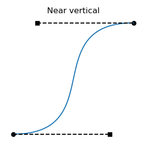
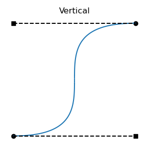
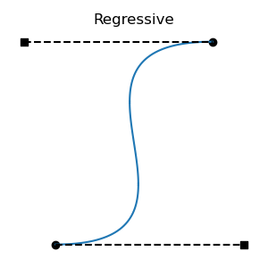

All regressive cases have at least one tangent outside the interval.  Is the
converse also true: that all cases with a tangent outside the interval are
regressive?  No: there are non-regressive curve shapes that can only be achieved
by placing one of the tangent endpoints outside the interval.  This can be
non-regressive if the out-of-bounds tangent isn't too long, and the segment's
other tangent is short enough.  These cases are fairly atypical, involving
regions of rapid change, but they are valid functions:

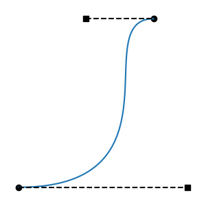

There's a graph that describes when regression arises:

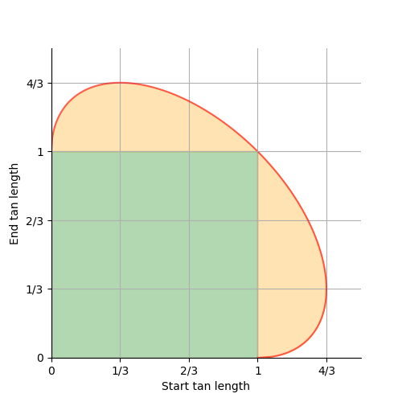

- In the green square, we have _contained tangents_, and there is no regression.

- In the orange ellipse sections, we have _bold tangents_, and there is no
  regression.

- On the red ellipse edge, we have a _single vertical_, and there is no
  regression.

- Everywhere else, we have regression.

- The ellipse also continues inside the green square, but it isn't meaningful
  there.

We've seen the (1, 1) point on the ellipse above; it's the symmetrical case with
the vertical in the center of the interval.  That one is also a corner of the
green box, one of the limits of contained tangents.

Here are two additional important cases, the (1/3, 4/3) and (4/3, 1/3) ellipse
limits.  These are the longest possible non-regressive tangents.  They put the
vertical at times 1/9 and 8/9 respectively.

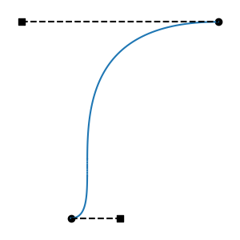
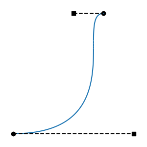

As we move between the above two limits, in the _center_ of the ellipse edge, we
make one tangent longer and the other shorter.  As we move between the (4/3,
1/3) limits and the (1, 0) limits, at the _fringes_ of the ellipse edge, we make
both tangents longer or shorter.

At (0, 1) and (1, 0), we get a vertical at either endpoint.  These are also at
corners of the green square, and limits of contained tangents.

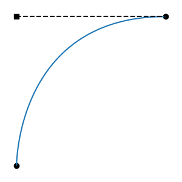
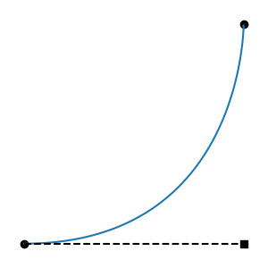

# Interactive Anti-Regression Demo

While reviewing the anti-regression strategies listed next, developers are
encouraged to run `regressDemo.py` in the `ts/script` directory.  This must be
run by a Python interpreter than can import `Ts`, and either `PySide6` or
`PySide2`.  Select a mode, then drag a tangent long, and watch the limiting
behavior and the graph at the bottom.

# Anti-Regression Strategies

First, most spline animation systems observe one important restriction, which Ts
enforces as well: tangents may never face backwards, out of their segment's
interval.  Such a tangent will be ignored at runtime, as though it were
zero-length.  This prevents some of the worst cases.  But, even when forced to
face into their segments, tangents can cause regression by being too long.

Here are the anti-regression strategies that Ts supports:

**Single-Tangent Strategies:** shorten each tangent in isolation.

- **Contain:** Forbid tangents from crossing neighboring knots in the time
  dimension.  This is overly conservative: it forbids bold tangents, which is
  both a slight creative limitation and a possible point of incompatibility.
  But the system is simple and intuitive, and it is used in some popular
  packages.

**Dual-Tangent Strategies:** for each spline segment, consider both tangents,
and shorten one or both.

- **Keep Start:** When tangents are long enough to cause regression, keep the
  start tangent the same, and shorten the end tangent until the non-regressive
  limit is reached, with a single vertical.  This is what Maya does.  It's
  asymmetrical, always favoring the start tangent, a bias that often pushes the
  adjusted curve far to the right of the original regressive Bezier.  On the
  ellipse graph above, Maya finds the vertical line through the original point
  in tangent-length space, and takes the nearest intersection with the ellipse.
  If the start tangent length is greater than 4/3, Maya alters both tangent
  lengths, always to (4/3, 1/3).  The latter case is illustrated by this
  particular segment:

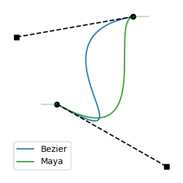

- **Keep Ratio:** When tangents are long enough to cause regression, shorten
  both of them, until the non-regressive limit is reached, with a single
  vertical.  In so doing, preserve the ratio of the original tangent lengths.
  On the ellipse graph above, this strategy finds the line from the origin to
  the original point, and takes the intersection of that line with the outer
  edge of the ellipse.

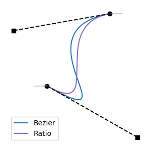

**Interactive Strategies:** as knots are interactively edited, clamp tangent
lengths.  Operate on both segments adjacent to the knot being edited.  Handle
edits to knot time, and edits to tangent length.  These strategies only work
during interactive edits, because they require differentiating between the knot
being edited (the "active" knot) and the other knot in the segment (the
"opposite" knot).

- **Limit Active:** Clamp the active tangent to the non-regressive limit, given
  the existing length of the opposite tangent.

- **Limit Opposite:** As the non-regressive limit is exceeded, shorten the
  opposite tangent to barely maintain non-regression.  When the opposite tangent
  cannot be made any shorter without regression, clamp the active tangent there.

**Disabling**: If desired, regressive splines may be deliberately authored by
selecting the **None** strategy.  This will result in **Keep Ratio** behavior at
evaluation time.

# Center and Fringe Behavior

When the Limit Opposite mode is used, there are two slightly different
behaviors:

- When the opposite tangent starts out long (more than 1/3 of the interval), and
  the active tangent is dragged long enough to cause regression: the opposite
  tangent will be shortened until the (4/3, 1/3) maximum is reached, then stop
  there.  In `regressDemo`, the way this behavior looks in the tangent-length
  graph is that the point collides with the _center_ of the edge of the ellipse,
  then slides down it.

- When the opposite tangent starts out short (less than 1/3 of the interval),
  and the active tangent is dragged long enough to cause regression: the
  opposite tangent will not be adjusted.  This avoids the counter-intuitive
  result of _lengthening_ the opposite tangent.  In `regressDemo`, the way this
  behavior looks in the tangent-length graph is that the point collides with the
  _fringe_ of the edge of the ellipse, and stops there.

With Keep Start, manipulating the length of the start tangent (but not the end
tangent; recall that Keep Start is asymmetrical) behaves similarly to Limit
Opposite, as described above.  However, in the fringe case, the opposite tangent
will in fact be lengthened until the (4/3, 1/3) maximum is reached.  This is for
compatibility with Maya.

# API

## Anti-Regression Contexts

Anti-regression is performed in the following ways:

- **Interactive Limiting**: Clients that support interactive dragging of knots
  and tangent handles may use `TsRegressionPreventer` to filter edits.

- **Edit Limiting**: Any time a `TsSpline`'s knots are changed, regression is
  avoided by shortening tangents, if needed.  The only two methods that can
  introduce regression are `SetKnot` and `SwapKnots`.

- **Querying**: To determine if splines contain regressive segments, clients may
  call `TsSpline::HasRegressiveTangents`,
  `UsdUtilsDoesLayerHaveRegressiveSplines`, or
  `UsdUtilsDoesStageHaveRegressiveSplines`.

- **Explicit Limiting**: If there is a possibility that a spline has been
  authored without anti-regression, clients may call
  `TsSpline::AdjustRegressiveTangents`.

- **Bulk Limiting**: When splines are imported in USD content, and there is a
  possibility that those splines could have been generated without
  anti-regression, clients may call `UsdUtilsAdjustRegressiveSplinesInLayer` or
  `UsdUtilsAdjustRegressiveSplinesOnStage`.

- **Runtime Limiting**: When splines are authored without anti-regression, and
  not subsequently de-regressed, and then evaluated, they will be de-regressed
  using the Keep Ratio strategy before evaluation.  This evaluation-time
  behavior does not modify the spline in memory; it only modifies a temporary
  copy that is used for evaluation.

## Current Authoring Mode

Ts always maintains a current authoring mode that affects all of the above
operations, except for Runtime Limiting, which always uses Keep Ratio.

## Default Authoring Mode

The (default) default anti-regression authoring mode is hard-coded to Keep
Ratio.  A different default may configured into the build:

* With `build_usd.py`: `--default-anti-regression=TsAntiRegression...`

* With cmake: `-DPXR_TS_DEFAULT_ANTI_REGRESSION_AUTHORING_MODE=TsAntiRegression...`

## Authoring Mode Overrides

Clients may temporarily change the current authoring mode using
`TsAntiRegressionAuthoringSelector`.

## Contain Mode

The Contain mode, unlike all others, is conservative: it disallows some
non-regressive splines (those with "bold" tangents that exceed the segment
interval).

When the current authoring mode is Contain, all anti-regression operations will
behave as though bold tangents were regressive.  For example,
`TsSpline::HasRegressiveTangents` will return true for bold tangents, and edit
limiting will clamp tangents to the segment interval when knots are changed.

If clients use Contain mode by default, but wish to avoid this conservative
behavior in some contexts, they may use a `TsAntiRegressionAuthoringSelector` to
query and limit in a non-conservative mode, such as Keep Ratio.

## Interactive Modes

`TsRegressionPreventer` supports all values of `TsAntiRegressionMode`.  It also
supports Limit Active and Limit Opposite, which cannot be used in any other
context, because they require differentiating a single knot that is being
edited.

It make sense to use `TsRegressionPreventer` in the same default mode as all
other anti-regression contexts.  It can also make sense to use Limit Active or
Limit Opposite with `TsRegressionPreventer`, despite the default mode being
different.  Maintainers of client code are encouraged to try `regressDemo` to
see what feels best.

# Load-Time Policies

It is possible, using the bulk API in `UsdUtils`, to perform anti-regression at
the time that spline content is loaded.  Whether that is necessary depends on
the client's situation.

- If the content being loaded was generated by the same software that is now
  loading it, then the client can be sure that no regression has been
  introduced, and load-time anti-regression can be skipped.

- If the content being loaded may have been generated by other software, the
  client has several options:

  - Skip load-time anti-regression, because the ecosystem of software that may
    have generated the content faithfully observes anti-regression authoring.

  - Skip load-time anti-regression, because it is preferable not to make
    automatic edits to imported content.  If there are regressive splines, they
    will be de-regressed at evaluation time.  If edits are made to regressive
    splines, they will undergo anti-regression at that time, which may cause
    additional changes on top of what the client is altering.

  - Perform load-time anti-regression, because it is preferable to avoid
    unexpected changes at edit time.

- If the content being loaded may have been generated by other software, and the
  client uses Contain mode, then it is possible that there are splines with bold
  tangents, which the client itself would never author.  Clients may:

  - Skip load-time anti-regression, because the client can tolerate bold
    tangents, and it is preferable not to change the shapes of imported splines.

  - Perform load-time anti-regression, because the client prefers to ensure that
    all tangents are contained within the interval.

Note that load-time anti-regression is similar to load-time _spline reduction_,
in which splines that use features that the client does not support can be
converted to similar splines that emulate those features.  If clients need both
reduction and anti-regression, they will typically do both at the same time.
