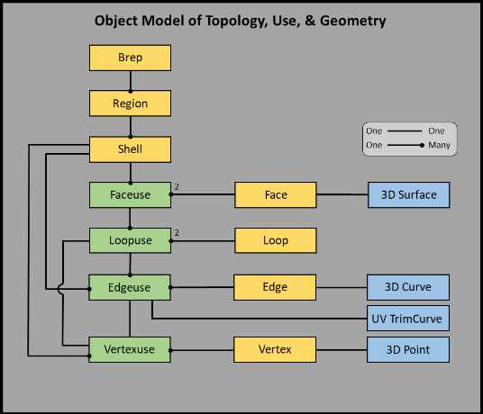
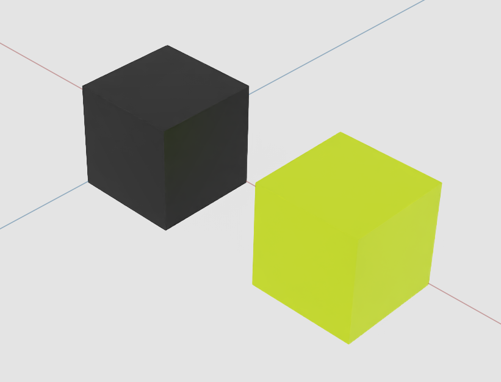
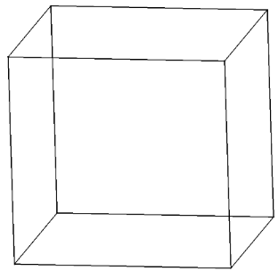
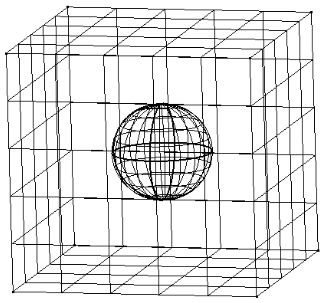
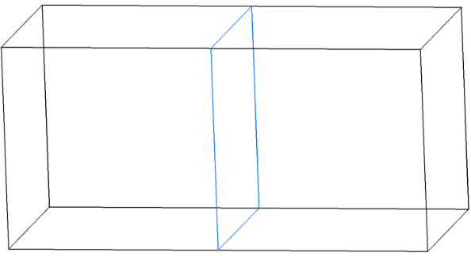
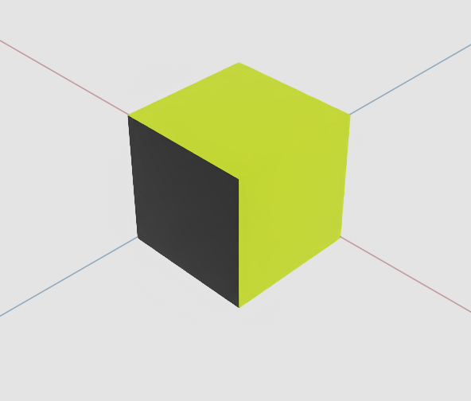

# Overview

`UsdSolid` introduces native, mathematically-exact **solid boundary-representation (B-rep)** geometry to OpenUSD. Its single concrete schema, `UsdSolidBrepArray`, is an `IsA` Gprim (deriving from `UsdGeomGprim`) that stores one or more Breps in a packed, flat, array-based representation. It is the schema companion (the "P2" proposal) to the CAD-geometry problem statement, and is built on Weiler's Radial Edge Data Model so it can represent manifold solids, non-manifold solids, sheet bodies, and wireframes in a single, kernel-neutral form.

> **Status:** `UsdSolid` is an active OpenUSD proposal (AOUSD PR #109), not yet a ratified Core Spec schema. The schema ships with `skipCodeGeneration = true` as `prelimUsdSolid`. Attribute names, packing conventions, and rules are subject to change as the AOUSD Geometry Working Group aligns on a design. Author against it for experimentation, not for long-term archival assets.

## Overview

A **boundary representation** (B-rep) describes a solid not as a volume or an approximating mesh, but by its *boundary*: trimmed surfaces (faces) joined along shared edges, which in turn meet at vertices. The intuition is a stained-glass window — individual pieces of glass (faces), welded together along their edges, enclose a region of space. Because the underlying surfaces and curves are exact (currently NURBS), a `UsdSolid` sphere *is* a sphere, not a faceted approximation of one.

A solid B-rep rigorously partitions all of space into **regions** separated by watertight boundaries. A manifold solid divides space into exactly one solid region plus one or more void regions, so that every point in space classifies unambiguously as inside or outside. Non-manifold bodies — required for real industrial assemblies — may partition space into any number of regions and may share a single edge among more than two faces.


*Figure 1 — The Brep object model. Simple topology objects (region, face, loop, edge, vertex) are connected indirectly through their "use" objects (faceuse, loopuse, edgeuse, vertexuse), which is what makes the model non-manifold-capable.*

## Why USD needs a solid B-rep

OpenUSD's existing geometry types — `UsdGeomMesh`, the subdivision types, and the `UsdGeomNurbsCurves` / `UsdGeomNurbsPatch` pair — cannot express the exact solids that manufacturing, AECO, robotics, simulation, and digital-twin workflows depend on. A mesh is an approximation chosen at a fixed resolution; it cannot answer questions about exact hole centers, precise distances, soft-clash resolution, or fabrication tolerances, and it cannot be re-tessellated to a higher fidelity once authored.

`UsdSolid` fills that gap. It lets a pipeline store the **exact source geometry** as the durable asset and derive display meshes from it on demand, for rendering, LOD, simulation handoff, or customer-specific needs — without ever losing the precise model. It also enables true round-trip CAD interoperability: producers and consumers can exchange exact geometry through USD rather than one-way mesh exports. To qualify as a CAD reference format, `UsdSolid` geometry is stored in **double precision** — a deliberate departure from the single-precision `UsdGeomNurbsCurves` / `UsdGeomNurbsPatch` types.

The schema is intentionally **kernel-neutral**. The Radial Edge model maps cleanly onto PRC (ISO 14739-1), STEP (ISO 10303), and Parasolid topology, so `UsdSolid` is a transport and reference representation that any conformant CAD kernel can read and write — not the wire format of any one implementation.

## The Radial Edge data model

`UsdSolid` is built on Kevin Weiler's **Radial Edge Data Model** (1986), the first complete non-manifold B-rep able to explicitly represent topological adjacency. Radial Edge was chosen over the winged-edge and half-edge models because those are limited to two faces per edge, whereas a surface-surface intersection naturally produces four neighboring surfaces. Radial Edge handles ordinary manifold solids, general non-manifold bodies, sheet bodies, and wireframes uniformly, and holds a neutral position across the CAD industry.

### Shapes, topology, and "use" objects

The model has three layers:

1. **Shapes** — points, curves, and surfaces. These are pure geometry with no boundaries and may be infinite (a plane) or finite (a B-spline patch). A surface gives a face its shape; a curve gives an edge its shape; a point gives a vertex its position.
2. **Topology objects** — the *simple* objects (vertex, edge, face, region) plus the *composite boundaries* (loop and shell). These add boundary information to shapes.
3. **Use objects** — the key abstraction. A topology object is "**used**" each time it participates in a boundary. Topology objects do **not** connect to their neighbors directly; instead, a neighbor relationship arises *indirectly* when two objects use a common boundary. Because one object can be used many times (a face can bound two regions; an edge can be shared by many faces), each distinct participation is recorded by a separate use object. This indirection is precisely what makes the model non-manifold-capable.

Around any edge, the edge-to-face connections are ordered by a right-hand-rule **radial traversal** into a sequence of `{entry side, exit side}` pairs. This radial ordering is what allows more than two faces to meet at one edge.

### Topology element glossary

| Element | What it is |
|---|---|
| **Region** | A connected set of points reachable by curves that never cross a boundary; it has volume. Every point in space classifies into exactly one region. The infinite exterior is always a region, so a closed box yields **two** regions (the infinite void + the interior solid). A region is `solidRegion` (points inside the Brep) or `voidRegion` (points outside). |
| **Shell** | A set of faces connected edge-to-edge that bounds a region. A region's **first** shell is its outer shell; later shells are inner shells defining cavities. A shell is used exactly once per region, so it acts as its own use object (there is **no** Shelluse). A shell may degenerate to a single point, or consist of wireEdges + vertices. |
| **Face** | A trimmed surface plus adjacency information. A face has exactly **one** outer loop and may have many inner loops (holes). Its shape comes from an owning surface (currently NURBS). The first loop listed is the outer loop. |
| **Loop** | A closed, head-to-tail connected sequence of edges bounding a face. A loop holds an ordered list of edgeuses. A loop may instead degenerate to a single vertex (a point-loop). |
| **Edge** | The shared boundary segment where surfaces meet. Its shape comes from an owning curve (currently NURBS). The curve runs from the edge's start vertex to its end vertex, and the edge's orientation matches its curve. In a manifold Brep an edge is shared by exactly two faces (or one face twice, at a seam). |
| **Vertex** | A point (point3d), the 0-dimensional boundary at the ends of edges. A vertex can be shared among edges, loop-vertices, and wireEdge-vertices, which is why those arrays carry explicit vertex indices. |
| **wireEdge** | A topologically free-standing edge that is *not* part of any face loop — a one-dimensional feature living independently in a shell. WireEdges enable wireframe models. |
| **Faceuse** | A *use of a face to bound a region.* There are exactly **two** faceuses per face (one per side); orientation is `same` (the surface-normal side) or `opposite`. |
| **Edgeuse** | A *use of an edge to bound a face.* One edge may have many edgeuses. Each records its edge, an orientation, the next radial edgeuse, a radial entry type, and the index of its associated trim (UV) curve. In the packed array, each stored entry represents a mated **{TopEdgeuse, BotEdgeuse} pair**. |
| **Loopuse** | A *use of a loop to bound a face.* Conceptually part of the full Radial Edge graph, but **removed** as redundant in the packed array — there are no Loopuse attributes. |
| **Vertexuse** | A *use of a vertex to bound an edge.* Conceptually present, but **removed** as redundant in the packed array — vertex sharing is expressed by explicit vertex indices instead. |
| **Shelluse** | Does not exist. A shell is used exactly once per region and serves as its own use. |

## Inheritance and related schemas

`UsdSolidBrepArray` is a concrete `IsA` (typed) schema:

```
UsdTyped
  └─ UsdGeomImageable
       └─ UsdGeomXformable
            └─ UsdGeomBoundable
                 └─ UsdGeomGprim
                      └─ UsdSolidBrepArray   (concrete)
```

Because it derives from `UsdGeomGprim`, a `UsdSolidBrepArray` carries `extent`, `visibility`, `purpose`, xform ops, and display-color properties, and it obeys the Gprim rule that **no Gprim may be nested inside another**. Entities smaller than a Brep (faces, edges, loops, vertices) are **not** prims — they are array entries.

Geometry is attached through applied API schemas rather than child prims:

| API schema | Apply kind | Carries |
|---|---|---|
| `BrepPointAPI` | multiple-apply | Vertex (and shell) point positions |
| `BrepCurve3dNurbAPI` | multiple-apply | 3D NURBS curves for edges and wireEdges |
| `BrepCurveUvNurbAPI` | single-apply | 2D NURBS trim (UV) curves for edgeuses |
| `BrepSurfaceNurbAPI` | single-apply | NURBS surfaces for faces |

Related schemas: `UsdGeomSubset` (for per-Brep and per-face material binding), `UsdShadeMaterial` / `UsdShadeMaterialBindingAPI`, and `UsdGeomMesh` (for co-authored display tessellations).

## The two-tier attribute layout

A `UsdSolidBrepArray` prim has two clearly separated tiers of attributes:

1. **Topology arrays** — un-prefixed, named by topology stratum (`region:*`, `shell:*`, `face:*`, …). These are arrays of indices and tokens describing how the Brep is wired together.
2. **`brep:`-prefixed geometry** — authored by the applied geometry API schemas. These hold the actual NURBS control vertices, knots, weights, point positions, per-Brep counts, and extents.

This separation lets a Brep author only the geometry types it actually uses (a NURBS-only model omits analytic-surface attributes), minimizing default-valued data.

### Topology arrays

| Stratum | Attribute | Type | Description |
|---|---|---|---|
| region | `region:type` | `token[]` | `solidRegion` or `voidRegion`. size = number of regions. |
| region | `region:shellCount` | `uint[]` | Shells per region; first shell is the outer shell. |
| shell | `shell:faceuseCount` | `uint[]` | Faceuses per shell. |
| shell | `shell:wireEdgeCount` | `uint[]` | WireEdges per shell. |
| shell | `shell:pointType` | `token[]` | Set only for a degenerate point shell (else `none`). |
| faceuse | `faceuse:faceIndex` | `uint[]` | Face referenced by each faceuse. size = 2 × faces. |
| faceuse | `faceuse:orientationType` | `token[]` | `same` (normal side) or `opposite`. |
| face | `face:loopCount` | `uint[]` | Loops per face (≥ 1); first is the outer loop. |
| face | `face:surfaceType` | `token[]` | e.g. `BrepSurfaceNurbAPI` (or an analytic surface token). |
| face | `face:trimType` | `token[]` | e.g. `general`. |
| face | `face:range` | `double2[]` | UV (min, max) pairs; size = 2 × faces. |
| loop | `loop:edgeuseCount` | `uint[]` | Edgeuses per loop (head-to-tail). |
| loop | `loop:vertexIndex` | `uint[]` | Vertex for a degenerate point-loop; sentinel `9999999` otherwise. |
| edgeuse | `edgeuse:edgeIndex` | `uint[]` | Edge referenced by each edgeuse. |
| edgeuse | `edgeuse:orientationType` | `token[]` | `same` / `opposite` (UV trim runs with or against the edge). |
| edgeuse | `edgeuse:thisRadialEntryType` | `token[]` | `topEntry` / `bottomEntry`. |
| edgeuse | `edgeuse:nextRadialEUIndex` | `uint[]` | Next edgeuse in the radial cycle around the edge. |
| edge | `edge:curveType` | `token[]` | e.g. `BrepCurve3dNurbAPI`. |
| edge | `edge:vertexIndices` | `int2[]` | (start, end) vertex indices. |
| edge | `edge:range` | `double[]` | Parametric (min, max) pairs; size = 2 × edges. |
| wireEdge | `wireEdge:curveType` | `token[]` | Curve type for free-standing edges. |
| wireEdge | `wireEdge:vertexIndices` | `int2[]` | (start, end) vertex indices. |
| wireEdge | `wireEdge:range` | `double[]` | Parametric (min, max) pairs. |
| vertex | `vertex:pointType` | `token[]` | e.g. `BrepPointAPI`. size = number of vertices. |

### Geometry API schemas

| API schema | Attribute | Type | Description |
|---|---|---|---|
| BrepPointAPI | `brep:vertexPoint:point:position` | `vector3d[]` | Vertex positions, parallel to the vertex stratum. |
| BrepPointAPI | `brep:shellPoint:point:position` | `vector3d[]` | Isolated shell-point positions. |
| BrepCurve3dNurbAPI | `brep:edge3dNurb:curve3d:nurb:controlVertices` | `point3d[]` | Concatenated CVs across all curves. |
| BrepCurve3dNurbAPI | `brep:edge3dNurb:curve3d:nurb:order` | `uint[]` | Order per curve (degree + 1). |
| BrepCurve3dNurbAPI | `brep:edge3dNurb:curve3d:nurb:vertexCount` | `uint[]` | CV count per curve. |
| BrepCurve3dNurbAPI | `brep:edge3dNurb:curve3d:nurb:knots` | `double[]` | Knots; per-curve slice = order + vertexCount. |
| BrepCurve3dNurbAPI | `brep:edge3dNurb:curve3d:nurb:weights` | `double[]` | Weights, parallel to controlVertices. |
| BrepCurveUvNurbAPI | `curveUv:*` | (NURBS) | 2D UV trim curves per edgeuse (optional). |
| BrepSurfaceNurbAPI | `brep:surface:nurb:controlVertices` | `point3d[]` | Concatenated tensor-product CVs. |
| BrepSurfaceNurbAPI | `brep:surface:nurb:uOrder` / `vOrder` | `uint[]` | U / V order per surface. |
| BrepSurfaceNurbAPI | `brep:surface:nurb:uVertexCount` / `vVertexCount` | `uint[]` | U / V CV counts per surface. |
| BrepSurfaceNurbAPI | `brep:surface:nurb:uKnots` / `vKnots` | `double[]` | U / V knots; slice = order + vertexCount per direction. |
| BrepSurfaceNurbAPI | `brep:surface:nurb:weights` | `double[]` | Surface weights. |
| (Brep header) | `brep:regionCount` | `uint[]` | Regions per Brep. size = number of Breps. |
| (Brep header) | `brep:intersectTol3d` | `double[]` | Per-Brep tolerance (non-negative). size = number of Breps. |
| (Brep header) | `brep:extent` | `double3[]` | Per-Brep tight (min, max) pairs; size = 2 × Breps. |
| (Gprim) | `extent` | `float3[]` | Overall prim extent (one min/max pair). |

## Flat-array packing and ordering conventions

`UsdSolidBrepArray` deliberately stores everything as parallel arrays (structure-of-arrays) on a **single prim** rather than as a prim-per-object scene graph. A 30,000-Brep car is one prim with packed arrays, not millions of prims.


*Figure — The flat, packed array layout: every Brep's elements are stored consecutively and the region → shell → face → loop → edgeuse hierarchy is carried by the count arrays.*

- **Consecutive-per-Brep rule.** All objects belonging to one Brep are *contiguous* in the arrays. A given Brep's elements of a type form one run; the start offset of Brep *i* is the running sum `Σ count[n]` for `n` in `[0, i)`. For example, if Brep 1 has 3 shells, Brep 2's first region starts at shell index 3.
- **Per-Brep delineation arrays size to the Brep count.** `brep:regionCount[]` and `brep:intersectTol3d[]` have one entry per Brep; `brep:extent[]` has two entries (min/max) per Brep.
- **Hierarchy lives in count arrays, not nesting.** `region:shellCount` partitions shells into regions, `shell:faceuseCount` partitions faceuses into shells, `face:loopCount` partitions loops into faces, and `loop:edgeuseCount` partitions edgeuses into loops. Consumers walk the counts in order to rebuild the tree.
- **Faceuses are doubled.** There are exactly 2 faceuses per face, so the faceuse arrays have `size() = 2 × number of faces`.
- **Edgeuses are halved.** Each stored edgeuse entry is a mated {TopEdgeuse, BotEdgeuse} pair, so the edgeuse arrays have `size() = ½ × the conceptual number of edgeuses`.
- **Removed redundant elements.** There are **no** Vertexuse and **no** Loopuse attributes; both are reconstructable. Vertex sharing is expressed through explicit `vertexIndices`; loop data is carried directly by the loop arrays.
- **No Shelluse arrays.** A shell is used once per region and is its own use.
- **Shells are listed outer-first.** A region's first shell is its outer shell; subsequent shells are inner (cavity) shells.
- **Tokens, not booleans.** Orientation and classification are tokens (`same`/`opposite`, `topEntry`/`bottomEntry`, `solidRegion`/`voidRegion`).
- **Geometry is packed by like type, in double precision.** Each NURBS array concatenates all entities of its kind; per-entity sub-arrays are delimited by the `order` / `vertexCount` entries. Surfaces are row-major (U = rows, V = columns). Each geometry type is an optional applied API, so unused types are simply absent.

## Working with UsdSolid: a minimal cube

The smallest meaningful `UsdSolidBrepArray` is a single manifold unit cube: 8 vertices, 12 edges, 6 faces, 6 loops, 2 shells, and 2 regions (the infinite void and the interior solid).


*Figure — The unit-cube Brep authored in the example below.*

The example below shows the characteristic shape of the arrays. Note how the count arrays reconstruct the tree and how the faceuse/edgeuse arrays exhibit the 2× / ½× sizing.

```usda
#usda 1.0
def Xform "World"
{
    def BrepArray "brepArray" (
        prepend apiSchemas = ["BrepPointAPI:vertexPoint",
                              "BrepCurve3dNurbAPI:edge3dNurb",
                              "BrepSurfaceNurbAPI"]
    )
    {
        # --- Per-Brep header (one Brep here) ---
        uniform uint[]    brep:regionCount   = [2]
        uniform double[]  brep:intersectTol3d = [0.00002]
        uniform double3[] brep:extent = [(-1e-5, -1e-5, -1e-5), (1.00001, 1.00001, 1.00001)]
        uniform float3[]  extent      = [(-1e-5, -1e-5, -1e-5), (1.00001, 1.00001, 1.00001)]

        # --- Regions: infinite void + interior solid, each one shell ---
        uniform token[] region:type       = ["voidRegion", "solidRegion"]
        uniform uint[]  region:shellCount  = [1, 1]

        # --- Shells: 6 faceuses each, no wireEdges ---
        uniform uint[]  shell:faceuseCount  = [6, 6]
        uniform uint[]  shell:wireEdgeCount = [0, 0]
        uniform token[] shell:pointType     = ["none", "none"]

        # --- Faceuses: 2 per face -> 12 entries ---
        uniform uint[]  faceuse:faceIndex       = [5, 4, 2, 0, 3, 1, 5, 1, 4, 0, 3, 2]
        uniform token[] faceuse:orientationType = ["same","same","same","same","same","same",
                                                   "opposite","opposite","opposite",
                                                   "opposite","opposite","opposite"]

        # --- Faces: 6, one loop each, NURBS surfaces ---
        uniform uint[]   face:loopCount   = [1, 1, 1, 1, 1, 1]
        uniform token[]  face:surfaceType = ["BrepSurfaceNurbAPI","BrepSurfaceNurbAPI",
                                            "BrepSurfaceNurbAPI","BrepSurfaceNurbAPI",
                                            "BrepSurfaceNurbAPI","BrepSurfaceNurbAPI"]
        uniform token[]  face:trimType    = ["general","general","general",
                                            "general","general","general"]
        uniform double2[] face:range = [(0,0),(1,1),(0,0),(1,1),(0,0),(1,1),
                                        (0,0),(1,1),(0,0),(1,1),(0,0),(1,1)]

        # --- Loops: 4 edgeuses each; sentinel marks "no point-loop" ---
        uniform uint[] loop:edgeuseCount = [4, 4, 4, 4, 4, 4]
        uniform uint[] loop:vertexIndex  = [9999999, 9999999, 9999999,
                                            9999999, 9999999, 9999999]

        # --- Edgeuses: halved/paired -> 24 entries (48 conceptual one-sided uses) ---
        uniform uint[]  edgeuse:edgeIndex        = [2,11,4,7, 3,9,0,1, 6,3,10,2, ...]
        uniform uint[]  edgeuse:nextRadialEUIndex = [11,23,13,17, 9,19,15,21, ...]
        uniform token[] edgeuse:orientationType   = ["same","same","opposite","opposite", ...]
        uniform token[] edgeuse:thisRadialEntryType = ["topEntry","topEntry",
                                                      "bottomEntry","bottomEntry", ...]

        # --- Edges: 12, NURBS curves, start/end vertices ---
        uniform token[] edge:curveType    = ["BrepCurve3dNurbAPI", ... ]      # 12 entries
        uniform int2[]  edge:vertexIndices = [(4,0),(5,0),(2,6),(1,5), ... ]  # 12 pairs
        uniform double[] edge:range = [0,1, 0,1, 0,1, ...]                    # 24 values

        # --- WireEdges: none ---
        uniform token[] wireEdge:curveType    = []
        uniform int2[]  wireEdge:vertexIndices = []
        uniform double[] wireEdge:range        = []

        # --- Vertices: 8 ---
        uniform token[] vertex:pointType = ["BrepPointAPI", ... ]   # 8 entries

        # --- Geometry (brep:-prefixed) ---
        uniform vector3d[] brep:vertexPoint:point:position = [ (0,0,0), (1,0,0), ... ]  # 8

        uniform point3d[] brep:edge3dNurb:curve3d:nurb:controlVertices = [ ... ]  # 12 curves x 2 CVs
        uniform uint[]    brep:edge3dNurb:curve3d:nurb:order        = [2,2,2,2,2,2,2,2,2,2,2,2]
        uniform uint[]    brep:edge3dNurb:curve3d:nurb:vertexCount  = [2,2,2,2,2,2,2,2,2,2,2,2]
        uniform double[]  brep:edge3dNurb:curve3d:nurb:knots        = [0,0,1,1, ...]  # 4 per curve
        uniform double[]  brep:edge3dNurb:curve3d:nurb:weights      = [1,1, ...]

        uniform point3d[] brep:surface:nurb:controlVertices = [ ... ]   # 6 faces x 2x2 CVs
        uniform uint[]    brep:surface:nurb:uOrder = [2,2,2,2,2,2]
        uniform uint[]    brep:surface:nurb:vOrder = [2,2,2,2,2,2]
        uniform uint[]    brep:surface:nurb:uVertexCount = [2,2,2,2,2,2]
        uniform uint[]    brep:surface:nurb:vVertexCount = [2,2,2,2,2,2]
        uniform double[]  brep:surface:nurb:uKnots = [0,0,1,1, ...]
        uniform double[]  brep:surface:nurb:vKnots = [0,0,1,1, ...]
        uniform double[]  brep:surface:nurb:weights = [1,1,1,1, ...]
    }
}
```

Reading the arrays back: there are 2 regions; each has 1 shell (`region:shellCount`), each shell has 6 faceuses (`shell:faceuseCount`), there are 6 faces each with 1 loop (`face:loopCount`), and each loop has 4 edgeuses (`loop:edgeuseCount`). The faceuse arrays have 12 entries (2 × 6 faces); the edgeuse arrays have 24 entries (½ of the 48 one-sided uses). The geometry tiers supply 8 vertex positions, 12 order-2 edge curves, and 6 bilinear surfaces.

To pack **multiple** Breps, concatenate every stratum's arrays Brep-by-Brep and grow the per-Brep header arrays. Two independent cubes give `brep:regionCount = [2, 2]`, a `brep:extent` with four entries, and `region:type = [voidRegion, solidRegion, voidRegion, solidRegion]`. A cube with an internal spherical void is a single Brep with 3 regions and `region:shellCount = [1, 2, 1]`, where the 2-shell solid region's second (inner) shell is the cavity.


*Figure — A cube with an internal void: one Brep, three regions (outer void, solid, inner void); the solid region has two shells, the second being the cavity.*


*Figure — A non-manifold configuration, where a single edge can be shared by more than two faces — the case the Radial Edge model exists to represent.*

## Materials

Materials bind through `UsdGeomSubset` authored beneath the `UsdSolidBrepArray` prim, using `elementType`:

- `elementType = "brep"` with `indices` into the Brep array binds a material to a **whole Brep**.
- `elementType = "face"` with face indices binds materials **per face**.

```usda
def GeomSubset "subset_0" (prepend apiSchemas = ["MaterialBindingAPI"])
{
    uniform token elementType = "brep"
    uniform int[] indices = [0]
    rel material:binding = </World/Looks/ABS_Hard_Leather_Brown>
}
```


*Figure — Per-face material binding via `UsdGeomSubset` with `elementType = "face"`.*

When the Brep is tessellated to a `UsdGeomMesh`, the same `UsdGeomSubset` mechanism carries the binding through to the mesh.

## Tessellation and the hdOcct reference plugin

`UsdSolid` stores exact geometry; renderers consume polygons. A reference Hydra render delegate, **hdOcct**, bridges the two: it reads a `UsdSolidBrepArray`, evaluates the exact NURBS faces, and tessellates them into triangles for display, governed by a chord-height tolerance (the maximum distance between the mesh and the true surface). Smaller chord height yields a finer mesh; triangle count grows roughly quadratically as it halves. Typical presets are 0.001 for mechanical close-ups, 0.01 for general visualization, and 0.1 for LOD/preview.

Because tessellation is derived, a pipeline commonly **co-authors** the exact Brep and a display mesh side by side: the `UsdSolidBrepArray` prim holds the durable exact geometry, while sibling `UsdGeomMesh` prims hold the triangles and point back to their source with a relationship such as `custom rel BrepSource = </World/brepArray>`. The exact Brep remains the source of truth and can be re-tessellated at any fidelity without re-authoring.

```python
# Conceptual: derive a display mesh from exact geometry at chosen quality
mesh = tessellate(brep, chord_height_tolerance=0.01, angle_tolerance_deg=15.0)
```

## Rules and restrictions

A valid Brep must satisfy a set of topological and geometric rules. Within OpenUSD, only the **topological** rules and NURBS-coherence rules are verifiable; full geometric validation (self-intersection, tangency, true tolerance enforcement) requires an external geometry kernel and is out of scope for in-stage validation. The proposal notes that these rules will be migrated into the schema doc strings once the AOUSD Geometry Working Group aligns on a design.

Highlights (see the full mapping in the migration table):

- **Watertight regions.** All regions are separated by closed shells. All self-intersections must be marked with topology — face-face intersections need an edge and/or vertex; edge-edge intersections need a vertex.
- **Single tolerance.** A valid Brep conforms to one tolerance number: any two connected entities must have a gap smaller than tolerance, all unconnected entities must be farther apart than tolerance, and degenerate geometry (measured against tolerance) is forbidden.
- **No slivers or degenerates.** No sliver faces or surfaces (contained in a pipe of radius = tolerance), no face/surface with area below tolerance², and no edge/curve contained in a sphere of radius = tolerance.
- **Ranges.** A face's range must be a subset of its surface's range; an edge's range must be a subset of its curve's range. For any range [a, b], b > a, and a periodic range must not exceed the period.
- **Faces and loops.** Each face has exactly one outer loop (the first listed) and may have inner loops or a degenerate point-loop. Seam edges are required where a surface closes.
- **Orientation.** The `same`-oriented faceuse lies on the positive-normal side of the surface; an edge's orientation matches its curve, which runs from the start vertex to the end vertex.
- **Coherent NURBS.** Every NURBS curve and surface must have positive order not exceeding its control-vertex count, a knot vector of size order + vertexCount that is non-decreasing, and strictly positive weights; control points and vertex positions must lie within the declared extent.
- **Trim curves.** When present, a trim curve must lie on its surface (its control points need not) and be within tolerance of both the surface and the projected 3D edge curve.
- **Manifold integrity.** For a manifold solid: each face is referenced by the correct pair of faceuses, the radial edgeuse chain around each edge forms a complete cycle, and no edge is left orphaned (unreferenced by any edgeuse).

## References

- AOUSD proposal PR #109, *Solid Models in USD* — `proposals/UsdSolid/README.md` and `proposals/UsdSolid/schema.usda` (branch `p2-usdsolid-schema`).
- AOUSD proposal PR #108 — *CAD Geometry / BRep problem statement* (`proposals/cad_geometry/README.md`), the companion P1 document; Appendix A is the authoritative B-rep glossary.
- K. Weiler (1986), *The Radial Edge Structure: A Topological Representation for Non-Manifold Geometric Boundary Modeling.*
- K. Lee (1999), *Principles of CAD/CAM/CAE Systems* (cited for Weiler being the first complete non-manifold B-rep).
- ISO 14739-1:2014 (PRC) — target geometry catalog; ISO 10303 (STEP) — volumes and wireframe concepts.
- OpenUSD documentation conventions: `usdVol` overview and `ParticleField3DGaussianSplat` user-guide pages.
